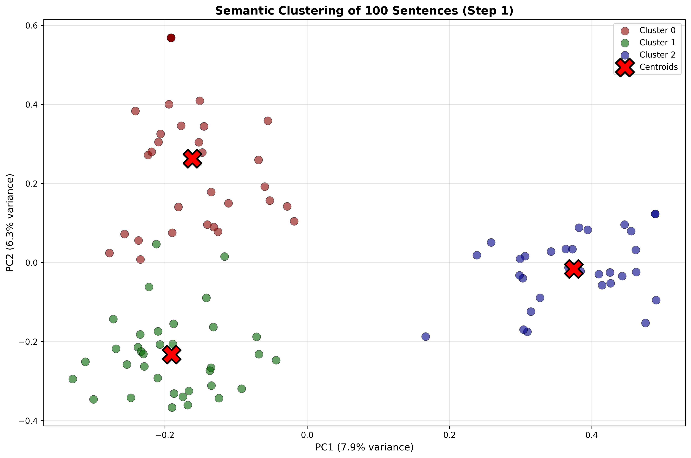
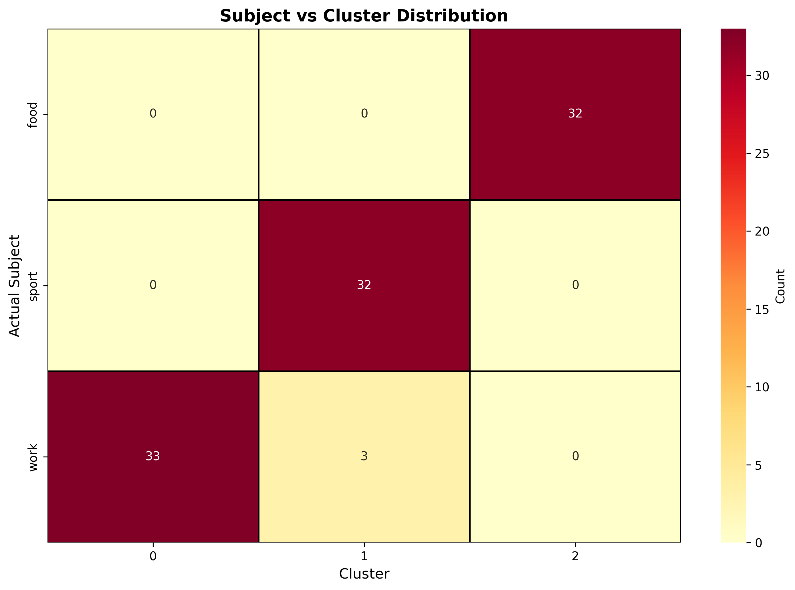
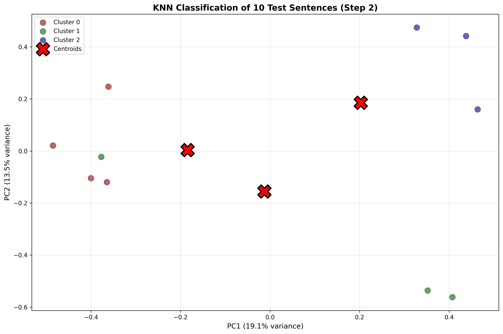
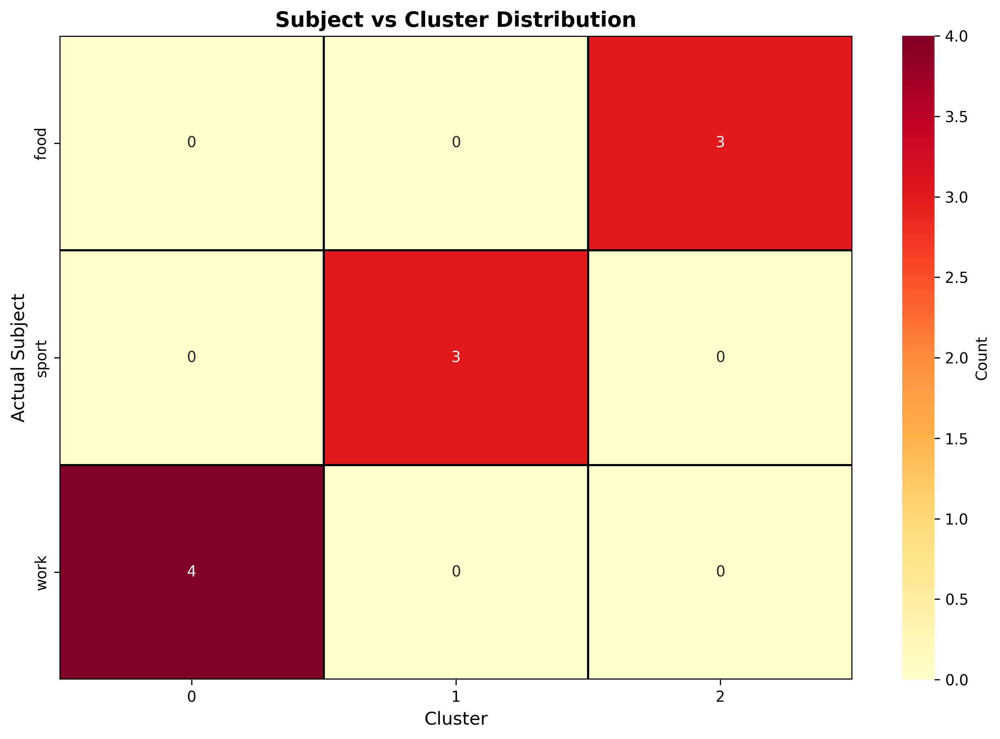

# Semantic Clustering System

**Author:** Yair Levi

---

## 📊 Visualizations

### Step 1: Cluster Creation

#### Cluster Visualization

*2D visualization of 100 sentences clustered into 3 semantic groups using K-means and PCA dimensionality reduction*

#### Confusion Matrix - Cluster Distribution

*Heatmap showing how sentences about different subjects (sport, work, food) are distributed across the 3 clusters*

#### Cluster Data Table (Sample)
*First 20 of 100 sentences with their cluster assignments. Full data: [step1_clusters.csv](./output/step1_clusters.csv)*

| Index | Sentence | Cluster | Actual Subject |
|-------|----------|---------|----------------|
| 0 | He scored the winning goal in extra time. | 1 | sport |
| 1 | The curry was spicy enough to make me sweat. | 2 | food |
| 2 | Our quarterly report exceeded all expectations. | 0 | work |
| 3 | Tennis requires excellent hand-eye coordination. | 1 | sport |
| 4 | She finally received a promotion after three years. | 0 | work |
| 5 | Fresh basil makes any pasta dish taste better. | 2 | food |
| 6 | The marathon runners trained for six months straight. | 1 | sport |
| 7 | The deadline for this project is next Tuesday. | 0 | work |
| 8 | I can't resist chocolate chip cookies straight from the oven. | 2 | food |
| 9 | His swimming technique has improved dramatically this season. | 1 | sport |
| 10 | The office is closed during national holidays. | 0 | work |
| 11 | Sushi is best enjoyed with wasabi and soy sauce. | 2 | food |
| 12 | They celebrated wildly after winning the championship. | 1 | sport |
| 13 | Remote work has become increasingly common since 2020. | 0 | work |
| 14 | She adds cinnamon to her coffee every morning. | 2 | food |
| 15 | The referee made a controversial call in overtime. | 1 | sport |
| 16 | Our team meeting starts promptly at nine. | 1 | work |
| 17 | Homemade bread smells amazing while baking. | 2 | food |
| 18 | Baseball games can sometimes last for hours. | 1 | sport |
| 19 | The new software system streamlined our workflow considerably. | 0 | work |

---

### Step 2: Testing & Classification

#### Test Sentence Classification

*2D visualization showing how 10 new test sentences are classified into the existing clusters using K-Nearest Neighbors*

#### Confusion Matrix - Test Classifications

*Heatmap showing the distribution of test sentence classifications across clusters*

#### Test Classification Data Table
*All 10 test sentences with their predicted clusters. Full data: [step2_classification.csv](./output/step2_classification.csv)*

| Index | Sentence | Cluster | Actual Subject |
|-------|----------|---------|----------------|
| 0 | The quarterback threw a perfect spiral for the winning touchdown. | 1 | sport |
| 1 | My colleague stayed late to finish the quarterly report. | 0 | work |
| 2 | Fresh basil makes any homemade pizza taste incredible. | 2 | food |
| 3 | She practices tennis three hours every day after school. | 1 | sport |
| 4 | Our company recently implemented a flexible remote work policy. | 0 | work |
| 5 | The curry was so spicy that my eyes watered. | 2 | food |
| 6 | Liverpool fans celebrated wildly when their team scored. | 1 | sport |
| 7 | After the promotion, she had to manage twelve employees. | 0 | work |
| 8 | Grandma's secret recipe includes cinnamon and nutmeg. | 2 | food |
| 9 | The deadline for submitting the application is next Friday. | 0 | work |

---

## Overview

A Python program that demonstrates semantic sentence clustering using AI-generated sentences, sentence transformers, and machine learning algorithms.

This system performs semantic clustering in two steps:

### Step 1: Cluster Creation
- Generates 100 sentences about 3 subjects (sport, work, food) using Anthropic's Claude API
- Converts sentences to semantic vectors using sentence-transformers
- Clusters the vectors into 3 groups using K-means algorithm
- Visualizes clusters and creates analysis tables

### Step 2: Testing & Classification
- Generates 10 new test sentences
- Converts them to vectors
- Uses K-Nearest Neighbors (KNN) to classify them into the clusters from Step 1
- Visualizes results and creates analysis tables

## Architecture

The program consists of three main Python files (all under 300 lines):

1. **main.py** - Main workflow orchestration
2. **utils.py** - Utility functions for sentence generation, vectorization, and data handling
3. **visualization.py** - Visualization and table generation functions

## Requirements

All dependencies are listed in `requirements.txt`:
- anthropic >= 0.50.0
- sentence-transformers >= 2.2.0
- scikit-learn >= 1.3.0
- matplotlib >= 3.7.0
- pandas >= 2.0.0
- seaborn >= 0.12.0
- numpy >= 1.24.0

## Setup

1. **Activate virtual environment:**
   ```bash
   source venv/bin/activate
   ```

2. **Install dependencies** (if not already installed):
   ```bash
   pip install -r requirements.txt
   ```

3. **Verify API key:**
   - Ensure your Anthropic API key is stored at `/home/ro/api_key`
   - The API key is read from file and never exposed in the code

## Usage

### Run the complete workflow:
```bash
python main.py
```

Or directly:
```bash
./main.py
```

### Test imports only:
```bash
python test_imports.py
```

## Output

The program creates the following files in the `output/` directory:

### Step 1 (Cluster Creation):
- `step1_clusters.png` - 2D visualization of clusters using PCA
- `step1_clusters.csv` - Table with all sentences and cluster assignments
- `step1_confusion_matrix.png` - Heatmap showing subject vs cluster distribution

### Step 2 (Testing):
- `step2_classification.png` - 2D visualization of test sentence classifications
- `step2_classification.csv` - Table with test sentences and predictions
- `step2_confusion_matrix.png` - Heatmap of test sentence classifications

## Technical Details

### Sentence Generation
- Uses Anthropic's Claude API (claude-3-5-sonnet model)
- Generates natural sentences about specified subjects
- Distributes sentences roughly equally among subjects

### Vectorization
- Model: `all-MiniLM-L6-v2` (384 dimensions)
- Optimized for semantic similarity tasks
- Vectors are L2-normalized (unit length)
- Fast processing on CPU

### Clustering (Step 1)
- Algorithm: K-means with k=3
- Input: 100 normalized sentence vectors
- Output: 3 clusters with centroids
- Random state: 42 (for reproducibility)

### Classification (Step 2)
- Algorithm: K-Nearest Neighbors (k=5)
- Trained on the 100 sentences from Step 1
- Classifies 10 new test sentences
- Provides probability scores for each cluster

### Visualization
- 2D representation using PCA (Principal Component Analysis)
- Shows variance explained by each principal component
- Color-coded clusters with centroids marked
- Confusion matrices showing subject distribution

## Example Output

```
STEP 1: CLUSTER CREATION
================================================================================

Generating 100 sentences about: sport, work, food
Generated 100 sentences

Sample sentences:
  1. [sport] The basketball game was incredibly exciting yesterday
  2. [food] She enjoys cooking Italian pasta for dinner
  3. [work] The team completed the project ahead of schedule
  ...

Converting 100 sentences to vectors...
Generated embeddings shape: (100, 384)

Performing K-means clustering (k=3)...
Clustering complete!
Cluster sizes: [32 35 33]

Creating visualizations...
Saved visualization to: output/step1_clusters.png
...
```

## Line Count

Each Python file is under 300 lines as required:
- `main.py`: ~240 lines
- `utils.py`: ~160 lines
- `visualization.py`: ~240 lines

## Security

- API key is read from file (`/home/ro/api_key`)
- API key is never exposed or printed in the code
- No API key is included in the repository

## Notes

- First run will download the sentence-transformers model (~90MB)
- Processing time: ~1-2 minutes for the complete workflow
- The program runs entirely in WSL virtual environment
- All visualizations are saved before being displayed

## Troubleshooting

### If imports fail:
```bash
source venv/bin/activate
pip install -r requirements.txt
```

### If API key error occurs:
- Check that `/home/ro/api_key` exists and contains your Anthropic API key
- Verify the API key is valid

### If visualization doesn't display:
- Check that you have a display configured in WSL
- All visualizations are saved to `output/` directory regardless

## Author

Yair Levi
