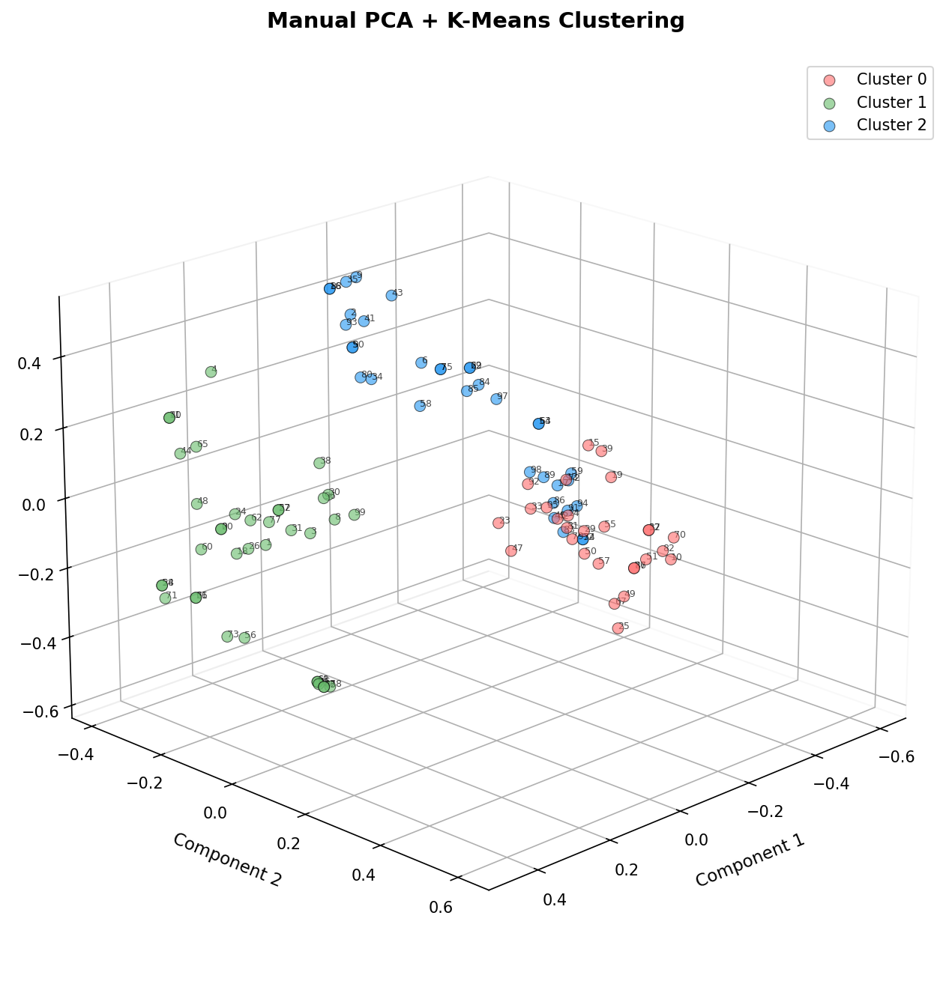
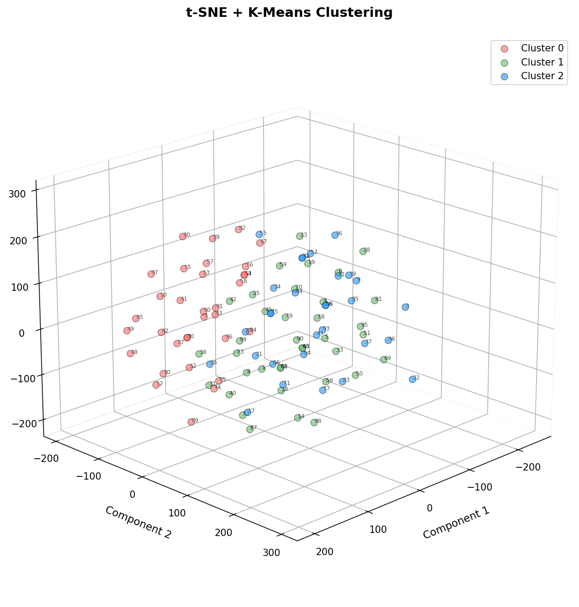

# PCA and t-SNE Text Vectorization System

## Visualization Results

### Manual PCA + K-Means Clustering


### sklearn PCA + K-Means Clustering


### t-SNE + K-Means Clustering


## Generated Sentences

The visualization above shows clustering of 100 sentences (IDs 0-99) across three categories. Here are all the sentences used in the analysis:

<details>
<summary><b>Click to expand: All 100 Sentences</b></summary>

```
0:   I finished the marketing project successfully
1:   I need to complete the audit report
2:   Training for the tournament is very challenging
3:   Collaborating on budget with colleagues is enjoyable
4:   The training presentation went very well
5:   The Champions won the championship this year
6:   Professional cycling athletes inspire me greatly
7:   Professional swimming athletes inspire me greatly
8:   Collaborating on planning with colleagues is enjoyable
9:   The match competition was incredibly exciting
10:  I love eating pasta for dinner
11:  The assessment presentation went very well
12:  Cooking brunch is my favorite hobby
13:  The curry tastes absolutely delicious
14:  The paella tastes absolutely delicious
15:  Traditional feast brings back childhood memories
16:  The race competition was incredibly exciting
17:  I practice soccer three times a week
18:  I need to complete the monitoring report
19:  Traditional brunch brings back childhood memories
20:  I finished the marketing project successfully
21:  The design deadline is next week
22:  soccer requires excellent physical conditioning
23:  This pho recipe is easy to prepare
24:  Our team discussed research strategies today
25:  I always order salad at restaurants
26:  I need to complete the brainstorming report
27:  Working on deployment today was productive
28:  The research deadline is next week
29:  Homemade feast is better than takeout
30:  Collaborating on development with colleagues is enjoyable
31:  Our team discussed marketing strategies today
32:  I enjoy playing baseball every weekend
33:  This curry recipe is easy to prepare
34:  Our local Knights made it to the finals
35:  The finals competition was incredibly exciting
36:  I have a conference call at 2 PM
37:  Cooking brunch is my favorite hobby
38:  Collaborating on testing with colleagues is enjoyable
39:  Traditional barbecue brings back childhood memories
40:  The assessment presentation went very well
41:  Training for the race is very challenging
42:  The lasagna tastes absolutely delicious
43:  Training for the championship is very challenging
44:  The monitoring presentation went very well
45:  I practice hockey three times a week
46:  I have a conference call at evening
47:  I discovered a new lasagna recipe today
48:  I finished the testing project successfully
49:  I always order sushi at restaurants
50:  Homemade dinner is better than takeout
51:  I love eating sandwich for dinner
52:  Working on deployment today was productive
53:  Watching running games is my favorite pastime
54:  The research deadline is next week
55:  Cooking picnic is my favorite hobby
56:  The meeting starts at midnight tomorrow
57:  The aroma of pizza makes me hungry
58:  The Spartans has talented players this season
59:  I enjoy playing swimming every weekend
60:  I finished the budget project successfully
61:  I have a conference call at 10 AM
62:  Working on review today was productive
63:  I have a conference call at evening
64:  Watching running games is my favorite pastime
65:  The audit presentation went very well
66:  The design deadline is next week
67:  I always order rice at restaurants
68:  I have a conference call at 10 AM
69:  soccer requires excellent physical conditioning
70:  I love eating steak for dinner
71:  The documentation deadline is next week
72:  I enjoy playing soccer every weekend
73:  The meeting starts at 3 PM tomorrow
74:  I enjoy playing baseball every weekend
75:  Professional swimming athletes inspire me greatly
76:  The aroma of salad makes me hungry
77:  Working on monitoring today was productive
78:  I have a conference call at 3 PM
79:  Homemade brunch is better than takeout
80:  The Dragons won the championship this year
81:  Homemade barbecue is better than takeout
82:  I love eating sushi for dinner
83:  I practice baseball three times a week
84:  swimming requires excellent physical conditioning
85:  Professional golf athletes inspire me greatly
86:  I practice tennis three times a week
87:  The aroma of salad makes me hungry
88:  The race competition was incredibly exciting
89:  I enjoy playing running every weekend
90:  The Champions won the championship this year
91:  I practice golf three times a week
92:  Fresh tacos from the market is wonderful
93:  Training for the finals is very challenging
94:  I practice volleyball three times a week
95:  This ramen recipe is easy to prepare
96:  Collaborating on implementation with colleagues is enjoyable
97:  volleyball requires excellent physical conditioning
98:  I enjoy playing cycling every weekend
99:  Collaborating on marketing with colleagues is enjoyable
```

**Sentence Categories:**
- **Work**: Project management, meetings, deadlines, collaboration (e.g., sentences 0, 1, 3, 4, 18, 20, 21, 24, 27, 28, 31, 36, 37, 46, 48, 52, 56, 60, 61, 62, 63, 65, 66, 67, 68, 71, 73, 77, 78, 96, 99)
- **Food**: Cooking, eating, recipes, restaurants (e.g., sentences 10, 12, 13, 14, 15, 19, 23, 25, 26, 29, 33, 34, 38, 39, 42, 47, 49, 50, 51, 55, 57, 58, 70, 76, 79, 80, 81, 82, 87, 92, 95)
- **Sport**: Training, competitions, athletes, physical activities (e.g., sentences 2, 5, 6, 7, 9, 16, 17, 22, 32, 35, 41, 43, 44, 45, 53, 54, 59, 64, 69, 72, 74, 75, 83, 84, 85, 86, 88, 89, 90, 91, 93, 94, 97, 98)

</details>

**Note**: The plots show how different dimensionality reduction methods group semantically similar sentences. Points that are close together in 3D space represent sentences with similar semantic meaning according to the embedding model.

## Transform Time Comparison

| Method | Transform Time | Relative Speed | Characteristics |
|--------|---------------|----------------|-----------------|
| **Manual PCA** | 0.5-2 seconds | Baseline | NumPy only, 11 detailed steps (a-k), educational implementation |
| **sklearn PCA** | <0.2 seconds | **~10x faster** | Optimized library, production-ready, same mathematical result |
| **t-SNE** | 5-15 seconds | ~10x slower | Non-linear, preserves local structure, best for visualization |

**Key Insights:**
- sklearn PCA is the fastest linear method, suitable for production
- Manual PCA provides educational value and mathematical transparency
- t-SNE takes longer but captures non-linear relationships better
- All methods successfully reduce 384D vectors to 3D space

---

## Project Overview

A Python-based system for text vectorization, dimensionality reduction, and clustering analysis. This project compares manual PCA implementation with library-based approaches (PCA and t-SNE) for 3D visualization of sentence embeddings.

### System Tasks

1. **Generate Sentences** - Creates 100 random sentences across three categories (sport, food, work)
2. **Vectorize Text** - Converts sentences to normalized vector embeddings
3. **Manual PCA** - Implements PCA from mathematical principles using only NumPy
4. **sklearn PCA** - Fast PCA using optimized sklearn library
5. **t-SNE** - Non-linear dimensionality reduction for comparison

All methods reduce vectors to 3D space, apply K-means clustering (K=3), and generate 3D visualizations.

## Quick Start

### Installation

```bash
# Navigate to project directory
cd /home/ro/PCA_tSNE

# Create and activate virtual environment
python3 -m venv venv
source venv/bin/activate

# Upgrade pip and install dependencies
pip install --upgrade pip
pip install -r requirements.txt
```

Note: First installation may take several minutes as it downloads PyTorch and sentence-transformers models (~500MB).

### Run Complete Pipeline

```bash
python main.py
```

This will:
- Generate 100 sentences
- Convert to normalized vectors
- Perform manual PCA, sklearn PCA, and t-SNE
- Display 3 interactive 3D visualizations
- Save all intermediate and final results

### Run Individual Tasks

```bash
# Task 1: Generate sentences
python task1_generate.py

# Task 2: Vectorize sentences
python task2_vectorize.py

# Task 3: Manual PCA (requires task 2 output)
python task3_manual_pca.py

# Task 4: sklearn PCA (requires task 2 output)
python task4_sklearn_pca.py

# Task 5: t-SNE (requires task 2 output)
python task5_tsne.py
```

## Project Structure

```
PCA_tSNE/
├── main.py                    # Main orchestration program
├── task1_generate.py          # Sentence generation
├── task2_vectorize.py         # Text vectorization
├── task3_manual_pca.py        # Manual PCA (NumPy only)
├── task4_sklearn_pca.py       # sklearn PCA
├── task5_tsne.py              # t-SNE implementation
├── utils.py                   # Utilities and helpers
├── visualization.py           # 3D plotting functions
├── requirements.txt           # Python dependencies
├── sentences.txt              # Generated sentences (output)
├── normalized.txt             # Normalized vectors (output)
├── pca_transformed_manual.txt # Manual PCA output
├── pca_transformed_sklearn.txt# sklearn PCA output
├── tsne_transformed.txt       # t-SNE output
├── pca_manual_clustering.png  # Manual PCA visualization
├── pca_sklearn_clustering.png # sklearn PCA visualization
├── tsne_clustering.png        # t-SNE visualization
├── PRD.md                     # Product Requirements Document
├── Claude.md                  # AI assistant context
├── planning.md                # Technical planning
├── tasks.md                   # Implementation tasks
└── README.md                  # This file
```

## Output Files

The program generates the following output files:

- **sentences.txt** - 100 generated sentences (one per line)
- **normalized.txt** - Normalized vector embeddings (100 × 384)
- **pca_transformed_manual.txt** - Manual PCA 3D vectors (100 × 3)
- **pca_transformed_sklearn.txt** - sklearn PCA 3D vectors (100 × 3)
- **tsne_transformed.txt** - t-SNE 3D vectors (100 × 3)
- **pca_manual_clustering.png** - Manual PCA visualization
- **pca_sklearn_clustering.png** - sklearn PCA visualization
- **tsne_clustering.png** - t-SNE visualization

## Features

### Task 1: Sentence Generation
- 100 random sentences across 3 categories
- Template-based generation for variety
- Reproducible with random seed

### Task 2: Text Vectorization
- Uses sentence-transformers library
- Model: `all-MiniLM-L6-v2` (384 dimensions)
- L2 normalization to unit length
- Batch processing for efficiency

### Task 3: Manual PCA
- Complete mathematical implementation
- 11 timed steps (a-k):
  - Step a: Calculate mean
  - Step b: Center data around zero
  - Step c: Build matrix X (vectors as columns)
  - Step d: Compute covariance matrix
  - Step e: Calculate eigenvalues
  - Step f: Calculate eigenvectors
  - Step g: Build transformation matrix P
  - Step h: Compute transpose of P
  - Step i: Transform vectors to 3D
  - Step j: K-means clustering
  - Step k: 3D visualization
- NumPy only (no sklearn for PCA)
- Educational focus on mathematical principles

### Task 4: sklearn PCA
- Optimized library implementation
- Explained variance ratio calculation
- Fast processing
- Comparison with manual implementation

### Task 5: t-SNE
- Non-linear dimensionality reduction
- Preserves local structure
- Useful for visualization
- Complementary to PCA

### Visualization
- Interactive 3D scatter plots
- Color-coded clusters
- Point labels showing sentence IDs
- Matplotlib-based
- Consistent styling across methods

## Performance

Approximate execution times (on moderate hardware):

- **Sentence generation**: <1 second
- **Vectorization**: 2-5 seconds (includes model loading)
- **Manual PCA**: 0.5-2 seconds
- **sklearn PCA**: <0.2 seconds (fastest)
- **t-SNE**: 5-15 seconds (most computationally intensive)
- **Total**: ~10-25 seconds

## Configuration

Key parameters can be modified in `utils.py`:

```python
RANDOM_SEED = 42              # For reproducibility
NUM_SENTENCES = 100           # Number of sentences
NUM_CLUSTERS = 3              # K-means clusters
PCA_COMPONENTS = 3            # Target dimensions
TSNE_PERPLEXITY = 30         # t-SNE parameter
EMBEDDING_MODEL = 'sentence-transformers/all-MiniLM-L6-v2'
```

## Code Quality

- All Python files ≤ 200 lines (as per requirements)
- Modular design with clear separation of concerns
- Comprehensive timing for each step
- Error handling
- Type hints for clarity
- Detailed comments

## Troubleshooting

### Model Download Issues
If sentence-transformers model fails to download:
```bash
# Set cache directory
export SENTENCE_TRANSFORMERS_HOME=~/.cache/sentence-transformers
```

### Memory Issues
If you encounter memory errors with large embeddings:
- Reduce `NUM_SENTENCES` in `utils.py`
- Use a smaller embedding model

### Visualization Not Showing
Ensure you have a display available:
```bash
# For WSL with X11
export DISPLAY=:0
```

Or modify visualization functions to save plots instead of showing them.

## Dependencies

- **numpy** (≥1.21.0) - Numerical computing
- **sentence-transformers** (≥2.2.0) - Text embeddings
- **scikit-learn** (≥1.0.0) - PCA, t-SNE, K-means
- **matplotlib** (≥3.5.0) - Visualization
- **torch** (≥1.10.0) - Deep learning backend
- **tqdm** (≥4.62.0) - Progress bars

## Mathematical Background

### PCA (Principal Component Analysis)
- Linear dimensionality reduction
- Maximizes variance along principal components
- Orthogonal transformation
- Computed via eigendecomposition of covariance matrix

### t-SNE (t-Distributed Stochastic Neighbor Embedding)
- Non-linear dimensionality reduction
- Preserves local neighborhood structure
- Good for visualization
- Computationally intensive

### K-Means Clustering
- Partition-based clustering
- Minimizes within-cluster variance
- Iterative algorithm
- K=3 clusters (matching 3 sentence categories)

## Environment Setup

### Prerequisites
- WSL (Windows Subsystem for Linux) or Linux
- Python 3.8 or higher
- pip package manager

## License

This project is for educational and research purposes.

## Author

Generated for WSL virtual environment usage.

## References

- [sentence-transformers](https://www.sbert.net/)
- [scikit-learn](https://scikit-learn.org/)
- [NumPy](https://numpy.org/)
- [Matplotlib](https://matplotlib.org/)
