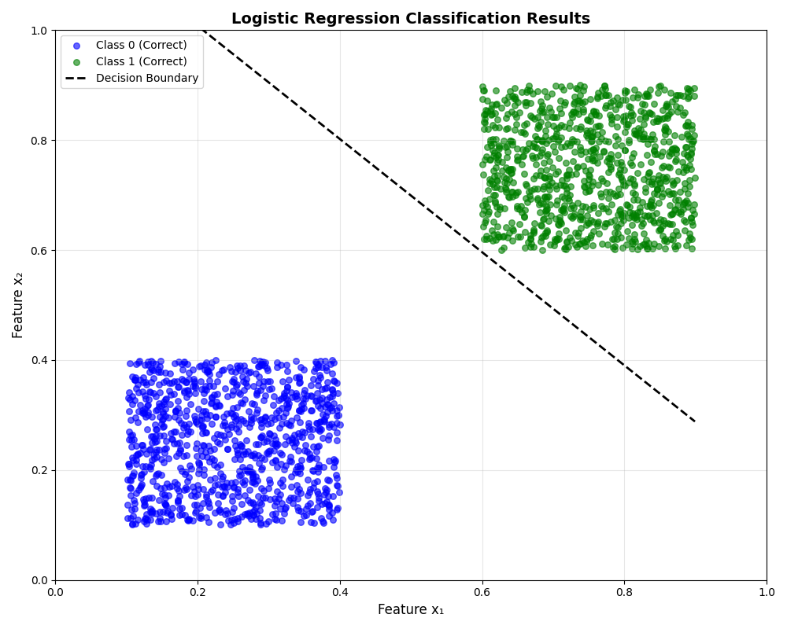
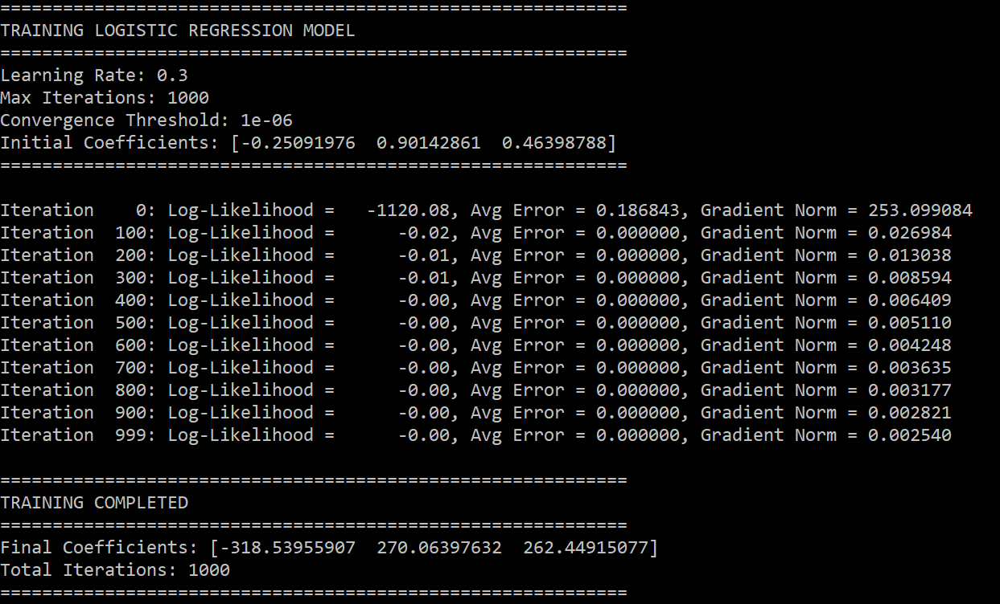
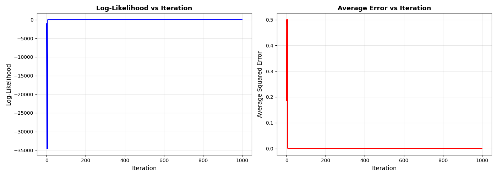
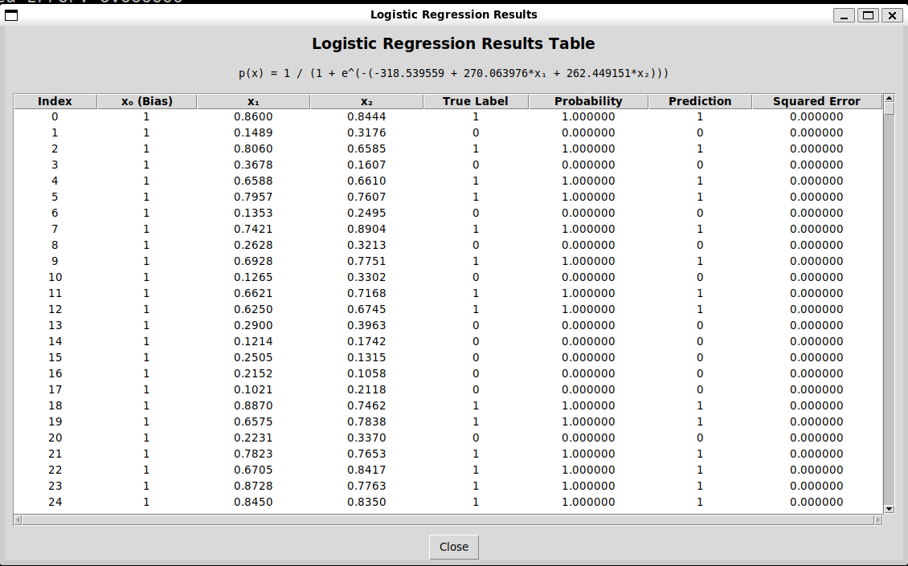

# Logistic Regression with Gradient Descent

## Results Visualization

### 1. Classification Results
The following plot shows the 2-group classification with the decision boundary:



*Blue circles represent Class 0 (correctly classified), green circles represent Class 1 (correctly classified), and red X markers indicate misclassified samples. The black dashed line shows the decision boundary.*

---

### 2. Training Progress
Main iterations and convergence results during model training:



*Training progress showing model convergence through iterations.*

---

### 3. Likelihood and Average Error
Log-likelihood and average error values changing through the training iterations:



*Left plot shows log-likelihood increasing as the model learns. Right plot shows average error decreasing over iterations.*

---

### 4. Final Results Table and Sigmoid Function
The final result table with the learned sigmoid function equation:



*Comprehensive results table showing predictions for all samples along with the final sigmoid function parameters.*

---

## Overview

**Author:** Yair Levi
**Version:** 1.0
**Date:** 2025-11-16

This project implements a logistic regression classifier from scratch using gradient descent algorithm. It demonstrates binary classification on synthetic 2D data without relying on ML libraries (only NumPy for numerical operations).

## Features

- **From-scratch implementation** of logistic regression
- **Interactive visualizations** showing classification results
- **Training progress tracking** (log-likelihood and error curves)
- **GUI results table** displaying all predictions
- **Misclassification highlighting** with red X markers
- **Decision boundary visualization**

## Requirements

- **Python:** 3.8+
- **Operating System:** WSL (Windows Subsystem for Linux) or Linux
- **Dependencies:** See `requirements.txt`

## Installation

### 1. Create Virtual Environment

```bash
python3 -m venv venv
source venv/bin/activate  # On WSL/Linux
```

### 2. Install Dependencies

```bash
pip install -r requirements.txt
```

## Usage

### Run the Program

```bash
python3 main.py
```

### Expected Output

The program will:

1. **Generate** synthetic dataset (2000 samples, 2 classes)
2. **Train** logistic regression model using gradient descent
3. **Display** training progress in console
4. **Show** classification scatter plot with misclassifications
5. **Show** training progress plots (log-likelihood and error vs iteration)
6. **Open** GUI table with detailed results

### Closing the Program

- Close matplotlib plot windows to proceed
- Close the tkinter GUI table to exit completely

## Project Structure

```
logistic_regression/
├── main.py              # Entry point, orchestrates workflow
├── data_generator.py    # Dataset generation functions
├── logistic_model.py    # Sigmoid, gradient calculation, training
├── utils.py             # Helper functions and metrics
├── visualization.py     # Plotting and GUI display
├── requirements.txt     # Python dependencies
├── results/            # Output visualizations
│   ├── classification.png
│   ├── training.PNG
│   ├── likelihood_average_error.png
│   └── Final_equation_result_table.PNG
├── PRD.md              # Product Requirements Document
└── README.md           # This file
```

## Module Descriptions

### `main.py` (191 lines)
Entry point that orchestrates the complete workflow from data generation to visualization.

### `data_generator.py` (176 lines)
Generates synthetic binary classification datasets with configurable class distributions.

### `logistic_model.py` (237 lines)
Core ML implementation:
- Sigmoid function: `p(x) = 1 / (1 + e^(-(β₀ + β₁*x₁ + β₂*x₂)))`
- Gradient calculation: `g = X^T(y - p)`
- Gradient ascent: `β_new = β_old + η * g`

### `utils.py` (242 lines)
Helper functions for:
- Error calculations (squared error, average error)
- Log-likelihood computation
- Accuracy and confusion matrix
- Statistics display

### `visualization.py` (165 lines)
Visualization tools:
- Classification scatter plots with misclassifications
- Training progress plots (2 subplots)
- GUI table using tkinter

## Algorithm Details

### Dataset
- **Total samples:** 2000 (1000 per class)
- **Class 0:** x₁, x₂ ∈ [0.1, 0.4]
- **Class 1:** x₁, x₂ ∈ [0.6, 0.9]

### Training Parameters
- **Learning rate (η):** 0.3
- **Max iterations:** 1000
- **Convergence threshold:** 1e-6

### Mathematical Model

**Sigmoid Function:**
```
p(x) = 1 / (1 + e^(-(β₀ + β₁*x₁ + β₂*x₂)))
```

**Gradient:**
```
g = X^T(y - p)
```

**Update Rule:**
```
β_new = β_old + η * g
```

## Expected Results

- **Accuracy:** > 95%
- **Convergence:** Usually within 200-400 iterations
- **Misclassifications:** < 100 samples (out of 2000)

## Visualization Examples

### 1. Classification Scatter Plot
- Blue circles: Class 0 (correctly classified)
- Green circles: Class 1 (correctly classified)
- Red X: Misclassified samples
- Black dashed line: Decision boundary

### 2. Training Progress Plots
- **Left:** Log-likelihood increases as model learns
- **Right:** Average error decreases over iterations

### 3. Results Table (GUI)
Displays for each sample:
- Features: x₀ (bias), x₁, x₂
- True label
- Predicted probability
- Binary prediction
- Squared error

## Troubleshooting

### GUI Display Issues (WSL)

If GUI doesn't display in WSL:

**WSL2 with WSLg (Windows 11):**
```bash
# Should work out of the box
```

**WSL1 or older WSL2:**
```bash
# Install X server (e.g., VcXsrv, Xming)
# Set DISPLAY variable
export DISPLAY=:0
```

### Import Errors

Ensure virtual environment is activated:
```bash
source venv/bin/activate
pip install -r requirements.txt
```

### NumPy/Matplotlib Errors

Update pip and reinstall:
```bash
pip install --upgrade pip
pip install --force-reinstall -r requirements.txt
```

## Code Quality

- **PEP 8 compliant**
- **Type hints** for function parameters
- **Comprehensive docstrings**
- **Modular design** (single responsibility principle)
- **File size limit** (< 250 lines per file)

## Success Criteria

**Functional:**
- Successfully separates two classes with > 95% accuracy
- Gradient descent converges smoothly
- All visualizations display correctly

**Technical:**
- Modular code structure
- Runs in WSL virtual environment without errors
- Uses only NumPy (no scikit-learn)

**Educational:**
- Clear demonstration of gradient descent
- Visualizations aid understanding
- Readable and well-documented code

## Future Enhancements

- Multi-class classification (> 2 classes)
- Regularization (L1/L2)
- Cross-validation
- ROC curve and AUC metrics
- Interactive parameter tuning
- Save/load trained models

## License

Educational project by Yair Levi

## Contact

For questions or issues, please refer to the PRD.md document for project specifications.

---

**Note:** This project is for educational purposes to demonstrate understanding of logistic regression and gradient descent from first principles.
