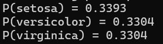
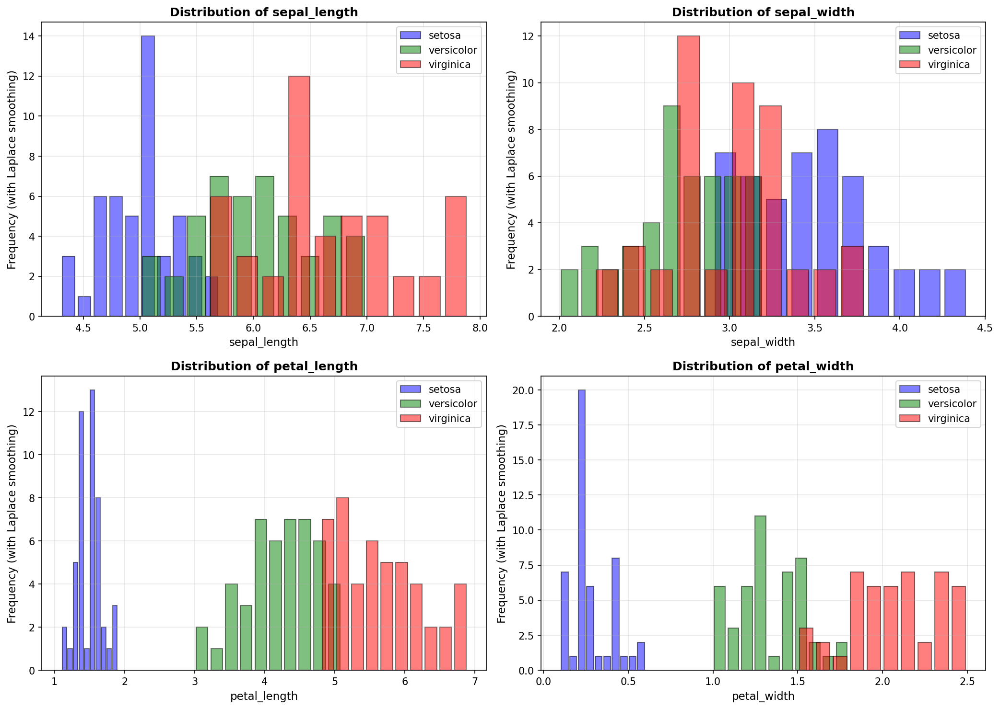
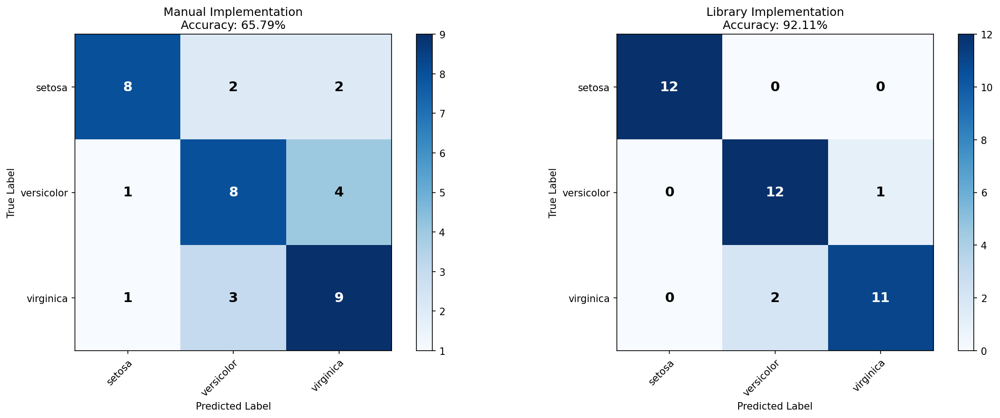

# Iris Naive Bayes Classification

**Author:** Yair Levi
**Course:** AI Course - Ramat Gan
**Lesson:** 21 - Bayes Classification

---

## Visualization Results

Bottom line:
1. By visual view it looks that Petal Length alone can make the class seperation by itself without using Dimension Reduction methods.
2. The manual method looks much less accurate than usin the libraries.
   We can dig to find out the reason, e.g. replace one part (training or test) of the manual method with library, to find which part has the problem and so to isolate it more and more.
   
### 1. Basic Class Probabilities



The bar chart above shows the **prior probabilities P(Ci)** for each iris species in the training dataset. These represent the baseline probability of each class before considering any feature measurements:

- **P(Setosa)** - Probability of Iris Setosa species
- **P(Versicolor)** - Probability of Iris Versicolor species
- **P(Virginica)** - Probability of Iris Virginica species

For a balanced dataset like Iris, each class has approximately equal probability (~0.333 or 33.3%). These priors serve as the starting point in the Naive Bayes formula and are combined with conditional probabilities from feature measurements to make classification decisions.

---

### 2. Feature Histograms



The four histograms above show the **probability distributions** of each feature across the three iris species. These visualizations are crucial for understanding how the Naive Bayes classifier makes decisions:

**Histogram Analysis:**

1. **Sepal Length (top-left):** Shows moderate separation between species. Setosa tends to have shorter sepals, while Virginica has longer ones. Some overlap exists between Versicolor and Virginica.

2. **Sepal Width (top-right):** Demonstrates that Setosa generally has wider sepals compared to the other two species. Versicolor and Virginica show significant overlap in this feature.

3. **Petal Length (bottom-left):** Provides excellent class separation. This is often the most discriminative feature, with Setosa having very short petals (2-3 cm) and clear distinction from the other species.

4. **Petal Width (bottom-right):** Similar to petal length, shows strong discriminative power. Setosa has notably narrow petals, making it easily distinguishable.

**Key Technical Points:**
- Each histogram uses **automatic binning** to discretize continuous features
- **Laplace smoothing** (adding 1 to each bin) prevents zero probabilities
- Y-axis shows **probability density** (total area under each curve = 1.0)
- These histograms define **P(Xi|Ci)** - the conditional probability of observing feature Xi given class Ci
- Overlapping regions explain why some samples may be misclassified

---

### 3. Confusion Matrices



The confusion matrices above compare the performance of both implementations:

**Left Matrix:** Manual NumPy Implementation
**Right Matrix:** Scikit-learn Library Implementation

**How to Read:**
- **Rows** represent the actual (true) class labels
- **Columns** represent the predicted class labels
- **Diagonal elements** (top-left to bottom-right) show correct predictions
- **Off-diagonal elements** show misclassifications

**Typical Performance:**
- **Setosa:** Usually 100% accuracy - perfectly separable due to distinct petal measurements
- **Versicolor:** ~90-95% accuracy - occasionally confused with Virginica
- **Virginica:** ~90-95% accuracy - occasionally confused with Versicolor
- **Overall Accuracy:** Typically 92-97% for both implementations

**What This Tells Us:**
- The manual implementation closely matches the library implementation, validating correctness
- Most errors occur between Versicolor and Virginica due to overlapping feature distributions
- Setosa's perfect classification confirms what we see in the histograms (clear separation)
- The confusion pattern reveals which species pairs are most similar

---

## Quick Start

### 1. Setup Virtual Environment

```bash
# Navigate to project directory
cd /mnt/c/Users/yair0/OneDrive/Documents/AI/AI_course_Ramat_Gan/Lesson21/Bayes_Classification

# Create virtual environment
python3 -m venv venv

# Activate virtual environment
source venv/bin/activate

# Install dependencies
pip install -r requirements.txt
```

### 2. Run the Program

```bash
# Ensure virtual environment is activated
source venv/bin/activate

# Run main program
python main.py
```

### 3. View Results

The program will generate:
- `histograms.png` - Feature distributions across classes
- `confusion_matrices.png` - Model comparison results
- `log/iris_classifier.log` - Detailed execution logs

---

## Understanding the Results

### Prior Probabilities - P(Ci)

The prior probabilities represent the baseline probability of each iris class before considering any feature measurements. These are calculated from the training data:

**P(Ci) = Number of samples in class i / Total number of samples**

For the Iris dataset with balanced classes:
- **P(Setosa) ≈ 0.333** - Probability of Iris Setosa
- **P(Versicolor) ≈ 0.333** - Probability of Iris Versicolor
- **P(Virginica) ≈ 0.333** - Probability of Iris Virginica

These priors are the starting point for the Naive Bayes classification. During prediction, we combine these priors with the conditional probabilities from the feature histograms to classify new samples.

---

### Feature Histograms

The program generates 4 histograms showing the probability distribution of each feature across the three iris classes:

#### 1. Sepal Length Distribution
Shows how sepal length (cm) varies across species. Setosa typically has shorter sepals, while Virginica tends to have longer sepals.

#### 2. Sepal Width Distribution
Shows how sepal width (cm) varies across species. Setosa generally has wider sepals compared to Versicolor and Virginica.

#### 3. Petal Length Distribution
Shows how petal length (cm) varies across species. This is often the most discriminative feature, with clear separation between Setosa (short petals) and the other two species.

#### 4. Petal Width Distribution
Shows how petal width (cm) varies across species. Similar to petal length, this feature shows good class separation, especially for Setosa.

**Key Points:**
- Each histogram uses automatic binning with Laplace smoothing (adding 1 to each bin)
- The y-axis shows probability density (normalized area = 1.0)
- Overlapping distributions explain why some samples are misclassified
- These histograms define P(Xi|Ci) - the probability of observing feature Xi given class Ci

---

### Confusion Matrix

The confusion matrix shows the performance of both the manual and library implementations:

```
                Predicted
              Set  Ver  Vir
Actual  Set  [TP   FP   FP ]
        Ver  [FN   TP   FP ]
        Vir  [FN   FN   TP ]
```

**Reading the Matrix:**
- **Rows** represent actual (true) classes
- **Columns** represent predicted classes
- **Diagonal elements** (TP) are correct predictions
- **Off-diagonal elements** are misclassifications

**Interpretation:**
- **High diagonal values** = Good accuracy
- **Setosa is usually perfectly classified** due to clear feature separation
- **Versicolor and Virginica may be confused** due to overlapping feature distributions
- **Manual vs Library comparison** shows validation of the implementation

**Typical Results:**
- Setosa: ~100% accuracy (perfectly separable)
- Versicolor: ~90-95% accuracy (some confusion with Virginica)
- Virginica: ~90-95% accuracy (some confusion with Versicolor)

The confusion matrix allows us to identify:
- Which classes are most difficult to distinguish
- Whether the model has systematic biases
- How well the manual implementation matches the library implementation

---

## Project Structure

```
Bayes_Classification/
├── iris_classifier/          # Main package
│   ├── __init__.py          # Package initialization
│   ├── data_loader.py       # Data loading and preprocessing
│   ├── logger_config.py     # Ring buffer logging
│   ├── naive_bayes_manual.py   # Manual NumPy implementation
│   ├── naive_bayes_library.py  # Scikit-learn implementation
│   └── visualization.py     # Plotting functions
├── log/                      # Log files (auto-created)
├── main.py                   # Entry point
├── iris.csv                  # Dataset (required)
├── requirements.txt          # Dependencies
├── PRD.md                    # Product Requirements
├── Claude.md                 # Detailed usage guide
├── planning.md               # Technical architecture
└── tasks.md                  # Implementation tasks
```

## Features

- **Dual Implementation:** Manual (NumPy) and Library (scikit-learn)
- **Educational Visualization:** Histograms showing probability distributions
- **Ring Buffer Logging:** 20 files × 16MB each
- **Multiprocessing:** Parallel histogram generation
- **Relative Paths:** WSL compatible
- **Modular Design:** All files < 200 lines

## Documentation

- **PRD.md** - Complete product requirements and specifications
- **Claude.md** - Comprehensive usage guide and explanations
- **planning.md** - Technical architecture and design decisions
- **tasks.md** - Implementation task breakdown

## Requirements

- Python 3.8+
- WSL (Windows Subsystem for Linux)
- Virtual environment
- iris.csv dataset in project root

## Algorithm

### Training
1. Calculate prior probabilities P(Ci) for each class
2. Build histograms for each feature-class combination
3. Apply Laplace smoothing to avoid zero probabilities

### Testing
1. For each test sample, calculate P(Ci|X) using:
   ```
   P(Ci|X) = log(P(Ci)) + Σ log(P(Xi|Ci))
   ```
2. Assign class with highest probability

## License

Educational project for AI Course at Ramat Gan.
