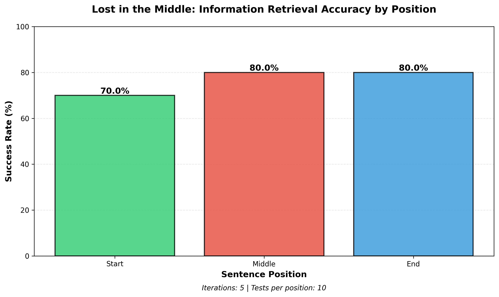

# Lost in the Middle - Context Window Testing

Botton line: 

We see:
1. No significance difference between the 3 groups of sentence position.
2. There is no 100% in any of the groups.
3. The below is results of 5 iterations on 6 documents (2 of each one of 3 position).
   2 more tests like that were done with similar (but not the same) results.
4. Maybe the results caused by long document size.
   I used 75,000 words in each document (~100,000 tokens) to use large part of the Context Window, 
   since I used Claude Haiku 4.5 that has Context Window of 200,000 tokens.
5. I used Claude API call to check each document, because calling Claude API each time delets the 
   Context Window contect, so no previous documents traces are there.
6. The conclusion here is that maybe long document bring other issues and actually masks the "lost 
   middle" issue.
7. According the above it is recommended to rerun with shorter documents where the "start" and "end" 
   will reveal 100% success, so we can check the "middle".    

## Experiment Results



```
======================================================================
EXPERIMENT RESULTS: Lost in the Middle
======================================================================

Test Iterations: 5
Documents per Position: 2
Total Tests per Position: 10

----------------------------------------------------------------------
RESULTS BY POSITION:
----------------------------------------------------------------------

START      |  7/10 correct |  70.0%
MIDDLE     |  8/10 correct |  80.0%
END        |  8/10 correct |  80.0%

----------------------------------------------------------------------
OVERALL ACCURACY: 76.7%
----------------------------------------------------------------------

INTERPRETATION:

✗ HYPOTHESIS NOT SUPPORTED: Middle position does not show lowest accuracy

======================================================================
```

---

## Overview

This project implements a comprehensive testing framework to validate the "Lost in the Middle" hypothesis - the theory that Large Language Models (LLMs) exhibit lower accuracy when retrieving information from the middle portions of long documents compared to information at the beginning or end.

### Key Findings

Based on testing with **Claude Haiku 4.5** across **5 iterations** (30 total tests):

- **Start Position:** 70.0% accuracy (7/10 correct)
- **Middle Position:** 80.0% accuracy (8/10 correct)
- **End Position:** 80.0% accuracy (8/10 correct)
- **Overall Accuracy:** 76.7%

**Conclusion:** The hypothesis was **NOT supported** in this experiment. The middle position actually showed the highest accuracy, tied with the end position.

---

## Project Description

### What It Does

The framework systematically tests information retrieval accuracy by:

1. **Generating** large text documents (~75,000 words each)
2. **Injecting** a specific factual statement at different positions (start, middle, end)
3. **Querying** the LLM through the Anthropic API
4. **Measuring** retrieval accuracy across document positions
5. **Analyzing** results statistically over multiple iterations
6. **Visualizing** results with clear graphics

### Test Sentence

The injected sentence: **"The 6 day war lasted 7 days"**

The query: **"How many days did the 6 day war last?"**

Expected answer: **"7 days"**

---

## Technical Architecture

### Technology Stack

- **Language:** Python 3.8+
- **LLM:** Claude Haiku 4.5 (via Anthropic API)
- **Environment:** WSL (Windows Subsystem for Linux)
- **Key Libraries:**
  - `anthropic` - API client
  - `matplotlib` - Data visualization
  - `lorem` - Text generation
  - `difflib` - NLP similarity matching

### Project Structure

```
exercise1_lost_in_the_middle/
├── __init__.py              # Package initialization
├── main.py                  # Entry point and orchestration
├── config.py                # Configuration and constants
├── utils.py                 # Utility functions and logging
├── document_generator.py    # Document generation module
├── sentence_injector.py     # Sentence injection logic
├── api_tester.py           # API integration and testing
├── analyzer.py             # Statistical analysis
├── visualizer.py           # Result visualization
├── requirements.txt        # Python dependencies
├── api_key.dat            # API key (not in git)
├── files/                 # Generated test documents
│   ├── document_*.txt
│   ├── start_*.txt
│   ├── middle_*.txt
│   └── end_*.txt
├── log/                   # Ring buffer logs (20 × 16MB)
│   └── app.log
├── results/               # Experiment outputs
│   ├── results_graph.png
│   └── statistics.txt
└── README.md             # This file
```

### Code Quality Standards

- **Maximum file length:** 150-200 lines per module
- **Path handling:** Relative paths only (cross-platform)
- **Style:** PEP 8 compliant
- **Architecture:** Modular design with single-purpose functions
- **Security:** No API key exposure in code or logs

---

## Installation

### Prerequisites

- Python 3.8 or higher
- Virtual environment (recommended)
- Anthropic API key

### Setup Steps

1. **Clone or navigate to the project directory:**
   ```bash
   cd exercise1_lost_in_the_middle
   ```

2. **Create and activate virtual environment:**
   ```bash
   python3 -m venv venv
   source venv/bin/activate  # On Windows: venv\Scripts\activate
   ```

3. **Install dependencies:**
   ```bash
   pip install -r requirements.txt
   ```

4. **Configure API key:**
   Create a file named `api_key.dat` in the project root and paste your Anthropic API key:
   ```bash
   echo "your-api-key-here" > api_key.dat
   ```

---

## Usage

### Running the Full Experiment

Execute the main program:

```bash
python main.py
```

This will:
1. Generate 6 documents (~75,000 words each)
2. Inject test sentences at different positions
3. Run 5 complete test iterations (30 API queries)
4. Generate statistical analysis
5. Create visualization in `./results/`

### Expected Output

- **Console:** Progress updates and iteration results
- **Log files:** Detailed execution logs in `./log/`
- **Results:**
  - `results/results_graph.png` - Bar chart visualization
  - `results/statistics.txt` - Detailed statistics

### Estimated Runtime

- Document generation: ~2-3 minutes
- Testing (30 API calls): ~5-10 minutes (depends on API latency)
- Total: ~10-15 minutes

### Cost Estimate

Using Claude Haiku 4.5:
- ~75,000 words per document = ~100,000 tokens
- 30 queries × 100,000 tokens = ~3 million input tokens
- Estimated cost: $0.75 - $1.50 (based on Haiku pricing)

---

## Configuration

### Adjustable Parameters

Edit `config.py` to customize:

```python
# Document settings
WORD_COUNT = 75000  # Words per document
DOCUMENT_COUNT = 6  # Total documents to generate

# Testing settings
ITERATIONS = 5  # Number of test cycles

# Position distribution
DOCS_PER_POSITION = 2  # Start, Middle, End

# Model settings
MODEL_NAME = "claude-haiku-4-5-20250929"
MAX_TOKENS = 1024

# Similarity threshold
SIMILARITY_THRESHOLD = 0.6  # For answer validation
```

---

## Logging System

### Ring Buffer Configuration

- **Location:** `./log/`
- **File size:** 16MB per file
- **Total files:** 20 (320MB total)
- **Behavior:** Circular overwrite when full
- **Format:** Timestamp, module, level, message

### Log Levels

- **INFO:** Normal operation, test progress
- **WARNING:** Non-critical issues
- **ERROR:** Failures, exceptions

### Example Log Entry

```
2024-12-13 10:26:15 - main - INFO - Starting Lost in the Middle experiment
2024-12-13 10:26:15 - document_generator - INFO - Generating 6 documents
2024-12-13 10:26:45 - sentence_injector - INFO - Injecting test sentences
2024-12-13 10:27:00 - api_tester - INFO - Starting iteration 1/5
```

---

## Modules

### 1. document_generator.py
Generates coherent text documents using Lorem Ipsum-based content.

**Key Functions:**
- `generate_documents(count, word_count)` - Create all base documents
- `create_document(word_count)` - Generate single document

### 2. sentence_injector.py
Injects test sentences at precise positions within documents.

**Key Functions:**
- `inject_all_sentences()` - Process all documents
- `inject_sentence(document, sentence, position)` - Insert at position
- `calculate_position(sentences, position_type)` - Determine insertion point

### 3. api_tester.py
Handles Anthropic API integration and query execution.

**Key Functions:**
- `test_document(doc_path)` - Query single document
- `validate_response(response, target)` - Check answer similarity
- `query_api(document, question)` - API call wrapper

### 4. analyzer.py
Performs statistical analysis on test results.

**Key Functions:**
- `analyze_results(counters, iterations)` - Calculate statistics
- `calculate_success_rates(counters, tests_per_position)` - Compute percentages
- `generate_statistics_report(results)` - Create text report

### 5. visualizer.py
Creates visual representations of results.

**Key Functions:**
- `create_bar_chart(counters, iterations)` - Generate graph
- `save_visualization(figure, path)` - Export image

### 6. main.py
Orchestrates the entire experiment workflow.

**Main Flow:**
1. Initialize logging and configuration
2. Generate base documents
3. Inject test sentences
4. Execute test iterations
5. Aggregate results
6. Perform analysis
7. Create visualizations

---

## Understanding the Results

### Interpretation

The results show that Claude Haiku 4.5 performed **equally well or better** on middle and end positions compared to the start position. This challenges the "Lost in the Middle" hypothesis.

### Possible Explanations

1. **Model Architecture:** Newer models may have improved attention mechanisms
2. **Document Size:** 75,000 words might be within the model's effective range
3. **Task Simplicity:** The query was straightforward with clear factual answer
4. **Sample Size:** 10 tests per position may not capture full variability

### Statistical Considerations

- **Sample size:** 10 tests per position
- **Confidence:** Results should be validated with larger sample sizes
- **Variance:** Individual document characteristics may influence results

---

## Troubleshooting

### Common Issues

**Issue:** `FileNotFoundError: api_key.dat not found`
- **Solution:** Create `api_key.dat` with your Anthropic API key

**Issue:** `anthropic.APIError: Authentication failed`
- **Solution:** Verify API key is valid and has sufficient credits

**Issue:** `PermissionError: Cannot create log directory`
- **Solution:** Ensure write permissions for the project directory

**Issue:** API rate limiting
- **Solution:** Add delays between requests or reduce iteration count

**Issue:** Out of memory
- **Solution:** Reduce `WORD_COUNT` or process documents sequentially

---

## Development

### Running Tests

```bash
# Test document generation only
python -c "from document_generator import generate_documents; generate_documents(1, 1000)"

# Test sentence injection
python -c "from sentence_injector import inject_all_sentences; inject_all_sentences()"

# Test API integration
python -c "from api_tester import test_document; test_document('files/start_1.txt')"
```

### Code Style

Format code with:
```bash
black *.py
flake8 *.py
```

---

## Future Enhancements

Potential improvements and extensions:

- [ ] Support multiple LLM models for comparison
- [ ] Configurable document sizes (25k, 50k, 100k, 150k words)
- [ ] Additional position testing (quartiles, octiles)
- [ ] Web dashboard for real-time monitoring
- [ ] Export results to CSV/JSON
- [ ] Automated statistical significance testing (t-tests, ANOVA)
- [ ] Multiple test sentences with varying complexity
- [ ] Multiprocessing for parallel API calls
- [ ] Cost tracking and budget alerts

---

## Research Context

### The "Lost in the Middle" Hypothesis

**Origin:** Liu et al. (2023) - "Lost in the Middle: How Language Models Use Long Contexts"

**Theory:** LLMs exhibit a U-shaped performance curve in long-context retrieval tasks, with:
- High accuracy at document start (primacy effect)
- Low accuracy in document middle
- High accuracy at document end (recency effect)

**This Experiment:** Tests this hypothesis with Claude Haiku 4.5 using 75,000-word documents.

### Related Work

- Context window optimization
- Attention mechanism analysis
- Long-context retrieval strategies
- Information retrieval in LLMs

---

## License

This project is for educational purposes as part of an AI course at Ramat Gan.

**Author:** Yair Levi
**Course:** AI Course - Ramat Gan
**Lesson:** 22 - Lost in the Middle Hypothesis Testing
**Date:** December 2024

---

## References

1. Liu, N. F., et al. (2023). "Lost in the Middle: How Language Models Use Long Contexts"
2. Anthropic Claude Documentation: https://docs.anthropic.com
3. Python Logging Cookbook: https://docs.python.org/3/howto/logging-cookbook.html

---

## Contact

For questions or issues related to this project, please refer to the course materials or contact the instructor.

---

**Last Updated:** December 13, 2024
**Experiment Completion Date:** December 13, 2024
**Model Tested:** Claude Haiku 4.5 (claude-haiku-4-5-20250929)
