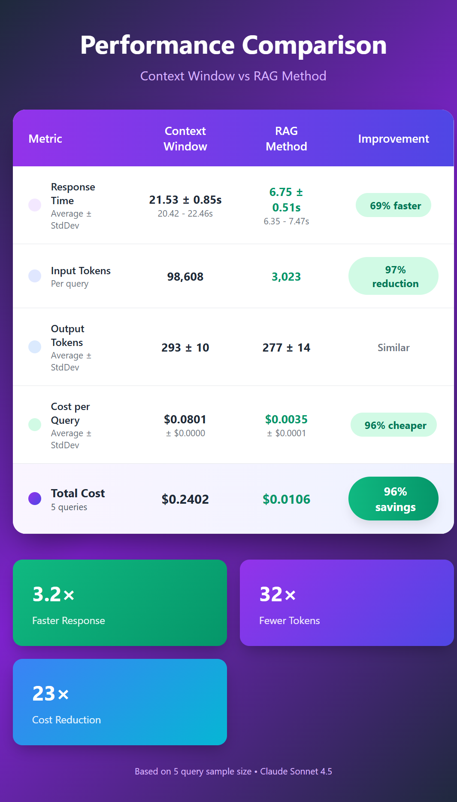

# Context Window vs RAG Performance Comparison

Compare Context Window and RAG methods for document retrieval.

The results for the query for both methods can be seen at ./results/results.json.


## Quick Start

```bash
# Setup
python3 -m venv venv
source venv/bin/activate
pip install -r requirements.txt

# Run
python -m context_window_vs_rag
```

## Requirements

- Python 3.8+
- 20 PDF files in `./docs/`
- API key in `api_key.dat`

## Documentation

See `README_RAG_Comparison.md` for full documentation.

## Author

Yair Levi - 2025
