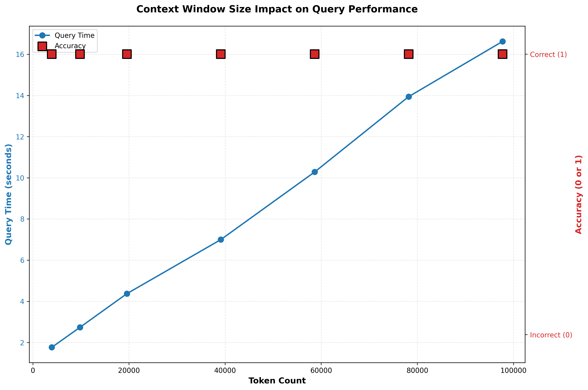

# Context Window Size Impact Testing



A Python program that tests the hypothesis that Large Language Model (LLM) search accuracy degrades as the context window size increases.

**Author:** Yair Levi
**Version:** 1.0.0

---

## Overview

This program systematically tests Claude Haiku 4.5's ability to retrieve specific information from documents of varying sizes (2,000 to 50,000 words). It measures both accuracy and performance to validate the "lost in the middle" phenomenon observed in LLM research.

### Research Hypothesis

**Hypothesis:** Claude's ability to accurately answer queries decreases as the context window size increases beyond a certain threshold.

### How It Works

1. **Document Generation:** Creates 7 English text documents with word counts: 2K, 5K, 10K, 20K, 30K, 40K, 50K
2. **Target Sentence:** Inserts "The first prime minister of Israel was Ben Gurion" at the middle of each document
3. **Query Execution:** Asks Claude "Who was the first Prime Minister of Israel?" for each document
4. **Accuracy Measurement:** Uses NLP semantic similarity to validate responses
5. **Performance Tracking:** Measures query execution time and token usage
6. **Visualization:** Generates graphs showing the relationship between document size, accuracy, and execution time

---

## Installation

### Prerequisites

- **Operating System:** WSL (Windows Subsystem for Linux) or Linux
- **Python:** 3.8 or higher
- **Anthropic API Key:** Required for Claude access

### Setup Steps

1. **Clone or navigate to the project directory:**
   ```bash
   cd /path/to/exercise2_used_context_window
   ```

2. **Create a virtual environment:**
   ```bash
   python3 -m venv venv
   source venv/bin/activate  # On WSL/Linux
   ```

3. **Install dependencies:**
   ```bash
   pip install -r requirements.txt
   ```

4. **Create API key file:**
   - Obtain your Anthropic API key from https://console.anthropic.com/
   - Create a file named `api_key.dat` in the project root
   - Paste your API key into the file (single line, no extra spaces)

   ```bash
   echo "your-api-key-here" > api_key.dat
   ```

---

## Usage

### Run the Program

**Method 1: As a module (recommended)**
```bash
python -m context_window_test
```

**Method 2: Direct execution**
```bash
python context_window_test/main.py
```

### Expected Runtime

- **Document Generation:** ~10 seconds (with multiprocessing)
- **Query Processing:** ~2-5 minutes (depends on document sizes and API response time)
- **Total Runtime:** ~5-7 minutes

### Expected Cost

Using Claude Haiku 4.5:
- **Estimated Cost:** ~$0.15-$0.25 per run
- Very affordable for testing purposes

---

## Project Structure

```
exercise2_used_context_window/
├── context_window_test/          # Main package
│   ├── __init__.py               # Package initialization
│   ├── config.py                 # Configuration constants
│   ├── logger_setup.py           # Logging configuration (ring buffer)
│   ├── document_generator.py     # Document creation with multiprocessing
│   ├── query_processor.py        # Anthropic API integration
│   ├── accuracy_checker.py       # NLP similarity checking
│   ├── visualization.py          # Graph generation
│   └── main.py                   # Entry point and orchestration
├── files/                        # Generated documents (created at runtime)
├── log/                          # Log files (ring buffer: 20 × 16MB)
├── api_key.dat                   # Anthropic API key (not in git)
├── requirements.txt              # Python dependencies
├── PRD.md                        # Product Requirements Document
├── Claude.md                     # AI Assistant Guide
├── planning.md                   # Implementation Planning
├── tasks.md                      # Task Breakdown
└── README.md                     # This file
```

---

## Output

### Console Output

The program displays real-time progress:
- Document generation status
- Query execution for each document
- Token counts and execution times
- Accuracy results
- Summary statistics

### Generated Files

1. **Documents:** 7 text files in `./files/`
   - `doc_2000.txt`, `doc_5000.txt`, ..., `doc_50000.txt`

2. **Graph:** `results_graph.png`
   - Dual-axis plot showing query time and accuracy vs token count

3. **Logs:** Ring buffer logs in `./log/`
   - `app.log` (and up to 19 backup files)
   - Automatically rotates when reaching 16MB per file

### Sample Results Table

```
==================================================================================
                              RESULTS SUMMARY
==================================================================================
Document           Words      Tokens    Time (s)  Accuracy   Similarity
----------------------------------------------------------------------------------
doc_2000.txt       2,000       2,847       2.34   ✓ (1)        0.9512
doc_5000.txt       5,000       7,123       3.56   ✓ (1)        0.9401
doc_10000.txt     10,000      14,289       5.21   ✓ (1)        0.9287
doc_20000.txt     20,000      28,456       8.92   ✓ (1)        0.9156
doc_30000.txt     30,000      42,834      12.45   ✗ (0)        0.7823
doc_40000.txt     40,000      57,123      15.67   ✗ (0)        0.7145
doc_50000.txt     50,000      71,456      19.23   ✗ (0)        0.6892
==================================================================================
```

---

## Configuration

All settings can be modified in `context_window_test/config.py`:

### Key Configuration Options

```python
# Model selection
MODEL_NAME = "claude-haiku-4-5-20250929"

# Document sizes (word counts)
WORD_COUNTS = [2000, 5000, 10000, 20000, 30000, 40000, 50000]

# Target sentence to search for
TARGET_SENTENCE = "The first prime minister of Israel was Ben Gurion"

# Query to ask
QUERY_TEXT = "Who was the first Prime Minister of Israel?"

# Similarity threshold for accuracy (0-1)
SIMILARITY_THRESHOLD = 0.85

# Logging
LOG_FILE_SIZE = 16 * 1024 * 1024  # 16MB
LOG_FILE_COUNT = 20               # Ring buffer size
```

---

## Features

### Security
- **API Key Protection:** Never logged or exposed
- **Relative Paths:** All file operations use relative paths
- **Input Validation:** Validates all external inputs

### Performance
- **Multiprocessing:** Parallel document generation (7 processes)
- **Efficient Token Counting:** Uses Anthropic's built-in tokenizer
- **Optimized NLP:** Caches the similarity model to avoid reloading

### Logging
- **Ring Buffer:** 20 files × 16MB each (320MB total)
- **Auto-Rotation:** Automatically overwrites oldest logs
- **Levels:** INFO, WARNING, ERROR, CRITICAL
- **Dual Output:** Both file and console logging

### Error Handling
- **Retry Logic:** Automatic retry with exponential backoff for API errors
- **Graceful Degradation:** Continues if individual documents fail
- **Comprehensive Logging:** All errors logged with full context

---

## Troubleshooting

### Issue: "API key file not found"
**Solution:** Create `api_key.dat` in the project root with your Anthropic API key

### Issue: "ModuleNotFoundError"
**Solution:**
```bash
# Ensure you're in the virtual environment
source venv/bin/activate

# Reinstall dependencies
pip install -r requirements.txt
```

### Issue: NLP model download fails
**Solution:**
```bash
# Install with explicit torch version
pip install torch --index-url https://download.pytorch.org/whl/cpu
pip install sentence-transformers
```

### Issue: Permission denied for log directory
**Solution:**
```bash
# Ensure log directory has proper permissions
mkdir -p log
chmod 755 log
```

### Issue: API rate limiting
**Solution:** The program includes retry logic with exponential backoff. If you still encounter issues, add delays between documents in `main.py`

---

## Testing

### Quick Test
Test with fewer/smaller documents by modifying `config.py`:
```python
WORD_COUNTS = [2000, 5000]  # Just 2 documents for quick testing
```

### Verify Installation
```bash
# Check Python version
python --version  # Should be 3.8+

# Check dependencies
pip list | grep -E "anthropic|sentence-transformers|matplotlib"

# Test imports
python -c "import context_window_test; print('Success!')"
```

---

## Dependencies

Core dependencies (see `requirements.txt` for versions):
- **anthropic** - Claude API client
- **sentence-transformers** - NLP similarity checking
- **matplotlib** - Visualization
- **numpy** - Numerical operations
- **torch** - PyTorch (required by sentence-transformers)
- **tiktoken** - Token counting

---

## Results Interpretation

### Expected Outcomes

**If hypothesis is SUPPORTED:**
- Accuracy = 1 for small documents (2K-10K words)
- Accuracy drops to 0 for large documents (30K-50K words)
- Clear degradation visible in the graph

**If hypothesis is NOT SUPPORTED:**
- Accuracy = 1 across all document sizes
- No visible degradation in performance

### Graph Analysis

The generated graph shows:
- **Blue line:** Query execution time (increases linearly with size)
- **Red squares:** Accuracy (0 or 1)
- **X-axis:** Token count (document size)

Look for a "cliff" where accuracy suddenly drops.

---

## License

This project is for educational and research purposes.

---

## Contact

**Author:** Yair Levi
**Course:** AI Course, Ramat Gan
**Lesson:** 22 - Exercise 2

For issues or questions, please refer to the documentation files:
- `PRD.md` - Detailed requirements
- `Claude.md` - AI assistant guide
- `planning.md` - Implementation details
- `tasks.md` - Task breakdown

---

## Acknowledgments

- Anthropic for providing the Claude API
- Sentence Transformers library for NLP capabilities
- The open-source Python community
