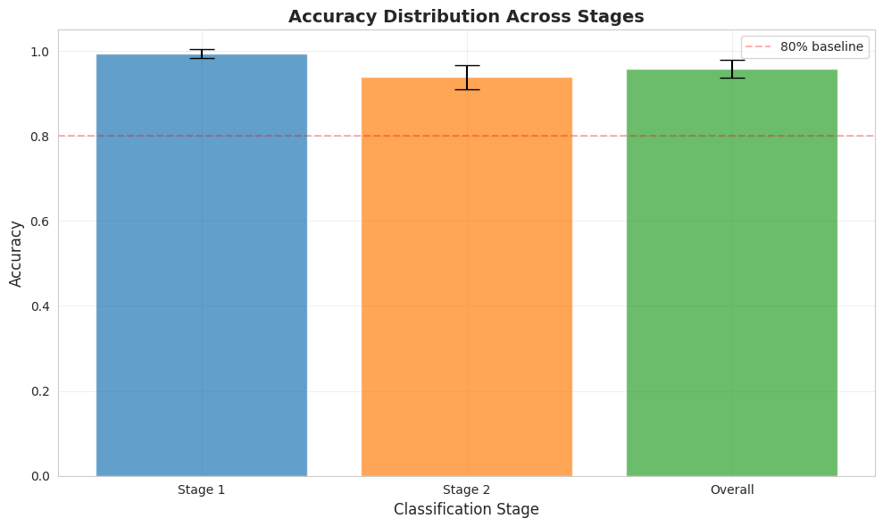
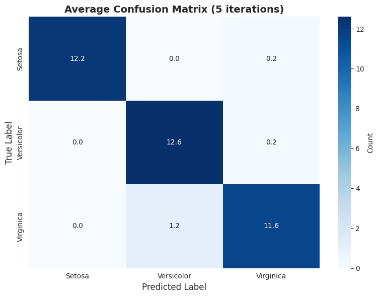
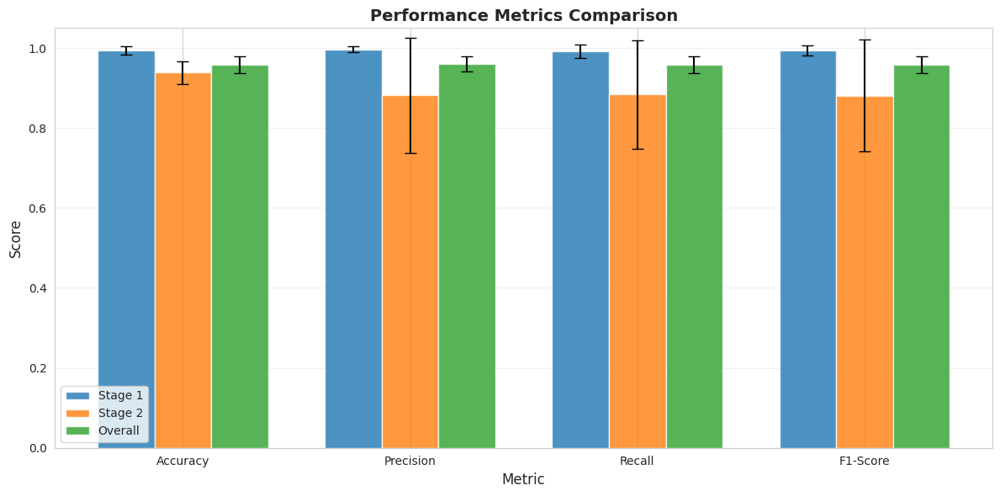

# Iris SVM Classification System

**Author:** Yair Levi  
**Version:** 1.0.0

A hierarchical Support Vector Machine (SVM) classification system for the Iris dataset, implemented in Python with multiprocessing support.

---

## 🎯 Results Summary

```
======================================================================
                    FINAL RESULTS SUMMARY
======================================================================

Number of iterations: 5

----------------------------------------------------------------------
STAGE 1 (Group A vs Group B):
----------------------------------------------------------------------
  Accuracy: 0.9947 ± 0.0105
  Range:    [0.9737, 1.0000]

----------------------------------------------------------------------
STAGE 2 (Class 1 vs Class 2):
----------------------------------------------------------------------
  Accuracy: 0.9387 ± 0.0288
  Range:    [0.8889, 0.9615]

----------------------------------------------------------------------
OVERALL (All 3 Classes):
----------------------------------------------------------------------
  Accuracy: 0.9579 ± 0.0211
  Range:    [0.9211, 0.9737]

======================================================================
Results and visualizations saved to: ./results/
======================================================================
```

**Achieved Performance:**
- **Stage 1 Accuracy:** 99.47% ± 1.05% (Excellent separation of Setosa)
- **Stage 2 Accuracy:** 93.87% ± 2.88% (Strong separation of Versicolor/Virginica)
- **Overall Accuracy:** 95.79% ± 2.11% (Excellent overall classification)

### Visualization Results

**Accuracy Distribution Across Stages:**



**Average Confusion Matrix (5 iterations):**



**Performance Metrics Comparison:**



---

## Overview

This program classifies the Iris dataset (3 classes) using a two-stage hierarchical SVM approach:

1. **Stage 1:** Separate Iris-setosa from {Iris-versicolor, Iris-virginica}
2. **Stage 2:** Separate Iris-versicolor from Iris-virginica

The program runs 5 iterations for statistical analysis and generates comprehensive visualizations.

---

## Features

- ✅ Hierarchical binary SVM classification for multi-class problem
- ✅ Multiprocessing for parallel execution of iterations
- ✅ Ring buffer logging (20 files × 16MB)
- ✅ Statistical analysis over 5 iterations
- ✅ Automatic visualization generation
- ✅ Modular package structure
- ✅ Relative path handling for WSL compatibility

---

## Requirements

- Python 3.8+
- WSL (Windows Subsystem for Linux) or Linux environment
- Virtual environment (recommended)

---

## Installation

### 1. Navigate to Project Directory
```bash
cd C:/Users/yair0/AI_continue/Lesson23/Lesson23_SVM
```

### 2. Set Up Virtual Environment
```bash
# Navigate to venv location (../../ from project root)
cd ../..

# Create virtual environment
python3 -m venv venv

# Activate virtual environment
source venv/bin/activate

# Return to project directory
cd Lesson23/Lesson23_SVM
```

### 3. Install Dependencies
```bash
pip install -r requirements.txt
```

---

## Project Structure

```
Lesson23_SVM/
├── iris_classifier/          # Core package
│   ├── __init__.py
│   ├── config.py            # Configuration
│   ├── logger_setup.py      # Logging system
│   ├── data_loader.py       # Data loading
│   ├── preprocessor.py      # Preprocessing
│   ├── svm_trainer.py       # SVM training
│   ├── evaluator.py         # Evaluation
│   ├── statistics.py        # Statistical analysis
│   └── visualizer.py        # Visualization
├── tasks/                    # Task modules
│   ├── __init__.py
│   ├── task_stage1.py       # Stage 1 classification
│   ├── task_stage2.py       # Stage 2 classification
│   └── task_analysis.py     # Results analysis
├── main.py                   # Entry point
├── log/                      # Log files (auto-created)
├── results/                  # Output files (auto-created)
├── iris.csv                  # Dataset
├── requirements.txt
├── README.md
├── Claude.md
├── planning.md
└── tasks.md
```

---

## Usage

### Basic Execution
```bash
# Ensure virtual environment is activated
source ../../venv/bin/activate

# Run the program
python main.py
```

### Expected Output
The program will:
1. Load the Iris dataset from `iris.csv`
2. Run 5 iterations (in parallel if possible)
3. Generate log files in `./log/`
4. Generate visualizations in `./results/`
5. Print summary statistics to console

---

## Output Files

### Log Files (`./log/`)
- `iris_svm_YYYYMMDD_HHMMSS.log` - Main log file
- Ring buffer: 20 files maximum, 16MB each
- Oldest files automatically overwritten

### Result Files (`./results/`)
- `accuracy_distribution.png` - Accuracy comparison across stages
- `confusion_matrix.png` - Aggregated confusion matrix
- `metrics_comparison.png` - All metrics comparison
- `results_summary.json` - Numerical results summary

---

## Configuration

Edit `iris_classifier/config.py` to modify:

### ML Parameters
- `TRAIN_SPLIT`: Training data proportion (default: 0.75)
- `NUM_ITERATIONS`: Number of iterations (default: 5)
- `RANDOM_STATE`: Random seed for reproducibility (default: 42)

### SVM Hyperparameters
- `SVM_KERNEL`: Kernel type (default: 'rbf')
- `SVM_C`: Regularization parameter (default: 1.0)
- `SVM_GAMMA`: Kernel coefficient (default: 'scale')

### Logging Parameters
- `LOG_MAX_BYTES`: Max log file size (default: 16MB)
- `LOG_BACKUP_COUNT`: Number of backup files (default: 19)

---

## Algorithm Details

### Hierarchical Classification Strategy

#### Stage 1: Binary Classification
- **Group A:** Iris-setosa (class 0)
- **Group B:** Iris-versicolor + Iris-virginica (classes 1, 2)
- **Approach:** Train SVM to distinguish Group A from Group B

#### Stage 2: Binary Classification
- **Input:** Only Group B samples (from Stage 1 predictions)
- **Classes:** Iris-versicolor (1) vs Iris-virginica (2)
- **Approach:** Train SVM to separate these two classes

#### Final Prediction
- If Stage 1 predicts Group A → Final class: 0
- If Stage 1 predicts Group B → Use Stage 2 prediction (class 1 or 2)

---

## Expected Performance

Based on Iris dataset characteristics:

- **Stage 1 Accuracy:** > 95% (Iris-setosa is linearly separable)
- **Stage 2 Accuracy:** 80-90% (Iris-versicolor and Iris-virginica are similar)
- **Overall Accuracy:** 85-92%

---

## Troubleshooting

### Issue: "Data file not found"
**Solution:** Ensure `iris.csv` exists in the project root directory

### Issue: "Permission denied" for log directory
**Solution:** Check write permissions on the project directory
```bash
chmod -R u+w ./log
```

### Issue: Multiprocessing not working
**Solution:** Program will automatically fall back to sequential execution. Check logs for details.

### Issue: Import errors
**Solution:** Ensure virtual environment is activated and all dependencies are installed
```bash
source ../../venv/bin/activate
pip install -r requirements.txt
```

### Issue: Path errors on WSL
**Solution:** All paths are relative and use `pathlib` for compatibility. Ensure you're running from the project root directory.

---

## Development Notes

### Code Style
- Maximum 150 lines per file
- PEP 8 compliant
- Comprehensive logging
- Type hints recommended

### Testing
Run individual modules:
```bash
python -m iris_classifier.data_loader
python -m tasks.task_stage1
```

---

## Performance

### Typical Runtime
- Single iteration: ~1-5 seconds
- Total (5 iterations, parallel): ~5-10 seconds
- Sequential execution: ~5-25 seconds

### Resource Usage
- Memory: < 500MB
- CPU: Utilizes 80% of available cores for multiprocessing
- Disk: < 400MB (logs + results)

---

## License

Educational project - Lesson 23

---

## Contact

For questions or issues:
1. Check log files in `./log/`
2. Review error messages
3. Consult `planning.md` and `tasks.md`

---

## Acknowledgments

- **Dataset:** R.A. Fisher (1936) - "The use of multiple measurements in taxonomic problems"
- **SVM Algorithm:** Vapnik & Cortes (1995) - "Support-vector networks"
- **Implementation:** scikit-learn library

---

**End of README**