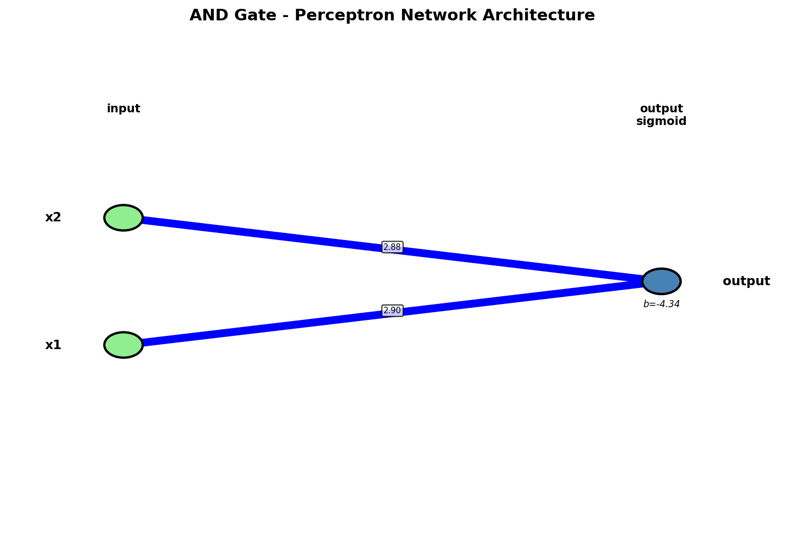
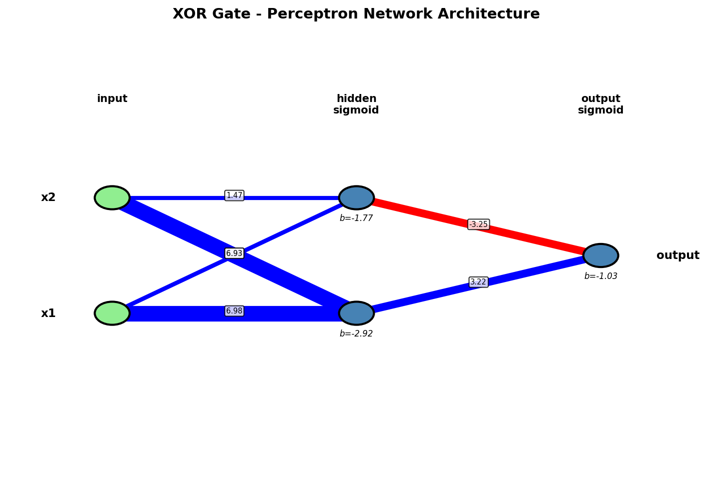
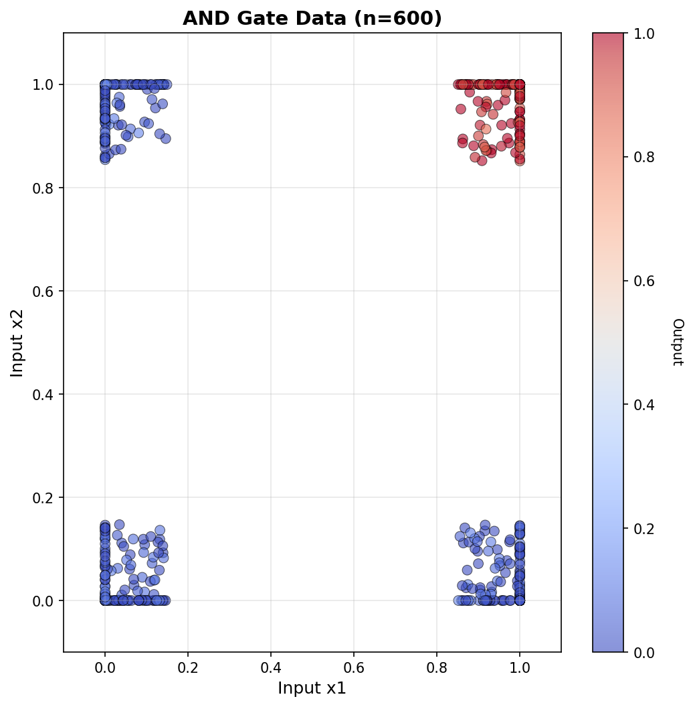
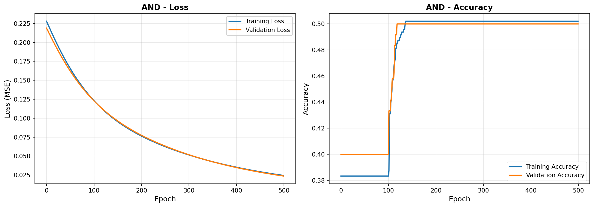

# Perceptron Gates Neural Network

**Author:** Yair Levi
**Date:** 2025-12-30

## Overview

Implementation of AND and XOR logic gates using Keras neural networks with perceptrons. Demonstrates fundamental neural network concepts including training with noisy data, network architecture design, and comprehensive visualization.

## Project Structure

```
perceptron_gates/
├── __init__.py              (21 lines)   - Package initialization
├── logger_config.py         (76 lines)   - Ring buffer logging setup
├── dataset_generator.py     (139 lines)  - Noisy dataset generation
├── models.py                (113 lines)  - Keras model architectures
├── trainer.py               (79 lines)   - Training and evaluation
├── visualizer.py            (143 lines)  - Network and data visualization
├── main.py                  (106 lines)  - Main orchestrator
├── requirements.txt                      - Python dependencies
├── PRD.md                                - Product requirements
├── planning.md                           - Architecture planning
├── tasks.md                              - Implementation tasks
├── Claude.md                             - AI assistant guide
├── README.md                             - This file
├── models/                               - Trained model files (generated)
│   ├── and_model.keras
│   └── xor_model.keras
├── visualizations/                       - Generated visualization images
│   ├── and_network.png
│   ├── and_data.png
│   ├── and_training.png
│   ├── xor_network.png
│   ├── xor_data.png
│   └── xor_training.png
└── log/                                  - Rotating log files (generated)
    └── perceptron_gates.log (+ 19 backups)
```

**Total: 677 lines of Python code (all files ≤ 150 lines)**

## Quick Start

### 1. Setup Virtual Environment

```bash
# Create virtual environment at ../../venv
cd ../..
python3 -m venv venv
source venv/bin/activate  # On WSL/Linux

# Install dependencies
cd Lesson27/perceptron_gates
pip install -r requirements.txt
```

### 2. Run the Program

```bash
# From the Lesson27 directory
cd /mnt/c/Users/yair0/AI_continue/Lesson27
python -m perceptron_gates.main
```

### 3. View Results

After execution, check these directories:
- `models/` - Trained neural network models (`.keras` files)
- `visualizations/` - Network diagrams and training plots (`.png` files)
- `log/` - Rotating log files

## Features

### Neural Network Architectures

**AND Gate (Linearly Separable):**
- Input: 2 neurons
- Output: 1 neuron (sigmoid)
- Parameters: 3
- Architecture: Simple single-layer perceptron

**XOR Gate (Non-Linearly Separable):**
- Input: 2 neurons
- Hidden: 2 neurons (sigmoid)
- Output: 1 neuron (sigmoid)
- Parameters: 9
- Architecture: Two-layer perceptron network

### Dataset Generation
- 600 samples per gate
- 15% random noise added to truth table values
- 80/20 train/validation split
- Realistic fuzzy boundaries for training

### Training
- Loss: Mean Squared Error (MSE)
- Optimizer: Adam (default learning rate)
- Epochs: 500
- Batch size: 32
- Multiprocessing: Parallel training for AND and XOR

### Logging
- Ring buffer: 20 files × 16 MB each
- Auto-rotation when files fill up
- Location: `./log/`
- Level: INFO and above

### Visualizations
1. **Network Architecture** - Diagram showing layers, neurons, and connections
2. **Data Point Clouds** - Scatter plots with color-coded outputs
3. **Training History** - Loss and accuracy curves over epochs

## Expected Results

### Performance Metrics
- **AND Gate:** >95% accuracy (typically ~99%)
- **XOR Gate:** >95% accuracy (typically ~98%)
- **Training Time:** < 5 minutes total
- **Memory Usage:** < 500 MB

### Output Files

**Models:**
- `models/and_model.keras`
- `models/xor_model.keras`

**Visualizations:**
- `visualizations/and_network.png` - AND architecture diagram
- `visualizations/xor_network.png` - XOR architecture diagram
- `visualizations/and_data.png` - AND data point cloud
- `visualizations/xor_data.png` - XOR data point cloud
- `visualizations/and_training.png` - AND training curves
- `visualizations/xor_training.png` - XOR training curves

**Logs:**
- `log/perceptron_gates.log` (and up to 19 backup files)

## Visualizations Gallery

### Network Architectures

**AND Gate Network:**



**XOR Gate Network:**



### Data Point Clouds

**AND Gate Data:**



**XOR Gate Data:**


### Training History

**AND Gate Training:**



**XOR Gate Training:**


## Graph explanation:
 Why Loss Improves But Accuracy Doesn't

  Accuracy plateaus early:
  - Keras accuracy uses a 0.5 threshold to classify predictions as 0 or 1
  - Early in training, the model quickly learns to predict values on the correct side of 0.5 (e.g., 0.3 for zeros, 0.7 for ones)
  - Once predictions cross the threshold correctly, accuracy is already high (~95-99%)

  MSE continues improving:
  - The target values are not exactly 0 and 1 - they have ±15% noise (ranging from ~0-0.15 for zeros, ~0.85-1.0 for ones)
  - After getting the classification right, MSE keeps decreasing as predictions get closer to these noisy target values
  - Example: prediction improves from 0.3 → 0.12 (MSE drops) but accuracy stays same (both are < 0.5)

  The Issue

  This is a regression vs classification mismatch:
  - MSE loss treats this as a regression problem (fit continuous noisy values)
  - Accuracy metric treats this as a classification problem (just get the right side of 0.5)

  The model is essentially learning to fit the noise in the data rather than learning new classification patterns after the initial convergence.

  Better Approach

  For a classification task like this, you would typically use:
  - loss='binary_crossentropy' instead of MSE
  - This would align the loss function with the classification goal

  The current setup works but shows this characteristic behavior where loss keeps improving while accuracy plateaus.

## Technical Details

### Key Design Decisions

1. **AND Gate Architecture:** Single perceptron because AND is linearly separable
2. **XOR Gate Architecture:** Hidden layer required because XOR is not linearly separable
3. **Noise Addition:** Positive noise (0-15%) creates realistic fuzzy boundaries
4. **Multiprocessing:** AND and XOR trained in parallel for efficiency
5. **Ring Buffer Logging:** 20 files ensure comprehensive logging without filling disk

### Module Responsibilities

- **logger_config.py** - Centralizes logging configuration
- **dataset_generator.py** - Pure data generation, no side effects
- **models.py** - Model definitions only, no training logic
- **trainer.py** - Training, evaluation, model persistence
- **visualizer.py** - All visualization logic isolated
- **main.py** - Orchestration and multiprocessing coordination

## Usage Examples

### Test Individual Modules

```bash
# Test logger
python -c "from perceptron_gates.logger_config import setup_logger; setup_logger('test').info('Test')"

# Test models
python -m perceptron_gates.models

# Test dataset
python -c "from perceptron_gates.dataset_generator import create_dataset; print(create_dataset('and'))"
```

### Load and Use Trained Models

```python
from pathlib import Path
from tensorflow import keras
import numpy as np

# Load trained model
model_path = Path("models/xor_model.keras")
model = keras.models.load_model(model_path)

# Test prediction
test_input = np.array([[0, 1]], dtype=np.float32)
prediction = model.predict(test_input, verbose=0)
print(f"XOR(0, 1) = {prediction[0][0]:.4f}")
```

## Troubleshooting

### Common Issues

**Import errors:**
- Ensure running as package: `python -m perceptron_gates.main`
- Activate virtual environment first

**TensorFlow warnings:**
- Normal on WSL without GPU
- Suppressed in code with `TF_CPP_MIN_LOG_LEVEL=3`

**Permission errors on log directory:**
- Package creates it automatically
- Check write permissions in project directory

**XOR not converging:**
- Increase epochs (currently 500)
- Check dataset noise level (15% is good balance)

## Documentation

- **PRD.md** - Complete product requirements
- **planning.md** - Detailed architecture and design decisions
- **tasks.md** - Implementation task breakdown
- **Claude.md** - Guide for AI assistants working with the code

## References

- Keras: https://keras.io/
- TensorFlow: https://www.tensorflow.org/
- NumPy: https://numpy.org/
- Matplotlib: https://matplotlib.org/

## License

Educational project by Yair Levi - 2025
