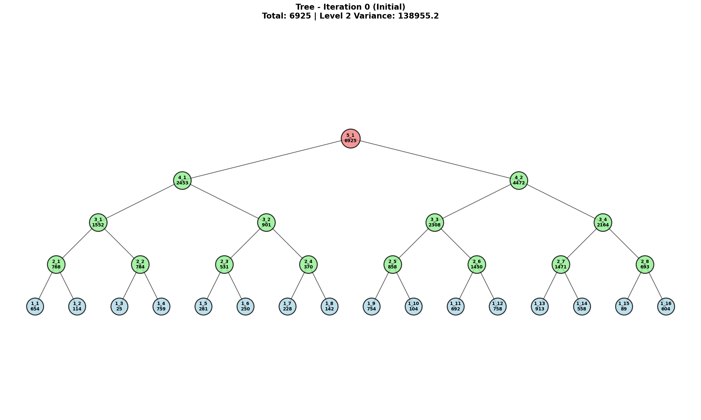
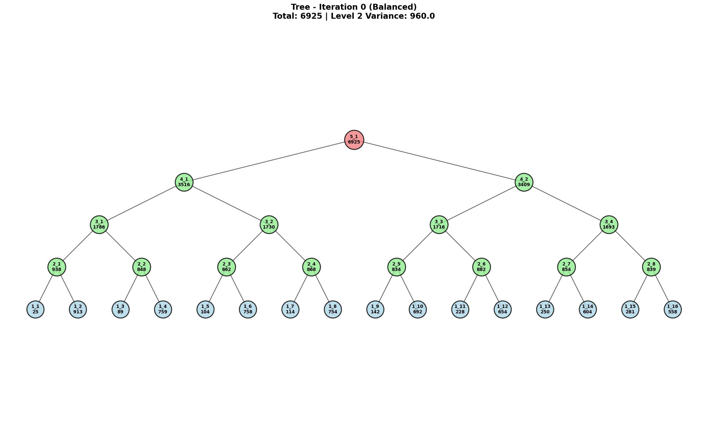

# Balanced Token Tree

**Author:** Yair Levi  
**Version:** 1.0.0  
**Date:** 2026-01-15

---

## Example Output

The program generates visualizations showing the tree before and after balancing. Here's an example from Iteration 0:

### Before Balancing


**Initial State:** Random token distribution with high variance (138,955.2) at Level 2 nodes.

### After Balancing


**Balanced State:** Optimized distribution with significantly reduced variance (960.0) at Level 2 nodes.

---

## Overview

This project demonstrates a tree balancing algorithm that redistributes tokens across a 5-level binary search tree (BST) to achieve optimal balance. The program:

1. Creates a complete BST with 16 leaves
2. Assigns random token values (0-1000) to leaves
3. Applies a balancing algorithm that pairs extreme values
4. Visualizes the tree structure before and after balancing
5. Runs multiple iterations to show progressive improvement

---

## Features

- Binary tree with 5 levels and systematic node naming
- Random token assignment with configurable seed
- Custom balancing algorithm (pairs largest with smallest values)
- Matplotlib-based tree visualization
- Ring buffer logging system (20 files × 16 MB)
- Multiprocessing support for parallel operations
- Modular design with files under 150 lines each
- WSL-compatible with virtual environment support

---

## Project Structure

```
Lesson30_BalancedTokenTree/
├── balanced_token_tree/          # Main package
│   ├── __init__.py               # Package initialization
│   ├── main.py                   # Entry point (will be implemented)
│   ├── tree_structure.py         # Tree node and structure classes
│   ├── token_manager.py          # Token assignment functions
│   ├── balancing.py              # Balancing algorithm
│   ├── visualization.py          # Tree visualization
│   ├── logger_config.py          # Logging configuration
│   └── tasks.py                  # Task orchestration
├── log/                          # Log files (auto-created)
│   └── app.log                   # Ring buffer logs
├── output/                       # Visualizations (auto-created)
│   ├── tree_iteration_0_initial.png
│   ├── tree_iteration_1_balanced.png
│   └── tree_iteration_2_balanced.png
├── PRD.md                        # Product Requirements Document
├── Claude.md                     # Claude Code development guide
├── planning.md                   # Technical architecture
├── tasks.md                      # Implementation tasks
├── requirements.txt              # Python dependencies
└── README.md                     # This file
```

---

## Requirements

- **Operating System:** WSL (Windows Subsystem for Linux)
- **Python Version:** 3.8 or higher
- **Virtual Environment:** Located at `../../venv/` relative to project root

### Python Dependencies

```
matplotlib >= 3.5.0
numpy >= 1.21.0
```

---

## Installation

### 1. Set Up Virtual Environment

Navigate to two directories above the project root and create a virtual environment:

```bash
cd ../..
python3 -m venv venv
```

### 2. Activate Virtual Environment

```bash
source venv/bin/activate
```

### 3. Install Dependencies

Navigate back to the project directory and install requirements:

```bash
cd Lesson30/Lesson30_BalancedTokenTree
pip install -r requirements.txt
```

### 4. Verify Installation

```bash
python -c "import matplotlib; import numpy; print('Dependencies installed successfully')"
```

---

## Usage

### Running the Program

Once implemented, run the program from the project root:

```bash
cd balanced_token_tree
python main.py
```

### With Fixed Random Seed (Reproducible Results)

```bash
python main.py --seed 42
```

### From Python

```python
from balanced_token_tree import run_pipeline

# Run with random seed
run_pipeline(seed=42)
```

---

## How It Works

### Tree Structure

The program creates a 5-level binary tree:

```
Level 5 (Root):    5_1
Level 4:           4_1, 4_2
Level 3:           3_1, 3_2, 3_3, 3_4
Level 2:           2_1, 2_2, 2_3, 2_4, 2_5, 2_6, 2_7, 2_8
Level 1 (Leaves):  1_1, 1_2, ..., 1_16
```

### Balancing Algorithm

The balancing algorithm redistributes tokens to minimize variance:

1. **Extract:** Collect all leaf token values
2. **Sort:** Sort values in ascending order
3. **Pair:** Take smallest and largest values
4. **Assign:** Place pairs under same parent node
5. **Repeat:** Continue until all leaves assigned
6. **Propagate:** Recalculate parent sums from leaves to root

**Example:**
- Initial: `[100, 200, 300, 400, 500, 600, 700, 800]`
- Pairs: `(100, 800), (200, 700), (300, 600), (400, 500)`
- Result: All parents have sum of 900 (perfect balance)

### Iterations

The program runs **2 complete iterations**, each showing before and after balancing:

**Iteration 0:**
1. Assign random tokens (0-1000) to leaves → Visualize
2. Apply balancing algorithm → Visualize

**Iteration 1:**
1. Assign NEW random tokens (0-1000) to leaves → Visualize
2. Apply balancing algorithm → Visualize

This demonstrates how the balancing algorithm works on different initial distributions.

---

## Output

### Visualizations

Four PNG images are saved to the `output/` directory:

- `tree_iteration_0_initial.png` - Iteration 0: Initial random distribution
- `tree_iteration_0_balanced.png` - Iteration 0: After balancing
- `tree_iteration_1_initial.png` - Iteration 1: NEW random distribution
- `tree_iteration_1_balanced.png` - Iteration 1: After balancing

Each visualization shows:
- Node names (e.g., "1_1", "2_3", "5_1")
- Token counts for each node
- Parent-child relationships (edges)
- Color coding by level

### Logs

Log files are written to the `log/` directory with ring buffer rotation:

- **Format:** `YYYY-MM-DD HH:MM:SS - module - LEVEL - message`
- **Levels:** INFO, WARNING, ERROR
- **Rotation:** 20 files × 16 MB each (320 MB total)
- **Behavior:** When full, oldest log is overwritten

### Console Output

The program displays progress information:

```
INFO: Starting Balanced Token Tree Program
INFO: Creating tree with 5 levels (16 leaves)
INFO: Tree structure created successfully

INFO: === ITERATION 0 ===
INFO: Step 1: Assigning random tokens to leaves
INFO: Initial token distribution - Root total: 8542
INFO: Generating visualization: tree_iteration_0_initial.png
INFO: Step 2: Applying balancing algorithm
INFO: Balanced tree - Root total: 8542, Variance: 1523.4
INFO: Generating visualization: tree_iteration_0_balanced.png

INFO: === ITERATION 1 (New Random Distribution) ===
INFO: Step 1: Assigning NEW random tokens to leaves
INFO: Initial token distribution - Root total: 7892
INFO: Generating visualization: tree_iteration_1_initial.png
INFO: Step 2: Applying balancing algorithm
INFO: Balanced tree - Root total: 7892, Variance: 892.1
INFO: Generating visualization: tree_iteration_1_balanced.png

INFO: Program completed successfully
```

---

## Development

### Implementation Status

This project currently includes all documentation and planning files. Implementation will follow the task breakdown in `tasks.md`.

### Next Steps

Follow the implementation tasks in order:

1. **Phase 1:** Project setup (virtual environment, structure)
2. **Phase 2:** Core data structures (TreeNode, BinaryTree)
3. **Phase 3:** Token management (assignment, extraction)
4. **Phase 4:** Balancing algorithm (pairing, statistics)
5. **Phase 5:** Logging system (ring buffer)
6. **Phase 6:** Visualization (position calculation, drawing)
7. **Phase 7:** Task orchestration (pipeline)
8. **Phase 8:** Main entry point (CLI)
9. **Phase 9:** Documentation (polish README)
10. **Phase 10:** Testing and validation

### Code Quality Standards

- **Line Limit:** Maximum 150 lines per file
- **Type Hints:** All function signatures
- **Docstrings:** All public functions and classes
- **Paths:** Relative paths only (no absolute paths)
- **Logging:** INFO level and above
- **Testing:** Manual verification of all features

---

## Technical Details

### Multiprocessing

The program uses multiprocessing for:
- Parallel visualization generation (if multiple formats needed)
- Future: Batch processing of multiple trees

### Path Management

All paths are relative to the project root:
- Virtual environment: `../../venv/`
- Log directory: `./log/`
- Output directory: `./output/`

### Logging Details

Ring buffer configuration:
- **Handler:** `logging.handlers.RotatingFileHandler`
- **File:** `log/app.log`
- **Max Size:** 16 MB per file
- **Backup Count:** 19 (total 20 files)
- **Format:** Timestamp, module name, level, message

---

## Documentation

Comprehensive documentation is available:

- **PRD.md:** Complete product requirements and specifications
- **Claude.md:** Development context for Claude Code assistance
- **planning.md:** Technical architecture and design decisions
- **tasks.md:** Step-by-step implementation guide with 15 tasks

---

## Troubleshooting

### Matplotlib Backend Error (WSL)

If you encounter display errors, ensure matplotlib uses the Agg backend:

```python
import matplotlib
matplotlib.use('Agg')
```

This is handled automatically in `visualization.py`.

### Virtual Environment Not Found

Ensure the virtual environment is at `../../venv/`:

```bash
cd ../..
ls -la venv
```

### Log Directory Permissions

If log files fail to create, check directory permissions:

```bash
chmod 755 log/
```

### Import Errors

Ensure you're in the correct directory and virtual environment:

```bash
pwd  # Should show: .../Lesson30_BalancedTokenTree
which python  # Should show: .../venv/bin/python
```

---

## Algorithm Complexity

- **Tree Building:** O(n) where n = 31 nodes
- **Token Assignment:** O(k) where k = 16 leaves
- **Balancing Sort:** O(k log k) where k = 16
- **Sum Propagation:** O(n) where n = 31
- **Visualization:** O(n) rendering

**Total per iteration:** Approximately 500ms on modern hardware

---

## Future Enhancements

Potential improvements for future versions:

- Configurable tree depth (not limited to 5 levels)
- Multiple balancing algorithms (comparison mode)
- Interactive visualization with zoom/pan
- Animation showing balancing process step-by-step
- Web interface with Flask/FastAPI
- Export to JSON/XML formats
- Unit test suite with pytest
- Performance benchmarks and metrics
- Support for weighted balancing (priority tokens)

---

## Contributing

This is an educational project by Yair Levi. For questions or suggestions, please refer to the documentation files or contact the author.

---

## License

This project is created for educational purposes.

---

## Author

**Yair Levi**  
Date: 2026-01-15  
Project: Balanced Token Tree  
Environment: WSL with Python 3.8+

---

## Acknowledgments

- Matplotlib team for excellent visualization library
- Python community for comprehensive standard library
- Binary tree balancing algorithms from computer science literature

---

**Status:** Documentation complete, ready for implementation  
**Next Step:** Begin Phase 1 of implementation (see tasks.md)