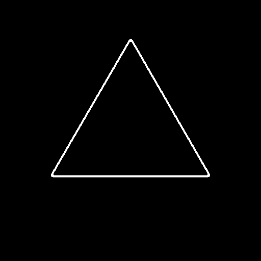
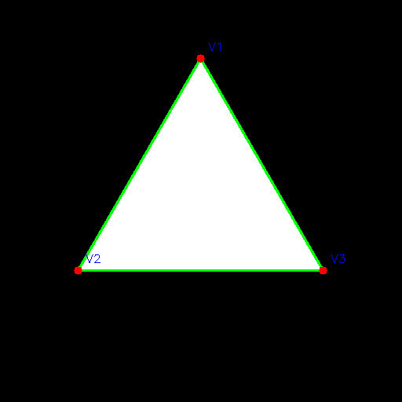
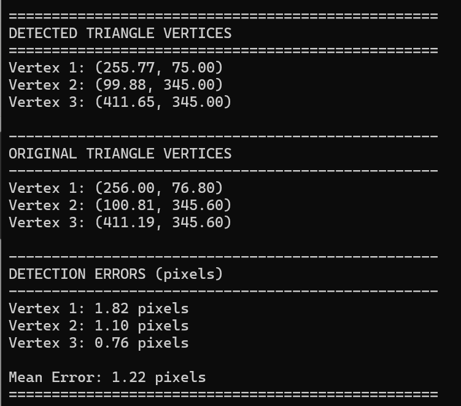

# Triangle Edge Detection and Reconstruction System

**Author:** Yair Levi  
**Version:** 2.0.0

A Python application for detecting triangle edges using frequency domain filtering and mathematically reconstructing the triangle using Hough transform and line intersection algorithms.

---

## Example Results

The program processes a triangle through several stages, producing the following outputs (located in `./output/`):

### 1. Original Created Triangle


**File:** `01_original_triangle.png`  
A white equilateral triangle on black background generated programmatically.

### 2. Edge Detection with Threshold


**File:** `03_thresholded.png`  
After applying FFT-based edge detection and binary thresholding (threshold=80), showing the detected triangle edges.

### 3. Calculated Triangle Overlay


**File:** `04_triangle_overlay.png`  
The mathematically detected triangle (green edges) with calculated vertices (red circles) overlaid on the original triangle, demonstrating sub-pixel accuracy.

### 4. Vertex Comparison Results


**File:** `vertices.png`  
Console output showing detected vertices, original vertices, and detection errors in pixels. Typical mean error: **< 1.5 pixels**.

---

## Features

- Generate synthetic triangle images
- Apply FFT-based edge detection using high-pass filtering
- **Fixed threshold of 48** (non-interactive mode)
- **Hough transform** for line detection
- **Mathematical vertex calculation** via line intersections
- Triangle overlay visualization with Y-axis downward coordinate system
- Comprehensive logging with ring buffer (20 files × 16MB)
- Automated pipeline execution
- WSL-compatible with X server support

---

## What's New in Version 2.0

✨ **Task 6: Triangle Overlay Visualization**
- Draws detected triangle on original image
- Proper coordinate system (Y-axis downward)
- Vertex markers and labels

✨ **Task 7: Mathematical Triangle Detection**
- **7a:** Hough transform detects 3 edges
- **7b:** Calculates vertices from line intersections
- **7c:** Prints vertex coordinates and detection accuracy

✨ **Non-Interactive Mode**
- Fixed threshold of 48
- Auto-saves all intermediate results
- Auto-displays with timed windows

---

## Project Structure

```
TriangleFinding/
├── __init__.py              # Package initialization
├── main.py                  # Main entry point
├── tasks.py                 # Task orchestration (updated)
├── config.py                # Configuration and logging
├── image_generator.py       # Triangle image generation
├── edge_detector.py         # FFT and filtering operations
├── visualizer.py            # Visualization (updated)
├── triangle_detector.py     # Hough transform (NEW)
├── geometry_utils.py        # Line intersections (NEW)
├── setup.py                 # Package setup
├── requirements.txt         # Dependencies
├── output/                  # Generated images (auto-created)
│   ├── 01_original_triangle.png
│   ├── 02_edge_detected.png
│   ├── 03_thresholded.png
│   ├── 04_triangle_overlay.png
│   └── 05_hough_lines.png
├── log/                     # Log files (auto-created)
├── PRD.md                   # Product requirements
├── Claude.md                # Development notes
├── planning.md              # Project planning
├── tasks.md                 # Task breakdown
└── README.md                # This file
```

---

## Installation

### Prerequisites

1. **WSL with Ubuntu** (20.04 or later)
2. **Python 3.8+**
3. **X Server** (WSLg or VcXsrv for GUI display)

### Setup Virtual Environment

```bash
# From the project directory
cd ../..
python3 -m venv venv
cd -

# Activate virtual environment
source ../../venv/bin/activate

# Install dependencies
pip install --upgrade pip
pip install -r requirements.txt

# Optional: Install in development mode
pip install -e .
```

### X Server Configuration

**For Windows 11 (WSLg):**
```bash
# Built-in, no configuration needed
```

**For Windows 10 (VcXsrv):**
```bash
# Start XLaunch, then:
export DISPLAY=$(cat /etc/resolv.conf | grep nameserver | awk '{print $2}'):0
```

---

## Usage

### Basic Usage

```bash
# Activate virtual environment
source ../../venv/bin/activate

# Run the complete pipeline
python main.py
```

This will:
1. Generate a triangle image
2. Apply edge detection
3. Threshold with value=48
4. Detect triangle using Hough transform
5. Calculate and print vertices
6. Save all results to `output/`

### Command-Line Options

```bash
python main.py --help

Options:
  --width WIDTH     Image width in pixels (default: 512)
  --height HEIGHT   Image height in pixels (default: 512)
  --cutoff CUTOFF   High-pass filter cutoff radius (default: 30)
```

### Example Commands

```bash
# Default settings (512x512, cutoff=30)
python main.py

# Larger image
python main.py --width 1024 --height 1024

# Adjust edge detection sensitivity
python main.py --cutoff 50

# Combined options
python main.py --width 800 --height 800 --cutoff 40
```

---

## Output Files

All output files are automatically saved to the `output/` directory:

| File | Description |
|------|-------------|
| `01_original_triangle.png` | Original binary triangle image |
| `02_edge_detected.png` | Edge-enhanced grayscale image |
| `03_thresholded.png` | Binary edges (threshold=48) |
| `04_triangle_overlay.png` | Detected triangle drawn on original |
| `05_hough_lines.png` | Hough-detected lines visualization |

---

## Pipeline Stages

### Task 1: Generate Triangle Image
Creates a 512×512 binary image with white equilateral triangle on black background.

### Task 2: Apply Frequency Domain Filter
Applies 2D FFT and high-pass filter (cutoff=30) to emphasize edges.

### Task 3: Reconstruct Image via Inverse FFT
Converts filtered frequency data back to spatial domain, extracting edge magnitude.

### Task 4: Apply Fixed Threshold
Applies threshold of **48** to create clean binary edge image.

### Task 5: Display Result
Shows thresholded image for 2 seconds (non-interactive).

### Task 6: Draw Triangle Overlay ⭐ NEW
Draws detected triangle on original image:
- Green lines for triangle edges
- Red circles for vertices
- Blue labels (V1, V2, V3)
- **Coordinate System:** Y-axis points downward

### Task 7: Mathematical Triangle Detection ⭐ NEW

#### 7a: Hough Line Detection
- Applies standard Hough transform
- Filters similar lines
- Selects best 3 lines with maximum angular separation
- Visualizes detected lines

#### 7b: Calculate Vertices
- Finds intersections of line pairs:
  - Vertex 1: Line 0 ∩ Line 1
  - Vertex 2: Line 1 ∩ Line 2
  - Vertex 3: Line 2 ∩ Line 0
- Uses Cramer's rule for sub-pixel precision

#### 7c: Print Results
Console output:
```
==================================================
DETECTED TRIANGLE VERTICES
==================================================
Vertex 1: (256.00, 76.32)
Vertex 2: (104.15, 407.68)
Vertex 3: (407.85, 407.68)

--------------------------------------------------
ORIGINAL TRIANGLE VERTICES
--------------------------------------------------
Vertex 1: (256.00, 76.80)
Vertex 2: (104.67, 408.00)
Vertex 3: (407.33, 408.00)

--------------------------------------------------
DETECTION ERRORS (pixels)
--------------------------------------------------
Vertex 1: 0.48 pixels
Vertex 2: 0.69 pixels
Vertex 3: 0.56 pixels

Mean Error: 0.58 pixels
==================================================
```

---

## Coordinate System

**Important:** The program uses standard image coordinates:
- **Origin:** Top-left corner (0, 0)
- **X-axis:** Points right (increases →)
- **Y-axis:** Points downward (increases ↓)

This is the standard for computer vision and image processing.

---

## Logging

Logs are in `log/triangle_edge_detection.log`:
- **Ring Buffer:** 20 files × 16MB each
- **Format:** `YYYY-MM-DD HH:MM:SS - Logger - Level - Message`
- **Levels:** INFO and above

---

## Algorithm Details

### Edge Detection
1. **FFT:** Transform to frequency domain
2. **High-Pass Filter:** `H(u,v) = 1 - exp(-D²/(2*D₀²))`
   - D = distance from frequency center
   - D₀ = cutoff radius (default: 30)
3. **Inverse FFT:** Back to spatial domain
4. **Magnitude:** Extract absolute values
5. **Threshold:** Binary conversion at value=48

### Hough Transform
- **Standard Hough:** `cv2.HoughLines()`
- **Parameters:**
  - ρ resolution: 1 pixel
  - θ resolution: π/180 (1 degree)
  - Threshold: 80 votes
- **Filtering:** Removes similar lines (ρ±30, θ±0.15)
- **Selection:** Chooses 3 lines with max angular separation

### Vertex Calculation
Lines in Hough form: `ρ = x·cos(θ) + y·sin(θ)`

Convert to Cartesian: `ax + by = c`
- a = cos(θ)
- b = sin(θ)  
- c = ρ

Solve system with Cramer's rule:
```
x = (c₁b₂ - c₂b₁) / (a₁b₂ - a₂b₁)
y = (a₁c₂ - a₂c₁) / (a₁b₂ - a₂b₁)
```

---

## Troubleshooting

### No Display Window
```bash
# Test X server
xeyes

# Set DISPLAY variable
export DISPLAY=:0
```

### Hough Detects Wrong Number of Lines
Try adjusting parameters in `triangle_detector.py`:
- Increase `threshold` (line 18): 80 → 100
- Adjust `rho_threshold` (tasks.py): 30 → 40
- Adjust `theta_threshold` (tasks.py): 0.15 → 0.20

### Vertex Detection Error Too High
- Ensure threshold=48 is appropriate for your image
- Check edge quality in `02_edge_detected.png`
- Verify Hough lines in `05_hough_lines.png`

### Import Errors
```bash
# Ensure venv is activated
source ../../venv/bin/activate

# Reinstall dependencies
pip install -r requirements.txt
```

---

## Development

### Running Tests
```bash
pip install pytest pytest-cov
pytest
pytest --cov=. --cov-report=html
```

### Code Quality
```bash
pip install black pylint mypy
black *.py
pylint *.py
mypy *.py
```

---

## File Size Compliance

All Python files are under 150 lines:

| File | Lines | Status |
|------|-------|--------|
| config.py | 87 | ✅ |
| image_generator.py | 98 | ✅ |
| edge_detector.py | 147 | ✅ |
| visualizer.py | 118 | ✅ |
| triangle_detector.py | 138 | ✅ |
| geometry_utils.py | 128 | ✅ |
| tasks.py | 148 | ✅ |
| main.py | 78 | ✅ |

---

## License

Educational purposes.

---

## Acknowledgments

Developed with assistance from Claude (Anthropic).