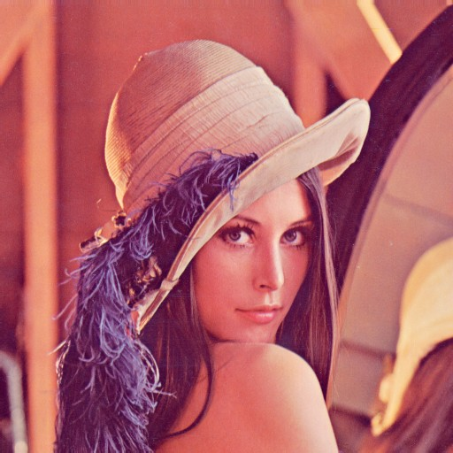
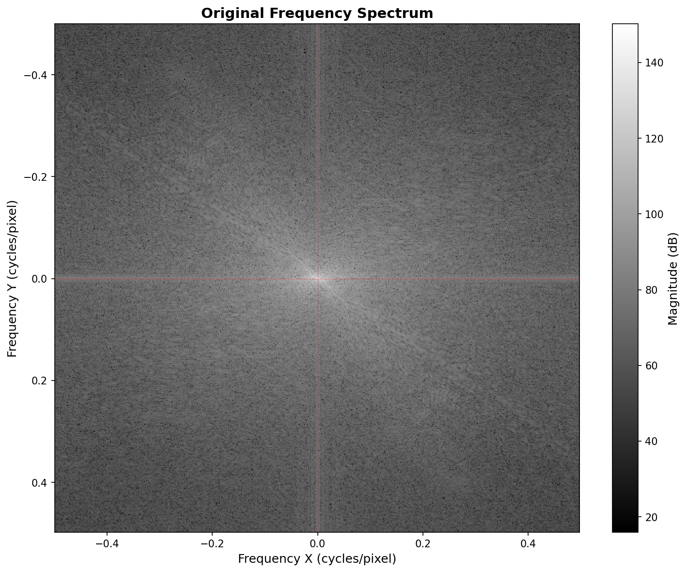
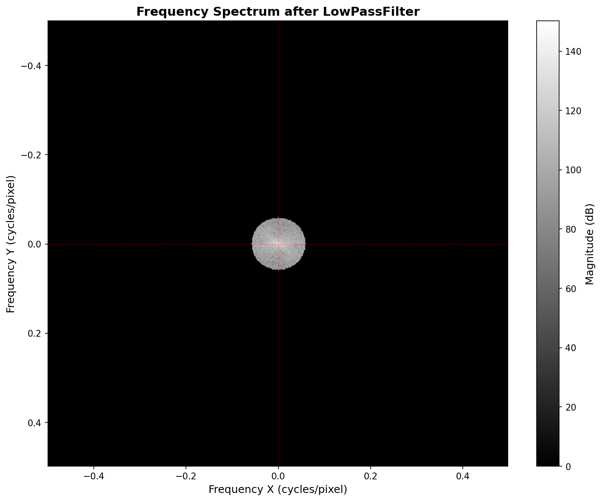
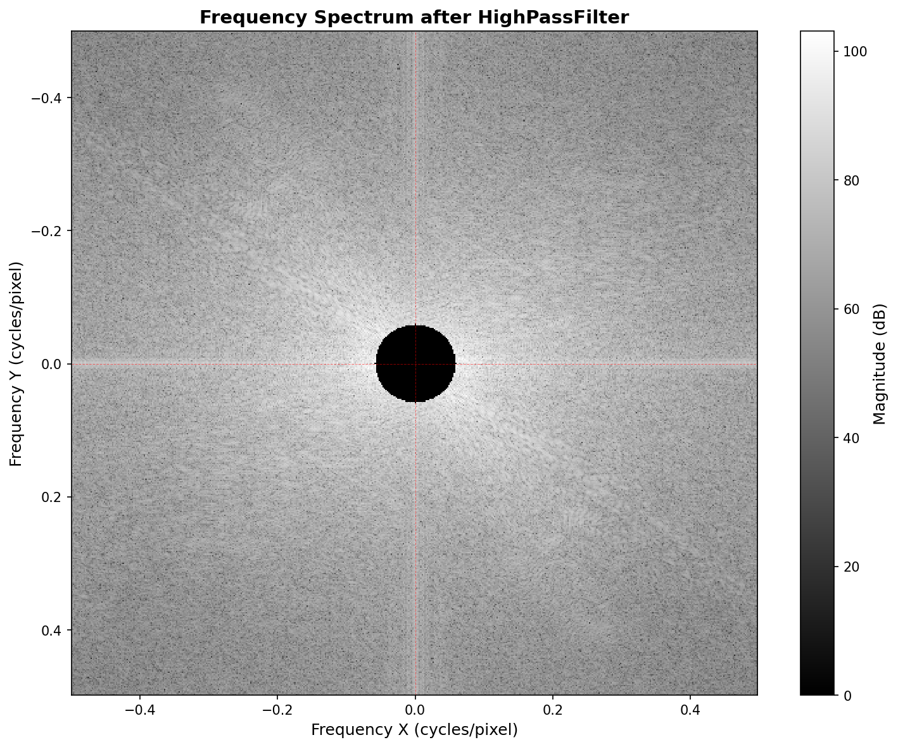
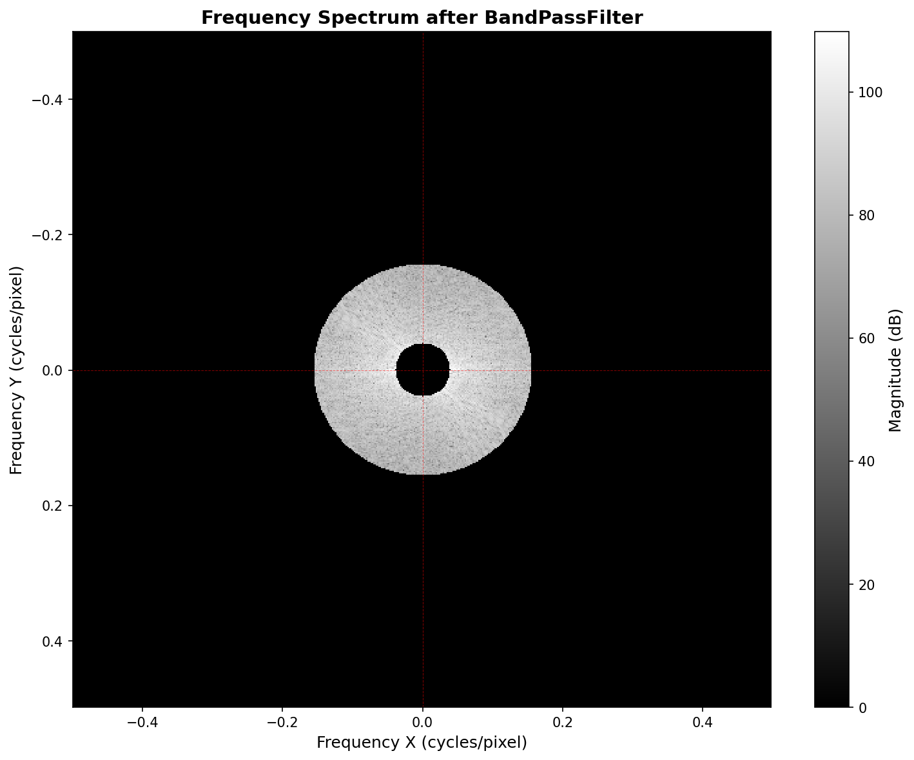

# Image Frequency Filter Application

**Author:** Yair Levi  
**Date:** January 19, 2026  
**Version:** 1.0.0

A Python application for applying frequency domain filters to images using Fast Fourier Transform (FFT). Supports High-Pass Filter (HPF), Low-Pass Filter (LPF), and Band-Pass Filter (BPF) operations with parallel processing capabilities.

---

## Visual Examples

### Original Image and Spectrum
<p align="center">
  
  
</p>

### Low-Pass Filter (Smoothing)
<p align="center">
  
  
</p>
*Low-Pass Filter keeps low frequencies (center), removes high frequencies (edges). Result: smooth, blurred image.*

### High-Pass Filter (Edge Enhancement)
<p align="center">
  
  
</p>
*High-Pass Filter removes low frequencies (center), keeps high frequencies (edges). Result: sharp edges, enhanced details.*

### Band-Pass Filter (Mid-Frequency Isolation)
<p align="center">
  
  
</p>
*Band-Pass Filter keeps only mid-range frequencies (ring pattern). Result: texture and pattern preservation.*

---

## Features

- **FFT-based Image Processing**: Convert images to frequency domain and apply filters
- **Multiple Filter Types**: 
  - High-Pass Filter (HPF) - Remove low frequencies (edge enhancement)
  - Low-Pass Filter (LPF) - Remove high frequencies (smoothing/blurring)
  - Band-Pass Filter (BPF) - Isolate specific frequency ranges
- **Spectrum Visualization**: View frequency spectrum before and after each filter
- **Parallel Processing**: Multiprocessing support for faster filter application
- **Comprehensive Output**: Generate frequency spectrum and comparison images
- **Ring Buffer Logging**: Efficient logging with 20 files × 16MB rotation
- **WSL Compatible**: Designed to work in Windows Subsystem for Linux

## Installation

### Prerequisites

- Python 3.8 or higher
- WSL (Windows Subsystem for Linux) or Linux environment
- Virtual environment support

### Quick Setup

1. **Navigate to project directory:**
   ```bash
   cd /mnt/c/Users/yair0/AI_continue/Lesson32_imageProcessing/imageFilter
   ```

2. **Run setup script:**
   ```bash
   chmod +x setup.sh
   ./setup.sh
   ```

   This will:
   - Create directory structure (input/, output/, log/)
   - Set up virtual environment at `../../venv/`
   - Install required packages

3. **Manual setup (alternative):**
   ```bash
   # Create virtual environment
   python3 -m venv ../../venv
   
   # Activate it
   source ../../venv/bin/activate
   
   # Install dependencies
   pip install -r requirements.txt
   
   # Create directories
   mkdir -p input output log
   ```

## Usage

### Basic Usage

1. **Place your image in the `input/` directory**

2. **Run the application:**
   ```bash
   # Apply all filters (HPF, LPF, BPF)
   python main.py --input your_image.jpg --filter all
   
   # Apply only HPF
   python main.py --input your_image.jpg --filter hpf
   
   # Apply only LPF
   python main.py --input your_image.jpg --filter lpf
   
   # Apply only BPF
   python main.py --input your_image.jpg --filter bpf
   ```

### Command-Line Options

```
--input FILENAME        Input image file (required, must be in input/ directory)
--filter {hpf,lpf,bpf,all}  Filter type to apply (default: all)
--hpf-cutoff FLOAT      HPF cutoff frequency in pixels (default: 30.0)
--lpf-cutoff FLOAT      LPF cutoff frequency in pixels (default: 30.0)
--low-cutoff FLOAT      BPF lower cutoff frequency (default: 20.0)
--high-cutoff FLOAT     BPF upper cutoff frequency (default: 80.0)
--show                  Display results interactively (may not work in WSL)
--no-save               Don't save output images
--no-multiprocessing    Disable parallel processing
```

### Examples

```bash
# High-pass filter with custom cutoff
python main.py --input photo.png --filter hpf --hpf-cutoff 40

# Low-pass filter with custom cutoff
python main.py --input photo.png --filter lpf --lpf-cutoff 25

# Band-pass filter with custom frequency range
python main.py --input landscape.jpg --filter bpf --low-cutoff 30 --high-cutoff 70

# Apply all filters with custom settings
python main.py --input test.bmp --filter all --hpf-cutoff 35 --lpf-cutoff 25

# Apply all filters and display results
python main.py --input test.bmp --filter all --show

# Sequential processing (no multiprocessing)
python main.py --input large_image.jpg --filter all --no-multiprocessing
```

## Project Structure

```
imageFilter/
├── __init__.py                 # Package initialization
├── main.py                     # Main application entry point
├── requirements.txt            # Python dependencies
├── setup.sh                    # Setup script
├── README.md                   # This file
│
├── config/                     # Configuration module
│   ├── __init__.py
│   └── settings.py             # Filter and app configuration
│
├── filters/                    # Filter implementations
│   ├── __init__.py
│   ├── base_filter.py          # Abstract base filter class
│   ├── high_pass.py            # High-pass filter
│   ├── low_pass.py             # Low-pass filter
│   └── band_pass.py            # Band-pass filter
│
├── tasks/                      # Processing task modules
│   ├── __init__.py
│   ├── fft_transform.py        # FFT transformation
│   ├── frequency_display.py    # Spectrum visualization
│   ├── filter_apply.py         # Filter application
│   ├── inverse_transform.py    # Inverse FFT
│   └── image_display.py        # Image comparison display
│
├── utils/                      # Utility modules
│   ├── __init__.py
│   ├── logger.py               # Ring buffer logging
│   ├── path_handler.py         # Path management
│   └── image_loader.py         # Image I/O
│
├── input/                      # Input images (place your images here)
├── output/                     # Processed output images
└── log/                        # Log files (20 × 16MB ring buffer)
```

## Output Files

The application generates the following outputs in the `output/` directory:

1. **Original Frequency Spectrum**: `[image]_spectrum_original.png`
   - Logarithmic magnitude spectrum of original image

2. **Filtered Spectra**: 
   - `[image]_spectrum_HighPassFilter.png` - Spectrum after HPF
   - `[image]_spectrum_LowPassFilter.png` - Spectrum after LPF
   - `[image]_spectrum_BandPassFilter.png` - Spectrum after BPF

3. **Filtered Images**: 
   - `[image]_HighPassFilter.png` - Image after HPF (edge enhanced)
   - `[image]_LowPassFilter.png` - Image after LPF (smoothed)
   - `[image]_BandPassFilter.png` - Image after BPF

4. **Comparison Grid**: `[image]_comparison.png`
   - Side-by-side comparison of original and all filtered versions

## How It Works

### Processing Pipeline

1. **Load Image**: Read input image and convert to grayscale
2. **FFT Transform**: Apply 2D Fast Fourier Transform
3. **Visualize Original Spectrum**: Display and save original frequency domain
4. **Apply Filters**: Apply HPF, LPF, and/or BPF in frequency domain
5. **Show Filtered Spectra**: Visualize and save spectrum after each filter
6. **Inverse FFT**: Convert filtered spectrum back to spatial domain
7. **Display Results**: Show/save original vs. filtered comparisons

### Filter Types

**High-Pass Filter (HPF)**
- Removes low frequencies (smooth areas)
- Enhances edges and fine details
- Cutoff parameter controls which frequencies to remove
- Ideal for edge detection and detail enhancement
- Result: Sharp, edge-enhanced image

**Low-Pass Filter (LPF)**
- Removes high frequencies (fine details)
- Smooths the image and reduces noise
- Cutoff parameter controls which frequencies to keep
- Ideal for noise reduction and smoothing
- Result: Blurred, smoothed image

**Band-Pass Filter (BPF)**
- Isolates specific frequency range
- Removes both very low and very high frequencies
- Useful for analyzing specific patterns or textures
- Two cutoff parameters define the frequency band
- Result: Image with only mid-range frequencies

## Logging

The application uses a ring buffer logging system:
- **Location**: `./log/` directory
- **Configuration**: 20 files × 16 MB each
- **Behavior**: When all files are full, oldest file is overwritten
- **Levels**: INFO and above are logged to file
- **Format**: `YYYY-MM-DD HH:MM:SS - module - LEVEL - message`

## Performance

- **Multiprocessing**: Enabled by default for parallel filter application
- **Memory Efficient**: Processes images in-place where possible
- **Optimized FFT**: Uses NumPy's optimized FFT implementation
- **Scalable**: Automatically adjusts to available CPU cores

## Troubleshooting

### Display Issues in WSL
If `--show` doesn't work:
- Remove the `--show` flag (images are still saved)
- Install X server (VcXsrv or Xming) for WSL display support
- Access saved images in `output/` directory

### Path Issues
All paths are relative to project root. If you encounter path errors:
- Ensure you're running from the project directory
- Check that input images are in `input/` directory
- Verify virtual environment is activated

### Memory Issues with Large Images
For very large images:
- Use `--no-multiprocessing` to reduce memory usage
- Consider downscaling the input image first
- Check available system memory

### Import Errors
If you get import errors:
```bash
# Ensure virtual environment is activated
source ../../venv/bin/activate

# Reinstall requirements
pip install -r requirements.txt
```

## Development

### Running Tests
```bash
# Run from project root
pytest tests/  # (when test suite is added)
```

### Code Quality
Each Python file is kept under 150 lines for maintainability:
- Modular design with clear separation of concerns
- Comprehensive logging for debugging
- Type hints for better IDE support
- Docstrings for all public functions

## Technical Details

- **FFT Implementation**: NumPy's `fft2` and `ifft2`
- **Image Processing**: OpenCV for I/O, NumPy for operations
- **Visualization**: Matplotlib with Agg backend (WSL compatible)
- **Multiprocessing**: Python's `multiprocessing.Pool`
- **Path Handling**: `pathlib` for cross-platform compatibility

## License

This project is created for educational purposes.

## Support

For issues or questions:
1. Check the log files in `log/` directory
2. Review the PRD, planning.md, and tasks.md for detailed documentation
3. Consult Claude.md for development guidance

## Author

**Yair Levi**  
January 19, 2026