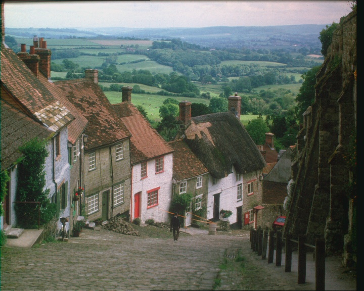
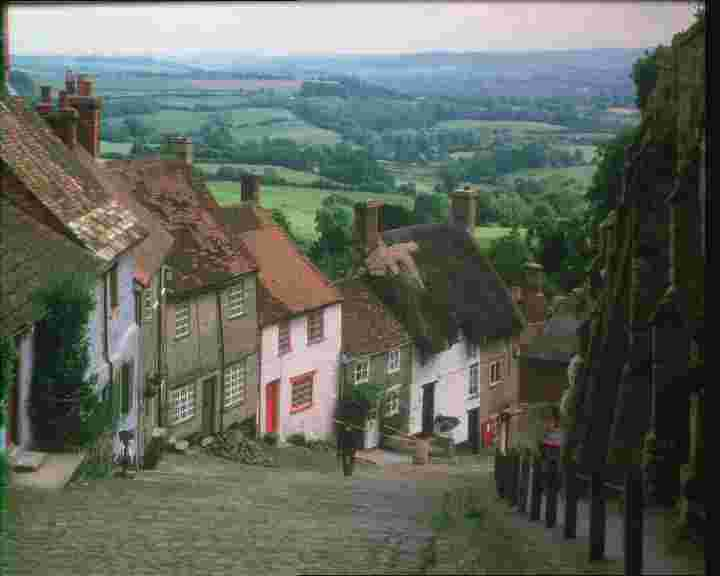
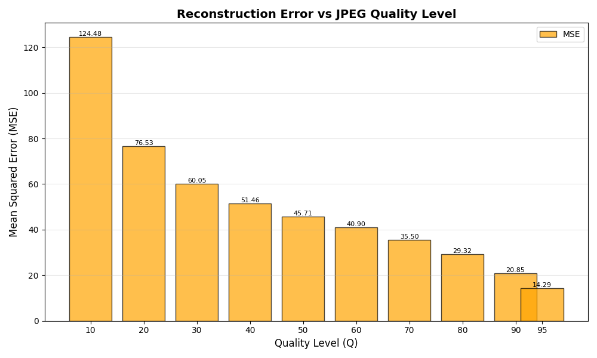
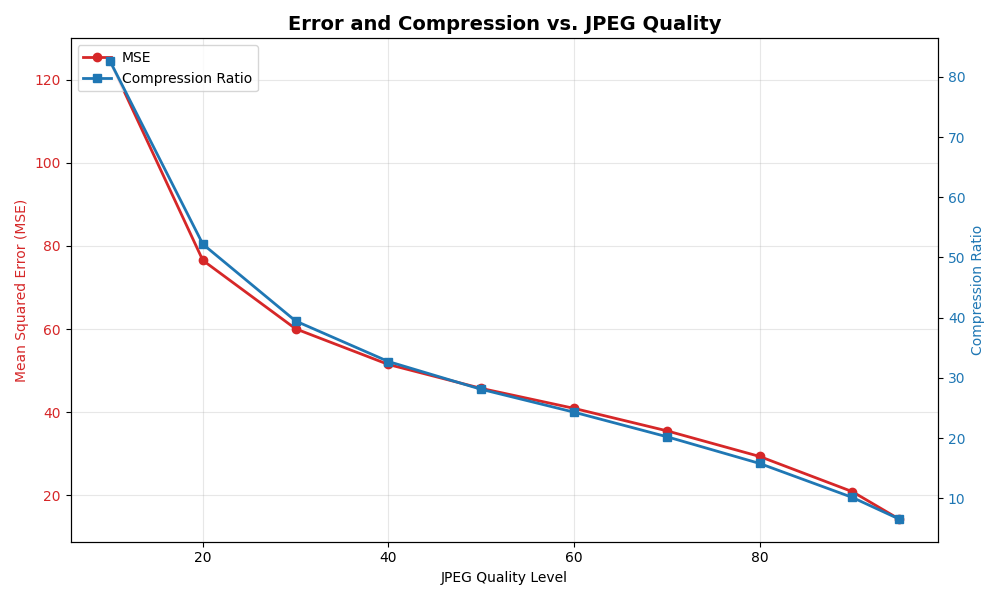

# JPEG Compression Analysis Tool

**Author:** Yair Levi  
**Version:** 1.0.0  
**Platform:** WSL (Windows Subsystem for Linux)

---

## 📊 Sample Results

### Original Input Image


*Original uncompressed BMP image (1215 KB)*

---

### Compression Results Comparison

#### Highest Quality (Q=95)


*JPEG Quality 95 - Near lossless (184 KB, 6.6x compression)*

#### Lowest Quality (Q=10)


*JPEG Quality 10 - Maximum compression (14.7 KB, 82.7x compression)*

---

### Analysis Visualizations

#### File Size vs Quality Level


*Shows dramatic file size reduction with JPEG compression. Original BMP is 1215 KB, while even Q95 (highest quality) achieves 6.6x compression.*

#### Reconstruction Error vs Quality Level


*Mean Squared Error (MSE) decreases as quality increases. Q10 has MSE of 124.48, while Q95 has only 14.29.*

#### Error and Compression Trade-off


*Shows the inverse relationship between compression ratio and error. Higher quality = lower error but less compression.*

---

## 📖 Overview

A Python tool that analyzes JPEG compression by measuring the trade-off between image quality and file size. It compresses images at multiple quality levels, calculates reconstruction errors, and generates visual comparisons through histograms.

### Features

- 🖼️ **Multi-Level Compression** - Compress images at 10 different JPEG quality levels
- 📊 **Error Analysis** - Calculate MSE (Mean Squared Error) and MAE (Mean Absolute Error)
- 📈 **Visualization** - Generate byte distribution and error vs. quality histograms
- ⚡ **Multiprocessing** - Fast parallel processing across quality levels
- 📝 **Comprehensive Logging** - Ring buffer logging (20 files × 16MB)
- 💾 **Metrics Export** - CSV file with all quality metrics

---

## 🚀 Quick Start

### Prerequisites

- WSL (Windows Subsystem for Linux)
- Python 3.8 or higher
- pip package manager

### Installation

1. **Navigate to project directory:**
   ```bash
   cd /mnt/c/Users/yair0/AI_continue/Lesson33_jpeg_compressing/jpeg_compressing
   ```

2. **Create virtual environment** (at `../../venv`):
   ```bash
   cd /mnt/c/Users/yair0/AI_continue
   python3 -m venv venv
   source venv/bin/activate
   ```

3. **Install dependencies:**
   ```bash
   cd Lesson33_jpeg_compressing/jpeg_compressing
   pip install -r requirements.txt
   ```

4. **Add a test image:**
   ```bash
   cp ~/Pictures/sample.jpg data/input/
   ```

5. **Run the analysis:**
   ```bash
   python main.py --input data/input/sample.jpg
   ```

---

## 📂 Project Structure

```
jpeg_compressing/
├── README.md                 # This file
├── Claude.md                 # Detailed user guide
├── planning.md               # Technical planning
├── tasks.md                  # Task checklist
├── requirements.txt          # Python dependencies
├── main.py                   # Main entry point
│
├── tasks/                    # Task modules
│   ├── __init__.py
│   ├── compress_task.py      # JPEG compression
│   ├── decompress_task.py    # Image decompression
│   ├── error_task.py         # Error calculation
│   └── visualize_task.py     # Histogram generation
│
├── utils/                    # Utility modules
│   ├── __init__.py
│   ├── config.py             # Configuration
│   └── logger.py             # Ring buffer logging
│
├── data/
│   └── input/                # Place input images here
│
└── output/
    ├── compressed/           # JPEG compressed images
    ├── decompressed/         # Decompressed images (optional)
    ├── metrics/              # CSV metrics file
    ├── plots/                # Histogram visualizations
    └── logs/                 # Application logs
```

---

## 💻 Usage

### Basic Usage

```bash
python main.py --input data/input/photo.jpg
```

### Command-Line Options

```bash
python main.py [OPTIONS]

Options:
  --input PATH              Path to input image (required)
  --quality-levels LEVELS   Comma-separated quality levels (default: 10,20,30,40,50,60,70,80,90,95)
  --save-decompressed       Save decompressed images to disk
  -h, --help               Show help message
```

### Examples

**Analyze with default quality levels:**
```bash
python main.py --input data/input/landscape.jpg
```

**Custom quality levels:**
```bash
python main.py --input data/input/portrait.jpg --quality-levels 10,50,90
```

**Save decompressed images:**
```bash
python main.py --input data/input/photo.jpg --save-decompressed
```

---

## 📊 Outputs

### 1. Compressed Images
Location: `output/compressed/`

Files: `compressed_q10.jpg` through `compressed_q95.jpg`

### 2. Metrics CSV
Location: `output/metrics/metrics.csv`

Contains:
- Quality level
- Mean Squared Error (MSE)
- Mean Absolute Error (MAE)
- File size (KB)
- Compression ratio

### 3. Visualizations
Location: `output/plots/`

- `byte_histogram_original.png` - Original image pixel distribution
- `byte_histogram_compressed.png` - 2×5 grid of compressed images
- `error_vs_quality.png` - MSE and compression ratio vs. quality

### 4. Logs
Location: `output/logs/`

Ring buffer of 20 log files (16MB each) tracking all operations.

---

## 🔬 Understanding the Results

### Mean Squared Error (MSE)
- **Lower is better** - Indicates less reconstruction error
- Formula: `mean((original - decompressed)²)`
- Emphasizes larger errors due to squaring

### Compression Ratio
- **Higher is better** - More compression achieved
- Formula: `original_size / compressed_size`
- Example: 20× means 20 times smaller

### Finding the Sweet Spot
- Check the error vs. quality plot
- Typical sweet spot: **Q=80-85** for photographs
- Balance between quality (low MSE) and size (high ratio)

---

## ⚙️ Technical Details

### Quality Levels
Default: `[10, 20, 30, 40, 50, 60, 70, 80, 90, 95]`
- 10 = Very low quality, maximum compression
- 95 = Near-lossless, minimal compression

### Multiprocessing
- Parallel compression and decompression
- Utilizes all available CPU cores
- ~5-7× speedup compared to sequential processing

### Error Metrics
**MSE (Primary):**
- Standard metric in image compression
- Sensitive to large errors
- Used for PSNR calculation

**MAE (Secondary):**
- Less sensitive to outliers
- Useful for comparison

---

## 🛠️ Dependencies

```
Pillow>=10.0.0        # Image I/O and JPEG compression
numpy>=1.24.0         # Numerical operations
pandas>=2.0.0         # Data handling
matplotlib>=3.7.0     # Visualization
```

Install all with:
```bash
pip install -r requirements.txt
```

---

## 🐛 Troubleshooting

### "No module named 'PIL'"
```bash
source ../../venv/bin/activate
pip install -r requirements.txt
```

### "FileNotFoundError: Input image not found"
Use relative paths from project root:
```bash
python main.py --input data/input/image.jpg
```

### Multiprocessing not working
Ensure you're using WSL2:
```bash
wsl --list --verbose
# Upgrade if needed
wsl --set-version Ubuntu 2
```

### View logs
```bash
tail -f output/logs/app.log
```

---

## 📈 Performance

### Execution Times
- Small images (<1MP): 5-10 seconds
- Medium images (2-5MP): 15-30 seconds
- Large images (>10MP): 1-2 minutes

### Disk Space
Approximately 10× the input image size for all outputs.

---

## 📚 Documentation

- **README.md** (this file) - Quick reference
- **Claude.md** - Comprehensive user guide
- **planning.md** - Technical architecture
- **tasks.md** - Development checklist

---

## 🔄 Typical Workflow

1. Place image in `data/input/`
2. Run analysis: `python main.py --input data/input/photo.jpg`
3. Check logs: `tail output/logs/app.log`
4. Review metrics: `cat output/metrics/metrics.csv`
5. Open plots: `explorer.exe output/plots/` (from WSL)
6. Analyze results and identify optimal quality level

---

## 🎯 Use Cases

- **Image Optimization** - Find optimal compression for web/mobile
- **Quality Assessment** - Evaluate JPEG quality settings
- **Research** - Study compression algorithms
- **Teaching** - Demonstrate lossy compression concepts

---

## 📄 License

This tool is for educational and research purposes.

---

## 👤 Author

**Yair Levi**  
Date: January 22, 2026

---

## 🙏 Acknowledgments

Built with Python, Pillow, NumPy, Pandas, and Matplotlib.

---

## 📞 Support

For issues or questions:
1. Check logs in `output/logs/`
2. Review the troubleshooting section
3. Consult `Claude.md` for detailed documentation

---

**Ready to analyze JPEG compression? Start with a quick test:**

```bash
python main.py --input data/input/your_image.jpg
```

Happy analyzing! 📊
