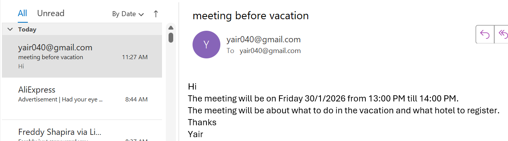
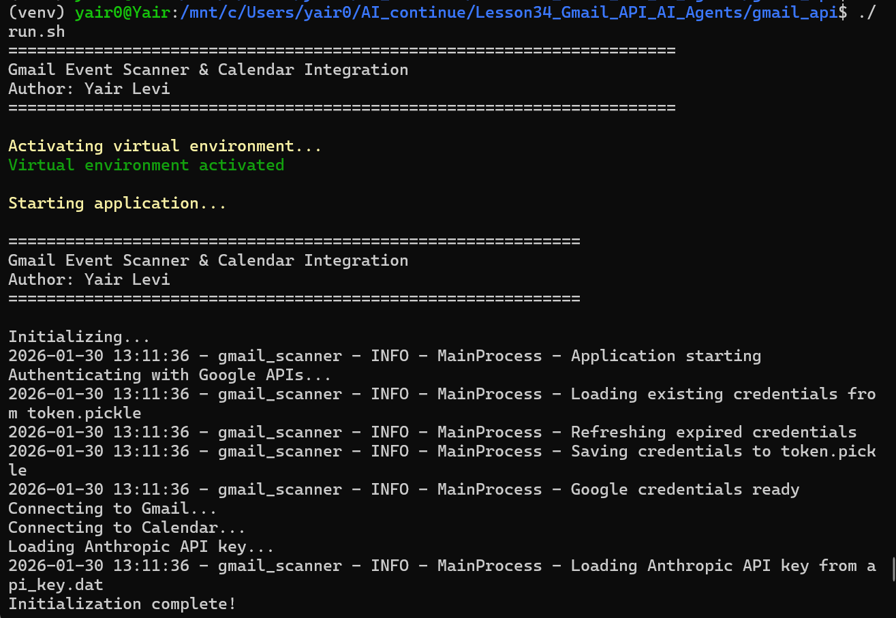
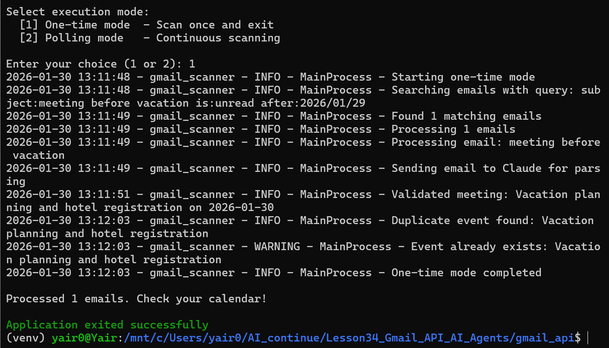
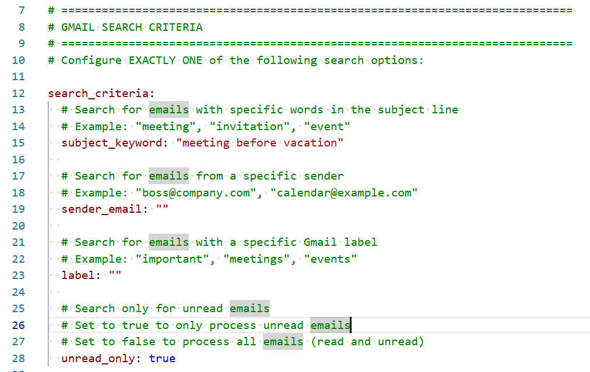
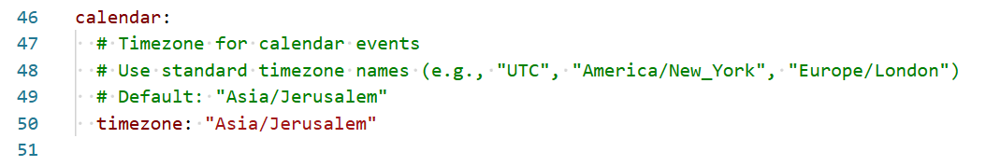

# Gmail Event Scanner & Calendar Integration

**Author:** Yair Levi  
**Version:** 1.0.0  
**Date:** January 29, 2026

Automated scanning of Gmail for meeting invitations with AI-powered parsing and Google Calendar integration.

---

## 📸 Demo & Screenshots

### 1. Sample Email
The application scans Gmail for meeting invitations. Here's an example email:



### 2. Updated Calendar
The extracted meeting details are automatically added to Google Calendar:


### 3. Terminal Output
Running the application in one-time mode (shown in two parts):

**Part 1:**


**Part 2:**


### 4. Configuration File
The application uses a YAML configuration file to define search criteria and timezone settings.

**Search Criteria:**


**Calendar Timezone:**


---

## 🔒 SECURITY WARNING

**⚠️ NEVER COMMIT CREDENTIALS TO GIT ⚠️**

This project handles sensitive credentials. Before using:

1. **READ** `SECURITY.md` completely
2. **VERIFY** `.gitignore` excludes all credential files
3. **NEVER** hardcode API keys in code
4. **ALWAYS** load credentials from files outside repository
5. **CHECK** your commits don't contain secrets

**Protected Files:**
- `credentials/credentials.json` ❌
- `credentials/token.pickle` ❌
- `./Anthropic_API_Key/*` ❌
- Any file containing API keys ❌

See `SECURITY.md` for complete security guidelines.

---

## Features

- 🔍 **Smart Email Scanning** - Search by subject, sender, label, or unread status
- 🤖 **AI-Powered Parsing** - Uses Anthropic's Claude to extract meeting details
- 📅 **Auto Calendar Creation** - Automatically adds events to Google Calendar
- ⚡ **Two Modes** - One-time scan or continuous polling
- 📝 **Ring Buffer Logging** - 20 files × 16MB with automatic rotation
- 🔒 **Secure Authentication** - OAuth 2.0 for Google, API key for Anthropic

---

## Prerequisites

- **Python 3.8+**
- **WSL (Windows Subsystem for Linux)** environment
- **Google Account** with Gmail and Calendar access
- **Anthropic API Key** for Claude AI
- **Virtual Environment** at `../../venv/` (relative to project)

---

## Installation

### 1. Set Up Virtual Environment

```bash
# Navigate to two directories above the project
cd ../..

# Create virtual environment
python3 -m venv venv

# Activate virtual environment
source venv/bin/activate
```

### 2. Install Dependencies

```bash
# Navigate back to project directory
cd AI_continue/Lesson34_Gmail_API_AI_Agents/gmail_api

# Install required packages
pip install -r requirements.txt
```

### 3. Set Up Credentials

#### Google API Credentials

1. Go to [Google Cloud Console](https://console.cloud.google.com/)
2. Create a new project or select existing one
3. Enable Gmail API and Google Calendar API
4. Create OAuth 2.0 credentials
5. Download credentials JSON file
6. Place files in `./credentials/`:
   - `credentials.json` - OAuth 2.0 client credentials
   - `token.pickle` - Authentication token (created on first run)

#### Anthropic API Key

1. Get your API key from [Anthropic Console](https://console.anthropic.com/)
2. Create directory: `./Anthropic_API_Key/`
3. Save key in one of these files:
   - `api_key.dat` (primary)
   - `key.txt` (fallback)
   - `key.txt.pub` (fallback)

### 4. Configure Application

```bash
# Copy example configuration
cp config.yaml config.yaml.backup

# Edit config.yaml with your preferences
nano config.yaml
```

**Configure ONE search criterion:**

```yaml
search_criteria:
  subject_keyword: "meeting"    # OR
  sender_email: "boss@company.com"    # OR
  label: "important"    # OR
  unread_only: true
```

---

## Configuration

### Search Criteria

Configure **exactly ONE** of the following:

| Option | Description | Example |
|--------|-------------|---------|
| `subject_keyword` | Search emails by subject | `"meeting"`, `"invitation"` |
| `sender_email` | Search by sender address | `"boss@company.com"` |
| `label` | Search by Gmail label | `"important"`, `"events"` |
| `unread_only` | Only unread emails | `true` or `false` |

### Polling Settings

```yaml
polling:
  scan_interval_seconds: 300  # Scan every 5 minutes
```

### Calendar Settings

```yaml
calendar:
  timezone: "UTC"  # Your timezone (e.g., "America/New_York")
```

### Advanced Settings

```yaml
system:
  log_level: "INFO"              # DEBUG, INFO, WARNING, ERROR
  max_emails_per_scan: 50        # Limit per scan
  api_retry_attempts: 3          # API retry count
  enable_multiprocessing: true   # Parallel processing
  max_workers: 4                 # Parallel workers
```

---

## Usage

### Activate Virtual Environment

```bash
# Always activate before running
source ../../venv/bin/activate
```

### Run the Application

```bash
# Using the run script (recommended)
./run.sh

# Or run directly
python main.py
```

### Execution Modes

#### One-Time Mode
- Scans Gmail once
- Processes matching emails
- Exits after completion
- Does NOT mark emails as read

```
Select execution mode:
  [1] One-time mode  - Scan once and exit
  [2] Polling mode   - Continuous scanning

Enter your choice (1 or 2): 1
```

#### Polling Mode
- Continuous scanning
- Scans at configured intervals
- Marks processed emails as read
- Only scans emails from yesterday onwards
- Press `Ctrl+C` to stop

```
Select execution mode:
  [1] One-time mode  - Scan once and exit
  [2] Polling mode   - Continuous scanning

Enter your choice (1 or 2): 2
```

---

## Project Structure

```
gmail_api/
├── __init__.py              # Package initialization
├── main.py                  # Application entry point
├── tasks.py                 # Task orchestration
├── config.py                # Configuration management
├── gmail_scanner.py         # Gmail API integration
├── calendar_manager.py      # Calendar API integration
├── email_parser.py          # AI-powered parsing
├── auth_manager.py          # Authentication handling
├── logger_setup.py          # Logging configuration
├── config.yaml              # User configuration
├── requirements.txt         # Python dependencies
├── README.md                # This file
├── PRD.md                   # Product Requirements
├── planning.md              # Development planning
├── tasks.md                 # Task breakdown
├── Claude.md                # Claude AI integration notes
├── artifacts/               # Demo screenshots
│   ├── mail.png             # Sample email screenshot
│   ├── calendar.png         # Calendar event screenshot
│   ├── terminal1.png        # Application running (part 1)
│   ├── terminal2.png        # Application running (part 2)
│   ├── config_search.png    # Search criteria config
│   └── config_calendar.png  # Calendar timezone config
├── credentials/             # API credentials
│   ├── credentials.json
│   └── token.pickle
└── log/                     # Application logs
    └── app.log*
```

---

## Logging

### Log Location
All logs are stored in `./log/` directory.

### Ring Buffer Configuration
- **Files:** 20 total (`app.log`, `app.log.1`, ... `app.log.19`)
- **Size:** 16 MB per file
- **Behavior:** Circular overwrite when full

### Log Levels
- **DEBUG:** Detailed diagnostic information
- **INFO:** General informational messages
- **WARNING:** Warning messages (non-critical issues)
- **ERROR:** Error messages (failures)
- **CRITICAL:** Critical errors (system shutdown)

### View Logs

```bash
# View current log
tail -f log/app.log

# View all logs
cat log/app.log*

# Search logs
grep "ERROR" log/app.log*
```

---

## 🔒 Security

**CRITICAL: This application handles sensitive credentials.**

### Credential Files (NEVER commit these)

```
❌ credentials/credentials.json
❌ credentials/token.pickle
❌ ./Anthropic_API_Key/api_key.dat
❌ ./Anthropic_API_Key/key.txt
❌ ./Anthropic_API_Key/key.txt.pub
```

### Best Practices

1. **Use .gitignore:** Ensure all credential paths are excluded
2. **File Permissions:** Set credentials to 600 (read/write for owner only)
   ```bash
   chmod 600 credentials/credentials.json
   chmod 600 ./Anthropic_API_Key/api_key.dat
   ```
3. **Never Log Secrets:** The code is designed to NOT log API keys
4. **Rotate Regularly:** Change API keys every 90 days
5. **Scan Before Commit:**
   ```bash
   git diff --cached | grep -i "sk-ant-\|AIza\|api_key.*="
   ```

### If Credentials Are Exposed

1. **Immediately revoke** the exposed credentials
2. **Generate new** credentials from respective consoles
3. **Remove from git history** if committed
4. **Notify** if shared inadvertently

**For complete security guidelines, see `SECURITY.md`**

---

## Troubleshooting

### Authentication Issues

**Problem:** `FileNotFoundError: credentials.json not found`

**Solution:**
1. Verify `credentials.json` exists in `./credentials/`
2. Check file permissions
3. Ensure you're running from correct directory

---

**Problem:** `Invalid Anthropic API key`

**Solution:**
1. Verify API key file exists in `./Anthropic_API_Key/`
2. Check file contains valid API key
3. Try alternative filenames (`api_key.dat`, `key.txt`, `key.txt.pub`)

---

### Configuration Issues

**Problem:** `At least one search criterion must be configured`

**Solution:**
Edit `config.yaml` and set ONE of:
- `subject_keyword`
- `sender_email`
- `label`
- `unread_only: true`

---

### Gmail API Issues

**Problem:** `Gmail search failed: Quota exceeded`

**Solution:**
1. Wait for quota reset (daily limit)
2. Reduce `max_emails_per_scan` in config
3. Increase `scan_interval_seconds` in polling mode

---

### Parsing Issues

**Problem:** `Failed to parse email: Missing meeting date`

**Solution:**
- Email may not contain meeting information
- Check email content manually
- Update search criteria to be more specific

---

### Calendar Issues

**Problem:** `Event already exists`

**Solution:**
- This is normal behavior (prevents duplicates)
- Event was already created in previous run
- No action needed

---

## FAQ

**Q: How does the date filtering work?**

A: The application only processes emails from yesterday onwards. This prevents processing very old emails and reduces API usage.

---

**Q: Can I run both modes simultaneously?**

A: No, you must choose one mode per execution. Run separate instances for different configurations.

---

**Q: What happens if I interrupt polling mode?**

A: The application catches `Ctrl+C` and shuts down gracefully, ensuring no data corruption.

---

**Q: How accurate is the AI parsing?**

A: Claude typically achieves >90% accuracy for well-formatted meeting emails. Complex or ambiguous emails may require manual review.

---

**Q: Does the app support recurring meetings?**

A: Not in version 1.0. Each email creates a single calendar event.

---

**Q: Can I customize the parsing logic?**

A: Yes, modify the prompt in `email_parser.py`. See `Claude.md` for detailed guidance.

---

## Performance Tips

1. **Reduce Email Volume**
   - Use specific search criteria
   - Set `max_emails_per_scan` appropriately

2. **Optimize Polling Interval**
   - Balance between responsiveness and API usage
   - Recommended: 300-900 seconds (5-15 minutes)

3. **Enable Multiprocessing**
   - Set `enable_multiprocessing: true` in config
   - Useful for processing many emails simultaneously

4. **Monitor Logs**
   - Regularly check logs for errors
   - Archive old logs to save disk space

---

## Contributing

This is a personal project by Yair Levi. For questions or improvements, please contact the author.

---

## License

Proprietary - All rights reserved.

---

## Changelog

### Version 1.0.0 (January 29, 2026)
- Initial release
- Gmail scanning with configurable criteria
- AI-powered email parsing using Claude
- Google Calendar integration
- One-time and polling modes
- Ring buffer logging system
- Multiprocessing support

---

## Support

For issues or questions:
1. Check this README
2. Review `PRD.md` for detailed specifications
3. Check `Claude.md` for AI integration details
4. Review logs in `./log/` directory

---

## Acknowledgments

- **Anthropic** - Claude AI for email parsing
- **Google** - Gmail and Calendar APIs
- **Python Community** - Excellent libraries

---

**Thank you for using Gmail Event Scanner!**
