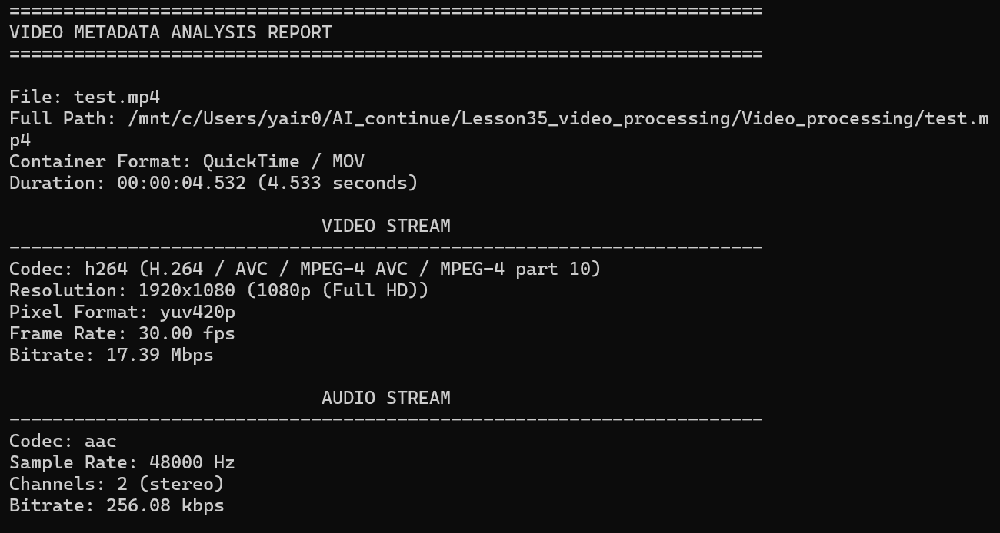
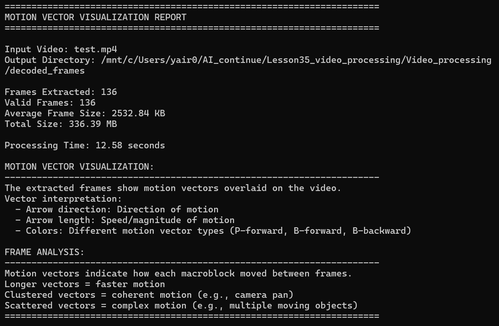
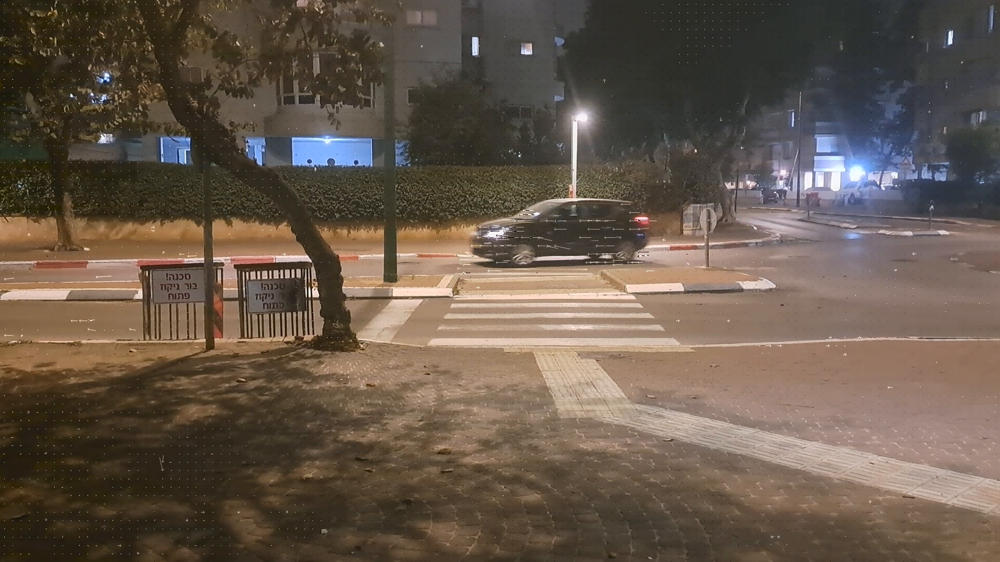

# Video Processing Analysis Tool

**Note:** The example input file used in this documentation is `test.mp4` located in the `/Video_processing/` folder.

A Python package for analyzing video files, visualizing motion vectors, and overlaying moving objects onto video frames for educational purposes.

---

## Example Outputs

All example artifacts shown below are located in the `/Video_processing/artifacts/` folder:

### Task 1: Video Metadata Analysis

#### Container and Stream Information



*Shows comprehensive information about the video container format, video stream (codec, resolution, frame rate, bitrate), and audio stream (codec, sample rate, channels, bitrate)*

#### GOP (Group of Pictures) Analysis


*Demonstrates the GOP structure used in the test video with frame distribution:*
- **I-Frames:** 4% (keyframes)
- **P-Frames:** 96% (predicted frames)
- **B-Frames:** 0% (no bi-directional frames in this video)

---

### Task 2: Motion Vector Visualization

#### Motion Vector Explanation



*Contains detailed explanations about motion vectors and their visualization, including how to interpret the vector overlays on decoded frames*

#### Example Decoded Frame with Motion Vectors



*A real example of frame #56 extracted from the video with motion vectors overlaid, showing the macro blocks and directional arrows indicating motion between frames*

---

### Task 3: Moving Object Overlay

**Output:** `test_with_object.mp4` in `/Video_processing/` folder

**Process:**
1. Takes the original input video (`test.mp4`)
2. Extracts all frames from the source video
3. Overlays a **black rectangle** (20×10 pixels) on each frame
4. The rectangle moves diagonally from **upper-left to bottom-right** corner
5. Re-encodes the frames into a new video

This demonstrates how motion compression works by introducing predictable motion into the video.

---

## Overview

This tool is designed for **Lesson 35: Video Processing** and provides three main functionalities:

1. **Task 1:** Extract and analyze comprehensive video metadata including GOP structure
2. **Task 2:** Visualize motion vectors on extracted frames
3. **Task 3:** Overlay a moving object onto video frames to demonstrate motion compression

---

## Features

- **Comprehensive Metadata Extraction:** Container format, codecs, dimensions, bitrates, GOP analysis
- **Motion Vector Visualization:** Extract frames with motion vector overlays showing P-frame and B-frame motion
- **Moving Object Overlay:** Add a moving rectangle to video frames for compression analysis
- **Ring Buffer Logging:** 20 log files × 16MB each with automatic rotation
- **Multiprocessing Support:** Parallel frame processing for improved performance
- **Flexible CLI:** Run individual tasks or all tasks sequentially

---

## Requirements

### System Requirements
- **Operating System:** WSL (Windows Subsystem for Linux), Linux, or macOS
- **Python:** 3.8 or higher
- **FFmpeg:** 4.0 or higher (must be installed separately)
- **Disk Space:** At least 500MB free

### Python Dependencies
```
Pillow>=10.0.0
numpy>=1.24.0
```

Install dependencies:
```bash
pip install -r requirements.txt
```

### FFmpeg Installation

**Ubuntu/WSL:**
```bash
sudo apt update
sudo apt install ffmpeg
```

**macOS:**
```bash
brew install ffmpeg
```

**Windows:**
Download from https://ffmpeg.org/download.html

**Verify Installation:**
```bash
ffmpeg -version
ffprobe -version
```

---

## Installation

1. Clone or download the project
2. Navigate to the project directory:
```bash
cd /path/to/Lesson35_video_processing/Video_processing/
```

3. Install Python dependencies:
```bash
pip install -r requirements.txt
```

4. Verify FFmpeg is installed:
```bash
ffmpeg -version
```

---

## Usage

### General Command Format

```bash
python3 -m Video_processing.main [OPTIONS]
```

### Task 1: Video Metadata Analysis

Extract comprehensive metadata including GOP structure, frame types, and stream information.

```bash
python3 -m Video_processing.main --task 1 --input video.mp4
```

**Output includes:**
- Container format and duration
- Video codec, resolution, frame rate, bitrate
- Audio codec, sample rate, channels, bitrate
- GOP analysis: I-frame, P-frame, B-frame counts and percentages
- Frame type distribution

**Example outputs:**


---

### Task 2: Motion Vector Visualization

Extract all frames with motion vector overlays visualizing inter-frame motion.

```bash
python3 -m Video_processing.main --task 2 --input video.mp4
```

**Output:**
- Frames saved to `./decoded_frames/` directory
- Each frame shows macro blocks and motion vectors as directional arrows
- Motion analysis summary

**Motion Vector Explanation:**


**Example Frame Output:**


---

### Task 3: Moving Object Overlay

Extract frames from the input video, overlay a moving black rectangle, and re-encode.

```bash
python3 -m Video_processing.main --task 3 --input test.mp4
```

**What it does:**
1. Extracts all frames from `test.mp4`
2. Draws a 20×10 pixel black rectangle on each frame
3. Rectangle moves diagonally from top-left to bottom-right
4. Re-encodes frames into `test_with_object.mp4`

**Optional: Specify output filename:**
```bash
python3 -m Video_processing.main --task 3 --input test.mp4 --output custom_output.mp4
```

**Output:** `test_with_object.mp4` in `/Video_processing/`

---

### Run All Tasks

Execute all three tasks sequentially:

```bash
python3 -m Video_processing.main --all --input video.mp4
```

This will:
1. Analyze video metadata
2. Extract frames with motion vectors
3. Generate video with moving object overlay

---

## Command-Line Options

```
--task {1,2,3}        Run specific task (1: Metadata, 2: Motion Vectors, 3: Overlay)
--all                 Run all tasks sequentially
--input PATH          Input video file path (required)
--output PATH         Output file path (Task 3 only, default: <input>_with_object.mp4)
--width WIDTH         Video width (Task 3, default: 1280)
--height HEIGHT       Video height (Task 3, default: 720)
--fps FPS             Frames per second (Task 3, default: 30)
--duration DURATION   Video duration in seconds (Task 3, default: 10)
--version             Show version information
--help                Show help message
```

---

## Project Structure

```
Video_processing/
├── __init__.py
├── main.py              # Main entry point
├── config.py            # Configuration constants
├── cli_handlers.py      # CLI task handlers
├── utils/
│   ├── __init__.py
│   ├── logger.py        # Ring buffer logging
│   ├── ffmpeg_wrapper.py
│   ├── metadata_helpers.py
│   └── video_generation_helpers.py
├── tasks/
│   ├── __init__.py
│   ├── task1_metadata.py
│   ├── task2_motion_vectors.py
│   └── task3_generate_video.py
├── log/
│   └── video_processing.log
├── decoded_frames/      # Output from Task 2
├── artifacts/           # Example outputs
│   ├── metadata1.png
│   ├── metadata2.png
│   ├── motion_vectors.png
│   └── frame_0056.png
├── test.mp4            # Example input video
├── test_with_object.mp4 # Example Task 3 output
└── requirements.txt
```

---

## Logging

- **Location:** `./log/video_processing.log`
- **Format:** Ring buffer with 20 files × 16MB each
- **Rotation:** When the 20th file fills up, the oldest file (file 1) is overwritten
- **Level:** INFO and above

**View logs:**
```bash
tail -f log/video_processing.log
```

---

## Examples

### Example 1: Analyze a Video

```bash
python3 -m Video_processing.main --task 1 --input sample_video.mp4
```

**Output:**
```
========================================
Video Metadata Analysis
========================================
Container Format: MP4 (H.264/AAC)
Duration: 00:01:23.456
Video Stream: H.264, 1920x1080 (1080p), 30 fps
Audio Stream: AAC, 48000 Hz, Stereo, 128 kbps

GOP Analysis:
  I-Frames: 25 (4%)
  P-Frames: 600 (96%)
  B-Frames: 0 (0%)
  Total GOPs: 25
```

### Example 2: Extract Motion Vectors

```bash
python3 -m Video_processing.main --task 2 --input sample_video.mp4
```

Creates decoded frames in `./decoded_frames/` with motion vector overlays.

### Example 3: Create Test Video with Moving Object

```bash
python3 -m Video_processing.main --task 3 --input test.mp4
```

Generates `test_with_object.mp4` with a moving black rectangle overlaid on the original video frames.

---

## Troubleshooting

### FFmpeg Not Found
```
Error: ffmpeg not found. Please install FFmpeg.
```
**Solution:** Install FFmpeg using your package manager (see Installation section)

### Input File Not Found
```
Error: Input file not found: video.mp4
```
**Solution:** Ensure the video file exists in `/Video_processing/` or provide the full path

### Permission Denied
```
Error: Permission denied
```
**Solution:** Check file permissions:
```bash
chmod +x Video_processing/main.py
chmod -R 755 Video_processing/
```

### No Motion Vectors Visible
**Solution:** The video codec may not support motion vector export. Use H.264 encoded videos.

---

## Technical Details

### GOP Structure Analysis
The tool analyzes the Group of Pictures (GOP) structure in compressed video:
- **I-Frames (Intra-coded):** Complete frames, no dependencies
- **P-Frames (Predicted):** Reference previous frames
- **B-Frames (Bi-directional):** Reference both past and future frames

### Motion Vectors
Motion vectors indicate how macro blocks move between frames:
- **Arrow direction:** Direction of motion
- **Arrow length:** Speed/magnitude of motion
- **Colors:** Different vector types (P-forward, B-forward, B-backward)

### Task 3 Technical Implementation
1. Uses FFprobe to detect source video properties (resolution, FPS)
2. Extracts all frames using FFmpeg
3. Opens each frame with PIL (Pillow)
4. Calculates rectangle position for linear diagonal motion
5. Draws 20×10 pixel black rectangle at calculated position
6. Saves modified frame
7. Re-encodes all frames using H.264 codec

---

## Educational Purpose

This tool is designed for **Lesson 35: Video Processing** to help students understand:
- How video compression works
- The role of different frame types (I/P/B)
- How motion estimation reduces file size
- The structure of modern video codecs

---

## License

This project is for educational purposes.

---

## Author

**Yair Levi**  
**Project:** Lesson 35 - Video Processing  
**Date:** February 2026  
**Version:** 1.0.0

---

## Version History

- **1.0.0** (February 2026)
  - Initial release
  - Task 1: Metadata extraction and GOP analysis
  - Task 2: Motion vector visualization
  - Task 3: Moving object overlay on video frames
  - Ring buffer logging system
  - Multiprocessing support for frame processing
