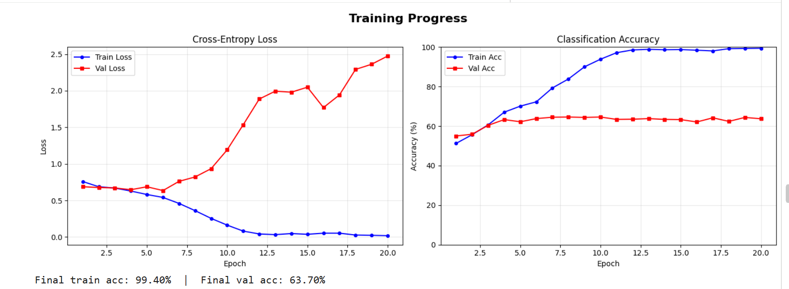
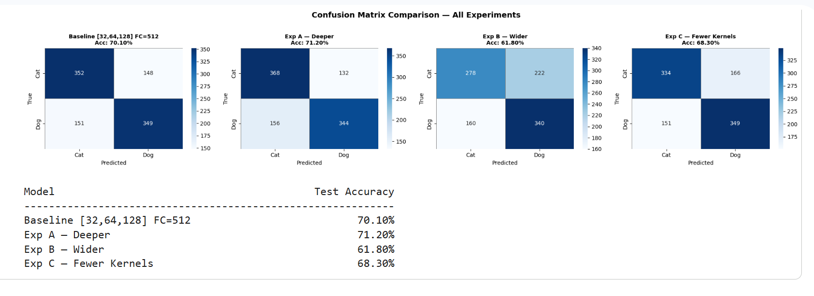

# 🐱 vs 🐶 Cat / Dog Image Classifier

**Author:** Yair Levi  
**Version:** 1.0 — February 2026  
**Platform:** Google Colab + PyTorch

Binary image classification using a Convolutional Neural Network (CNN) that distinguishes between photographs of cats and dogs. The project is delivered as a fully annotated Google Colab notebook covering the complete ML pipeline — from raw images to improvement experiments.

---

## 📉 Training Results & Analysis

### Training Progress



> **Final train accuracy: 99.40% — Final validation accuracy: 63.70%**

#### 🔴 Overfitting Detected

The training curves reveal a classic **overfitting** pattern:

- The **train loss** (blue) steadily decreases toward ~0 across all 20 epochs, while the **train accuracy** climbs to near 100%.
- The **validation loss** (red) initially decreases alongside training loss (epochs 1–6), but then **diverges sharply upward** from epoch 7 onward — even as train loss keeps falling.
- The **validation accuracy** plateaus around **63–65%** from epoch 5 onwards and never improves further.

This tells us the model has **memorised the training set** rather than learning generalisable features. The gap between 99.4% train accuracy and 63.7% validation accuracy (~36 percentage points) is a strong indicator of overfitting.

The three architectural experiments (deeper, wider, fewer kernels) **did not resolve this problem** — they only changed how fast or severely the overfitting occurred, not whether it occurred.

---

### Confusion Matrix Comparison — All Experiments



#### 📊 Accuracy is Low Across All Configurations

| Model | Test Accuracy |
|---|---|
| Baseline `[32, 64, 128]` FC=512 | **70.10%** |
| Exp A — Deeper `[32, 64, 128, 256]` | 71.20% *(+1.1%)* |
| Exp B — Wider `[64, 128, 256]` FC=1024 | 61.80% *(-8.3%)* |
| Exp C — Fewer Kernels `[16, 32, 64]` | 68.30% *(-1.8%)* |

The best result — **71.2%** from the deeper model — is only marginally better than the baseline, and all models struggle particularly with **cats being misclassified as dogs** (high False Negative rate for cats). The wider model (Exp B) actually performs **worse**, suggesting that adding more parameters without addressing the root cause (overfitting on a small dataset) is counterproductive.

**None of the architectural changes alone were sufficient** to overcome the fundamental limitation of having only 2,000 training images.

---

## 🔬 Next Steps — Recommended Improvements

To meaningfully improve beyond ~70% accuracy, the following techniques should be explored, roughly in order of expected impact:

| Technique | What it does | Expected Impact |
|---|---|---|
| 🖼️ **Data Augmentation** | Random flips, crops, rotations, colour jitter applied on-the-fly during training — effectively multiplies dataset size | ⭐⭐⭐⭐⭐ High |
| 📦 **More Data (10K–50K images)** | A larger dataset directly reduces overfitting by giving the model more diverse examples to generalise from | ⭐⭐⭐⭐⭐ High |
| 🔁 **Transfer Learning** | Use a pretrained backbone (ResNet, EfficientNet, VGG) trained on ImageNet's 1.2M images — freeze early layers, fine-tune the top | ⭐⭐⭐⭐⭐ High |
| 🛑 **Early Stopping** | Stop training when validation loss stops improving — prevents the model from over-memorising the training set | ⭐⭐⭐⭐ Medium-High |
| 📐 **Batch Normalization** | Normalises activations between layers — stabilises training, acts as a mild regulariser, and often allows higher learning rates | ⭐⭐⭐⭐ Medium-High |
| ⚖️ **Weight Decay (L2 Regularisation)** | Penalises large weights in the loss function — discourages the model from over-relying on any single feature | ⭐⭐⭐ Medium |
| 💧 **Dropout Tuning** | Increase dropout rate (e.g., 0.5 → 0.6) or add dropout after Conv layers — forces the network to learn more redundant, robust features | ⭐⭐⭐ Medium |

> 💡 **The single highest-leverage change** is Transfer Learning combined with Data Augmentation. A pretrained ResNet-18 fine-tuned on even 2,000 images with augmentation routinely achieves **90%+ accuracy** on this dataset.

---

## 📁 Project Files

| File | Description |
|---|---|
| `cats_dogs_classifier.ipynb` | Main Google Colab notebook — run this |
| `cats_dogs_PRD.md` | Product Requirements Document (Markdown) |
| `cats_dogs_PRD.docx` | Product Requirements Document (Word) |
| `README.md` | This file |

---

## 🚀 Quick Start

### 1. Enable GPU in Colab
`Runtime → Change runtime type → Hardware accelerator → T4 GPU`

### 2. Prepare your dataset

Place your images on Google Drive with the following structure:

```
MyDrive/
└── cats_dogs/
    ├── cats/        ← 1,500 cat images (.jpg / .png)
    └── dogs/        ← 1,500 dog images (.jpg / .png)
```

> Images are color (RGB) and may have any resolution — the notebook handles resizing automatically.  
> Images were randomly sampled from the [Kaggle Dogs vs. Cats dataset](https://www.kaggle.com/c/dogs-vs-cats).

### 3. Open the notebook in Colab

Upload `cats_dogs_classifier.ipynb` to Google Drive, then double-click it to open in Colab.  
Alternatively: `File → Open notebook → Upload`.

### 4. Run all cells

`Runtime → Run all`  
The first cell will prompt you to authorize Google Drive access.

---

## 📊 Dataset Split

| Split | Cats | Dogs | Total |
|---|---|---|---|
| **Training** | 1,000 | 1,000 | 2,000 |
| **Test** | 500 | 500 | 1,000 |
| **Grand Total** | 1,500 | 1,500 | 3,000 |

---

## 🏗️ Model Architecture

A configurable CNN with three Conv+MaxPool blocks followed by fully-connected layers:

```
Input (3 × 150 × 150)
  │
  ├─ Conv2d(3→32) → ReLU → MaxPool2d   →  32 × 74 × 74
  ├─ Conv2d(32→64) → ReLU → MaxPool2d  →  64 × 36 × 36
  ├─ Conv2d(64→128) → ReLU → MaxPool2d → 128 × 17 × 17
  │
  ├─ Flatten → 36,992
  ├─ Linear(36992→512) → ReLU → Dropout(0.5)
  └─ Linear(512→2) → Softmax
         │
    [P(cat), P(dog)]
```

**MaxPool2d(2×2) is applied after every Conv layer**, halving the spatial dimensions at each stage and providing spatial translation invariance.

---

## ⚙️ Configurable Hyperparameters

All parameters are defined at the top of the model cell — no need to edit code elsewhere:

```python
KERNELS       = [32, 64, 128]   # Filters per Conv block
KERNEL_SIZE   = 3               # Convolutional filter size
FC_UNITS      = 512             # Neurons in hidden FC layer
FC_LAYERS     = 1               # Number of hidden FC layers
DROPOUT_RATE  = 0.5             # Dropout probability
LEARNING_RATE = 0.001           # Adam learning rate
BATCH_SIZE    = 32              # Images per gradient step
NUM_EPOCHS    = 20              # Training epochs
```

---

## 🔧 Preprocessing Pipeline

| Step | Transform | Why |
|---|---|---|
| Resize | `transforms.Resize((150, 150))` | Fixed input size required by CNN |
| To Tensor | `transforms.ToTensor()` | PIL → float32 tensor, scales pixels to [0, 1] |
| Normalize | `transforms.Normalize(mean=[0.485,0.456,0.406], std=[0.229,0.224,0.225])` | Zero-mean/unit-variance accelerates convergence |

---

## 📈 What the Notebook Produces

| Output | Description |
|---|---|
| Sample image grid | 5 cats + 5 dogs displayed before training |
| One-hot encoding demo | Shows how cat=`[1,0]` and dog=`[0,1]` targets look |
| `model.summary()` | Layer-by-layer shapes and parameter counts |
| Training curves | Loss & accuracy plotted per epoch (train vs. validation) |
| Sample predictions | 10 test images with true/predicted labels (green=correct, red=wrong) |
| Classification report | Precision, recall, F1 per class |
| Confusion matrix | 2×2 heatmap (TP, FP, FN, TN) |
| Error analysis | Misclassified images with confidence scores and explanations |
| Improvement comparison | Side-by-side confusion matrices for all experiments |

---

## 🚀 Improvement Experiments

Three experiments are included that each vary one architectural dimension:

| Experiment | Change | Purpose |
|---|---|---|
| **A — Deeper** | 4 Conv blocks `[32, 64, 128, 256]` | Tests if more layers improve feature extraction |
| **B — Wider** | Kernels `[64, 128, 256]`, FC=1024 | Tests if more capacity per layer helps |
| **C — Fewer Kernels** | Kernels `[16, 32, 64]`, FC=256 | Tests the accuracy-efficiency trade-off |

Each experiment produces its own training curves and confusion matrix, with a final side-by-side accuracy comparison.

---

## 🛠️ Requirements

The notebook installs dependencies automatically. For reference:

```
torch >= 2.0
torchvision >= 0.15
torchsummary
matplotlib
seaborn
scikit-learn
numpy
```

All packages are pre-installed on Google Colab or installed via `pip` in the first cell.

---

## 📚 Key Concepts Explained in the Notebook

- **Conv2d** — how kernels slide over images to detect local patterns
- **MaxPooling** — spatial downsampling and translation invariance
- **ReLU** — why non-linearity is essential in deep networks
- **Softmax** — converting raw scores to probabilities
- **Cross-Entropy Loss** — measuring distance between predicted and true distributions
- **Adam optimizer** — adaptive learning rates and momentum
- **Backpropagation** — computing gradients via the chain rule
- **Dropout** — regularization by random neuron deactivation
- **One-Hot Encoding** — representing discrete class labels as vectors
- **Confusion Matrix** — TP, TN, FP, FN explained visually

---

## 📂 Local Usage (without Google Drive)

To run locally instead of on Colab:

1. Place images in `./cats/` and `./dogs/` relative to the notebook.
2. Change `DATA_DIR` in the notebook:
   ```python
   DATA_DIR = '.'   # uses ./cats/ and ./dogs/ in current directory
   ```
3. Set `num_workers=0` in the DataLoaders if running on Windows.

---

*README prepared by Yair Levi — February 2026*
