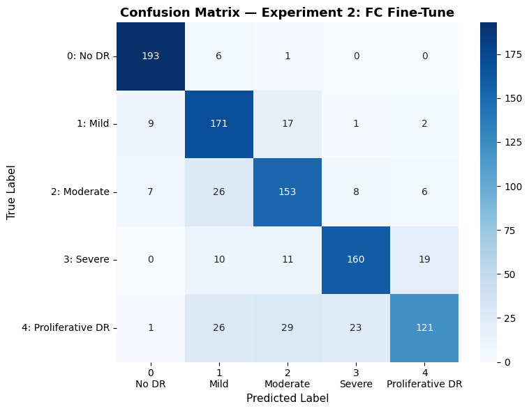
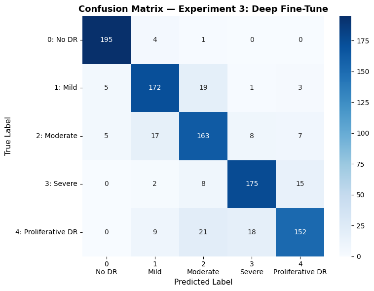

# 🔬 Diabetic Retinopathy Risk Assessment System

**Author:** Yair Levi  
**Platform:** Google Colab · **Framework:** PyTorch · **Backbone:** ResNet-50 (ImageNet)  
**Dataset:** [APTOS 2019 Blindness Detection](https://www.kaggle.com/competitions/aptos2019-blindness-detection/data)

---

## 📊 Experiment Results at a Glance

### Experiment 2 — FC Fine-Tune (Accuracy: 79.8%)

Training the last Fully Connected layer only, while all convolutional layers remain frozen.



### Experiment 3 — Deep Fine-Tune (Accuracy: 85.7%)

Additionally unfreezing ResNet-50's deepest convolutional block (Layer 4) for domain adaptation.



---

## 🎯 Project Overview

Diabetic Retinopathy (DR) is one of the leading causes of preventable blindness worldwide. This project delivers an end-to-end deep learning pipeline that classifies retinal fundus images into **5 DR severity levels** using Transfer Learning with **ResNet-50**.

### DR Severity Classes

| Class | Label | Clinical Description |
|-------|-------|---------------------|
| 0 | No DR | No signs of diabetic retinopathy. Healthy retina. |
| 1 | Mild | Microaneurysms only. Earliest detectable stage. |
| 2 | Moderate | More than just microaneurysms. Some vision threat. |
| 3 | Severe | Extensive hemorrhages. High risk of progression. |
| 4 | Proliferative DR | Abnormal new blood vessel growth. Sight-threatening. |

---

## 📁 Project Structure

```
Diabetic_Retinopathy/          ← Google Drive root
├── images/                    ← Retinal fundus images (.png)
│   ├── <id_code>.png
│   └── ...
├── labels.csv                 ← id_code, diagnosis (0–4)
└── models/
    ├── exp2_fc_finetune.pth   ← Saved Experiment 2 model
    └── exp3_deep_finetune.pth ← Saved Experiment 3 model (if space)
```

---

## ⚙️ Configuration

All user-tunable parameters are defined at the top of Section 1 of the notebook:

| Parameter | Default | Description |
|-----------|---------|-------------|
| `USE_BATCH_NORM` | `True` | Enable/disable BatchNorm in classifier head |
| `LEARNING_RATE` | `1e-4` | Adam LR for Experiment 2 |
| `LR_EXP3` | `1e-5` | Adam LR for Experiment 3 (lower to prevent forgetting) |
| `BATCH_SIZE` | `32` | Mini-batch size (reduce to 16 if OOM) |
| `NUM_EPOCHS` | `10` | Training epochs per experiment |
| `TARGET_PER_CLASS` | `1000` | Target images per class after balancing |
| `UNFREEZE_LAYERS` | `['layer4', 'fc']` | ResNet-50 blocks unfrozen in Experiment 3 |
| `RANDOM_SEED` | `42` | For reproducibility |

---

## 🔄 Pipeline

```
Google Drive Dataset
        │
        ▼
1. Load labels.csv + validate paths
        │
        ▼
2. Display 1 sample image per class (visual sanity check)
        │
        ▼
3. Balance Preprocessing  ← FIRST (reduce I/O before resize)
   • Class 0: 1806 → 1000  (downsample)
   • Class 1:  371 → 1000  (augment +629)
   • Class 2: 1000 → 1000  (keep)
   • Class 3:  194 → 1000  (augment +806)
   • Class 4: 1180 → 1000  (downsample)
        │
        ▼
4. Resolution Preprocessing  ← SECOND (resize balanced set only)
   All images → 224×224 px (Lanczos, saved to local Colab cache)
        │
        ▼
5. Stratified 80/20 train/test split
   Normalize: mean=[0.485,0.456,0.406], std=[0.229,0.224,0.225]
        │
        ▼
6. Load ResNet-50 (ImageNet weights)
   Replace FC: Linear(2048→512) → [BN] → ReLU → Dropout(0.5) → Linear(512→5)
        │
        ├──▶ Experiment 1: Zero-Shot (no training, baseline)
        │
        ├──▶ Experiment 2: FC Fine-Tune (freeze conv, train head only)
        │         └── Save model → Google Drive
        │
        └──▶ Experiment 3: Deep Fine-Tune (unfreeze layer4 + head)
                  └── Save model → Google Drive (if space ≥ 500 MB)
```

---

## 📈 Detailed Performance Results

### Per-Class Metrics Comparison

| Class | Exp 2 Precision | Exp 2 Recall | Exp 2 F1 | Exp 3 Precision | Exp 3 Recall | Exp 3 F1 |
|-------|:-:|:-:|:-:|:-:|:-:|:-:|
| No DR (0) | 91.9% | 96.5% | 94.1% | 95.1% | 97.5% | 96.3% |
| Mild (1) | 71.5% | 85.5% | 77.9% | 84.3% | 86.0% | 85.1% |
| Moderate (2) | 72.5% | 76.5% | 74.5% | 76.9% | 81.5% | 79.1% |
| Severe (3) | 83.3% | 80.0% | 81.6% | 86.6% | 87.5% | 87.1% |
| Proliferative DR (4) | 81.8% | 60.5% | 69.5% | 85.9% | 76.0% | 80.6% |

### Overall Summary

| Metric | Experiment 1 (Zero-Shot) | Experiment 2 (FC Fine-Tune) | Experiment 3 (Deep Fine-Tune) |
|--------|:---:|:---:|:---:|
| **Accuracy** | ~20% (random) | **79.8%** | **85.7%** |
| **Macro F1** | ~20% | **79.5%** | **85.7%** |
| **Trainable Params** | 0 | ~1.05M (head only) | ~24M (layer4 + head) |

**Key observations:**
- Deep fine-tuning (Exp 3) improved overall accuracy by **+5.9 percentage points** over FC-only tuning (Exp 2).
- The largest gain was on **Class 4 (Proliferative DR)**: recall improved from 60.5% → 76.0% — critical for catching the most dangerous stage.
- **Class 3 (Severe)** also showed strong improvement: recall 80.0% → 87.5%.
- **Class 0 (No DR)** remained near-perfect in both experiments (96.5% → 97.5%), as it is the most visually distinct class.
- The confusion between adjacent severity levels (e.g., Mild↔Moderate, Severe↔Proliferative) reflects the inherent clinical difficulty of boundary cases.

---

## 🧪 Augmentation Transforms (for under-represented classes)

Applied to Classes 1 and 3 during Balance Preprocessing:

- **Horizontal flip** (p=0.5)
- **Vertical flip** (p=0.5)
- **Random rotation** ±15° (Bicubic resampling)
- **Brightness jitter** ±10%
- **Contrast jitter** ±10%
- **Mild Gaussian blur** (p=0.3, radius=0.8)

---

## 🚀 How to Run

1. Open `Diabetic_Retinopathy_Classifier.ipynb` in Google Colab.
2. Set runtime to **GPU** (Runtime → Change runtime type → T4 GPU).
3. Ensure your Google Drive has the dataset at `MyDrive/Diabetic_Retinopathy/`.
4. Adjust user parameters in **Section 1** if desired.
5. Run all cells sequentially (Runtime → Run all).

### Prerequisites

The notebook installs all dependencies automatically. External requirements:
- Google account with Google Drive access
- Dataset from [Kaggle APTOS 2019](https://www.kaggle.com/competitions/aptos2019-blindness-detection/data) placed in Drive

---

## 💾 Model Checkpoints

Each saved `.pth` file contains:
```python
{
    'model_state_dict':     ...,   # Model weights
    'optimizer_state_dict': ...,   # Optimizer state
    'history':              ...,   # Per-epoch loss & accuracy
    'results':              {'accuracy': ..., 'macro_f1': ...},
    'config':               ...    # All hyperparameters used
}
```

To load a saved model:
```python
import torch
from torchvision import models

checkpoint = torch.load('exp3_deep_finetune.pth')
model = models.resnet50(weights=None)
model.fc = build_classifier_head(2048, 5, use_batch_norm=True)
model.load_state_dict(checkpoint['model_state_dict'])
model.eval()
```

---

## ⏱️ Timing (approximate, T4 GPU)

| Stage | Estimated Time |
|-------|---------------|
| Balance Preprocessing | ~30–60 s |
| Resolution Preprocessing | ~3–6 min |
| Experiment 1 (inference) | ~30 s |
| Experiment 2 (10 epochs) | ~8–12 min |
| Experiment 3 (10 epochs) | ~15–20 min |
| **Total pipeline** | **~30–40 min** |

---

## 📚 References

- He, K. et al. (2016). *Deep Residual Learning for Image Recognition*. CVPR.
- APTOS 2019 Blindness Detection — [Kaggle Competition](https://www.kaggle.com/competitions/aptos2019-blindness-detection)
- PyTorch ResNet-50: `torchvision.models.resnet50(weights=ResNet50_Weights.IMAGENET1K_V1)`

---

*Author: Yair Levi*

