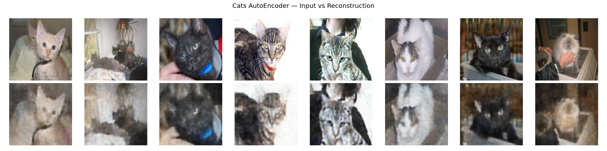
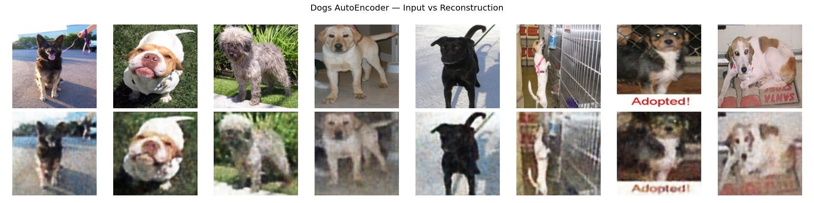
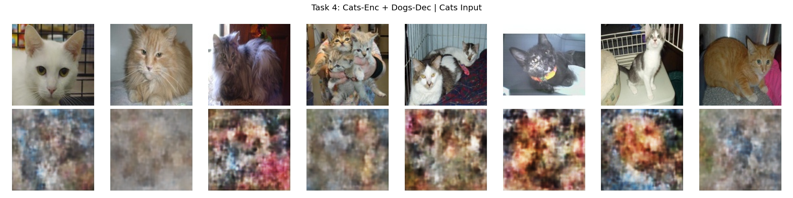
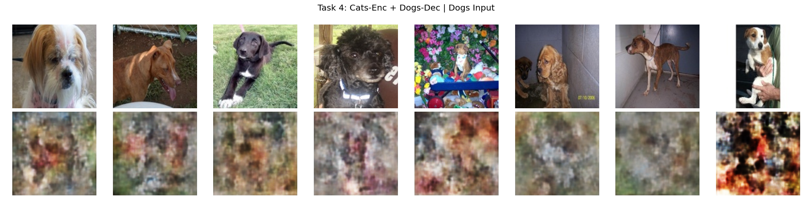

# AutoEncoder — Cats & Dogs

**Author:** Yair Levi

---

## Results

### Task 2 — Cats AutoEncoder: Input vs Reconstruction



The cats autoencoder produces strong reconstructions — facial structure, fur texture, color, and pose are all well preserved across a diverse set of cat images.

---

### Task 3 — Dogs AutoEncoder: Input vs Reconstruction



The dogs autoencoder similarly reconstructs body shape, coat color, and background context with good fidelity — even for challenging poses and lighting conditions.

---

### Task 4 — Cats Encoder + Dogs Decoder: Cats Input



When cat images are passed through the **cats encoder** and then decoded by the **dogs decoder**, the output is a colorful abstract texture. The dogs decoder has never seen cat latent codes during training, so it maps them into a dog-shaped prior — resulting in impressionistic, mixed-domain blends.

---

### Task 4 — Cats Encoder + Dogs Decoder: Dogs Input



Dogs images encoded by the **cats encoder** and decoded by the **dogs decoder** produce similarly abstract results — the cats encoder compresses dog features into a latent space optimized for cats, which the dogs decoder then struggles to interpret faithfully.

---

## Overview

This project implements a configurable **Convolutional AutoEncoder** in Python that:

1. Resizes cats and dogs images using multiprocessing
2. Trains a separate AutoEncoder for cats
3. Trains a separate AutoEncoder for dogs
4. Merges cats encoder with dogs decoder for cross-domain inference
5. Merges dogs encoder with cats decoder for cross-domain inference

---

## Project Structure

```
AutoEncoder/
├── tasks.py                        # Main task dispatcher (CLI entry point)
├── requirements.txt
├── PRD.md
├── Claude.md
├── planning.md
├── tasks.md
├── README.md
├── setup.py
├── Makefile
├── smoke_test.py
├── .env.example
├── .gitignore
│
├── autoencoder/                    # Python package
│   ├── __init__.py
│   ├── config.py                   # All hyperparameters & paths
│   ├── logger.py                   # Ring-buffer rotating log handler
│   ├── dataset.py                  # Dataset & DataLoader utilities
│   ├── model.py                    # Encoder, Decoder, AutoEncoder
│   ├── train_utils.py              # Training loop & visualization helpers
│   ├── preprocessing.py            # Task 1 — multiprocessing image resize
│   ├── train_cats.py               # Task 2 — train cats AutoEncoder
│   ├── train_dogs.py               # Task 3 — train dogs AutoEncoder
│   ├── cross_utils.py              # Shared cross-domain helpers
│   ├── cross_cats_enc_dogs_dec.py  # Task 4 — cats-enc + dogs-dec
│   └── cross_dogs_enc_cats_dec.py  # Task 5 — dogs-enc + cats-dec
│
├── cats/                           # 1500 raw cat images (input)
├── dogs/                           # 1500 raw dog images (input)
├── output/
│   ├── cats_resized/
│   ├── dogs_resized/
│   ├── models/
│   └── plots/
└── log/                            # Rotating log files (auto-created)
```

---

## Setup

```bash
# From project root
cd ../..
python3 -m venv venv
source venv/bin/activate
cd AutoEncoder
pip install -r requirements.txt
```

---

## Running Tasks

```bash
python tasks.py --task 1       # Preprocess: resize all images
python tasks.py --task 2       # Train cats AutoEncoder
python tasks.py --task 3       # Train dogs AutoEncoder
python tasks.py --task 4       # Cats-enc + Dogs-dec inference
python tasks.py --task 5       # Dogs-enc + Cats-dec inference
python tasks.py --task all     # Run all tasks in order
```

---

## Hyperparameters

All defaults live in `autoencoder/config.py` and can be overridden via CLI:

| Parameter | Default | Description |
|-----------|---------|-------------|
| `--image_size H W` | `128 128` | Resize target for input images |
| `--code_size` | `128` | Bottleneck / latent dimension |
| `--num_layers` | `3` | Encoder depth (decoder mirrored) |
| `--nodes_per_layer` | `64` | Base channel count |
| `--loss_function` | `mse` | `mse`, `bce` |
| `--epochs` | `30` | Training epochs |
| `--batch_size` | `32` | Mini-batch size |
| `--learning_rate` | `0.001` | Adam optimizer LR |
| `--num_workers` | `4` | Multiprocessing workers |
| `--sample_count` | `8` | Samples shown in plots |

Example override:

```bash
python tasks.py --task 2 --code_size 64 --epochs 50 --loss_function bce
```

---

## Logging

Logs are written to `log/autoencoder.log` using a **ring-buffer** strategy:
- 20 files maximum
- 16 MB per file
- When the last file fills up, the first file is overwritten

---

## Hyperparameter Tuning Tips

| Symptom | Try |
|---------|-----|
| Reconstruction too blurry | Increase `code_size` or `num_layers` |
| Overfitting | Decrease `code_size` |
| Training too slow | Reduce `image_size`, `batch_size`, or `epochs` |
| Cross-domain output is pure noise | Increase `code_size` for more general features |
| Loss is NaN | Lower `learning_rate`, check image normalization |
