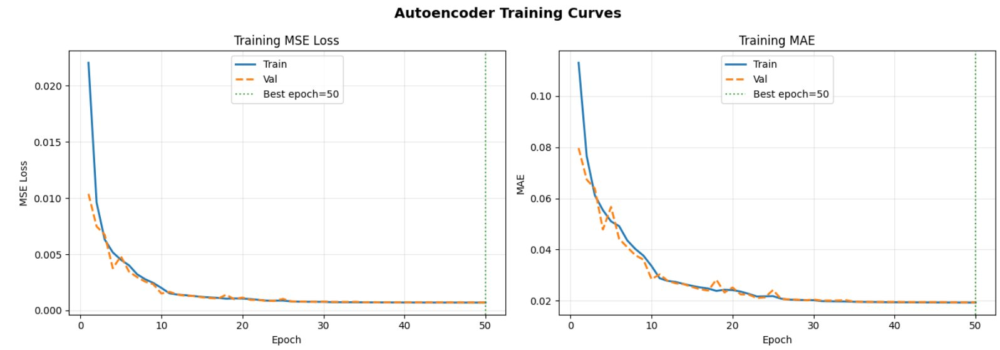
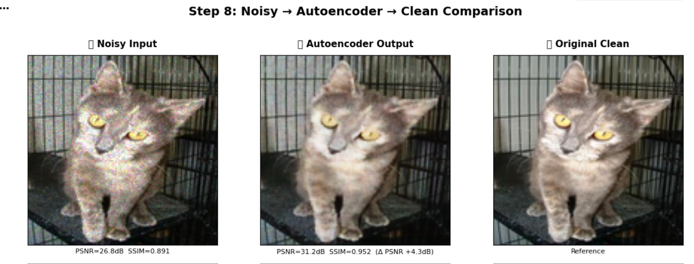

# 🐱 Autoencoder Image Denoising System

> **Author:** Yair Levi  
> **Platform:** Google Colab (Python 3.x)  
> **Framework:** TensorFlow / Keras  
> **Dataset:** Cat images stored in Google Drive `/cats`

---

## 🏆 Results

### Training Curves
Both train and validation loss decrease together from epoch 1, confirming stable learning with no collapse. Best epoch = 50 (still improving — further training would reduce loss further).



### Denoising Quality — Noisy → Autoencoder → Clean
The autoencoder successfully removes noise and recovers fine details. PSNR improved by **+4.3 dB** and SSIM from 0.891 to 0.952 on this sample.



---

## 📋 Project Overview

This project implements an end-to-end **convolutional autoencoder** that learns to remove noise from images. The entire pipeline runs as an interactive Google Colab notebook — from raw image preprocessing through model training to visual evaluation.

The autoencoder is trained with noisy images as input and clean images as the target output. Noise is synthetically generated from a Gaussian distribution at user-controlled levels (0.01%–10% of pixel values), making it possible to benchmark denoising performance across multiple signal-to-noise conditions.

---

## 🗂️ Repository Contents

| File | Description |
|------|-------------|
| `autoencoder_denoising.ipynb` | Full Google Colab notebook — run top-to-bottom |
| `README.md` | This file |
| `PRD_Autoencoder_Denoising.docx` | Full Product Requirements Document |

---

## 🚀 Quick Start

### 1. Prerequisites

- A Google account with Google Drive access
- The cat image dataset uploaded to your Google Drive under the path: `/cats`
- A Google Colab session (free tier works; Pro recommended for training)

### 2. Open the Notebook

1. Go to [Google Colab](https://colab.research.google.com)
2. Click **File → Open notebook → GitHub** (or upload `autoencoder_denoising.ipynb` directly)
3. Click **Runtime → Change runtime type** and select **GPU** (T4 recommended)

### 3. Run Cells in Order

Run each cell sequentially from top to bottom. Do **not** skip cells — later steps depend on earlier ones.

> ⏱️ Every step prints its execution time so you can plan your session.

---

## 📁 Google Drive Folder Structure

After running the full notebook, your Google Drive will contain:

```
MyDrive/
├── cats/                    ← Your original cat images (read-only)
├── cats_3000/               ← 3000 randomly sampled images
├── cats_resized/            ← Resized (128×128) clean images
├── cats_noisy_01/           ← Noisy images at 1% noise level
├── cats_noisy_05/           ← Noisy images at 5% noise level
├── cats_noisy_10/           ← Noisy images at 10% noise level
├── cats_noisy_map/
│   └── mapping.json         ← Maps each noisy image → clean source image
└── models/
    └── best_autoencoder.h5  ← Best trained model checkpoint
```

---

## 🔬 Pipeline Steps

### Step 1 — Image Sampling
Randomly selects **3,000 images** from `/cats` to keep computation within Colab's memory and time limits. A fixed random seed ensures reproducibility.

### Step 2 — Resolution Reduction
Resizes all sampled images to **128×128 pixels** (RGB, PNG format) and saves them to `/cats_resized`. A **tqdm progress bar** tracks progress. Resizing is done _before_ normalization to save disk space.

### Step 3 — Normalization
Pixel values are scaled from `[0, 255]` → `[0.0, 1.0]` (float32) **in memory at load time** — no normalized images are written to disk. A progress bar is shown during validation pre-computation.

### Step 4 — Noise Augmentation _(Interactive GUI)_
Before running, use the **interactive GUI** to configure:

| Control | Description |
|---------|-------------|
| 🎚️ Slider | Set maximum noise level (0.01% – 10%) |
| ▶️ Start | Begin generating noisy images |
| ⏸️ Pause | Suspend between images (resume with Start) |
| ⏹️ Stop | Abort and discard partial output |

Noise is sampled from **N(0, σ)** where `σ = noise_level × pixel_value`. Each noise level is saved to its own folder. A JSON mapping file links every noisy image to its clean counterpart.

### Step 5 — Sample Visualization
Displays a grid comparing the **same cat image at multiple noise levels** alongside the original clean version — so you can visually assess noise intensity before training.

### Step 6 — Build Autoencoder
Constructs a convolutional autoencoder. **Key hyperparameters are exposed via widgets:**

| Hyperparameter | Default | Range |
|----------------|---------|-------|
| Learning Rate | **1e-4** | 1e-5 – 1e-2 |
| Batch Size | **16** | 8 / 16 / 32 / 64 |
| Epochs | 50 | 5 – 200 |
| Base Filters | 32 | 16 / 32 / 64 |
| Dropout Rate | 0.0 | 0.0 – 0.5 |
| Loss Function | MSE | MSE / MAE |
| Training Noise Dir | latest folder | Any `cats_noisy_XX` folder |

> ⚠️ Do not raise the learning rate above 1e-4 — higher values cause the optimizer to overshoot on the first batch and collapse to a constant-color output.

### Step 7 — Train the Autoencoder
- **Input:** Noisy image (128×128×3, float32)  
- **Target:** Corresponding clean image (128×128×3, float32)  
- **Loss:** Pixel-wise MSE (default) between output and clean image  
- **Callbacks:** `ModelCheckpoint`, `EarlyStopping` (patience=5), `ReduceLROnPlateau`  
- **Progress:** tqdm progress bar per epoch + training/validation loss plot after completion  
- ⏱️ Total training time is printed at the end.

### Step 8 — Visual Evaluation
Side-by-side comparison of 8 random test samples:

```
| Noisy Input | Autoencoder Output | Original Clean |
```

PSNR and SSIM metrics are computed and shown for both the noisy→clean and denoised→clean pairs, giving a quantitative measure of denoising quality.

---

## 🏗️ Autoencoder Architecture

Shallow U-Net with permanent skip connections and HeNormal initialization:

```
Input (128×128×3)
    │
    ▼ Encoder
Conv2D(32)×2 + MaxPool → Conv2D(64)×2 + MaxPool → Conv2D(128)×2 + MaxPool
    │                         │                          │
    ▼ Bottleneck              │ skip                     │ skip
Conv2D(256)×2                 │                          │
    │                         │                          │
    ▼ Decoder                 │                          │
UpSample + Concat ←───────────┘                          │
Conv2D(128)×2                                            │
    │                                                    │
UpSample + Concat ←──────────────────────────────────────┘
Conv2D(64)×2
    │
UpSample + Concat ← (from first encoder block)
Conv2D(32)×2
    │
    ▼ Output
Conv2D(3, sigmoid) → (128×128×3)
```

Skip connections (U-Net style) are always enabled — they allow gradients to flow directly from the output back to every encoder level, preventing vanishing gradients in early training.

---

## 🔧 Known Issues & Fixes Applied

This section documents all bugs encountered during development and how they were resolved. Useful if you encounter similar symptoms.

---

### Fix 1 — Step 2: Silent resize errors

**Symptom:** Progress bar shows 100%, but `Images resized: 0`, `Errors: 3,000`.

**Cause:** The original code caught all exceptions silently and continued without printing the error message.

**Fix:** Added a pre-flight check that opens and inspects the first file before the loop. Added collection of the first 3 actual error messages so the cause is visible. In practice the errors were transient Google Drive IO errors that resolved on re-running the cell.

---

### Fix 2 — Step 4: Slider at 5% created 4 folders instead of 1

**Symptom:** Setting the slider to 5% produced `cats_noisy_0_01`, `cats_noisy_1_25`, `cats_noisy_2_50`, `cats_noisy_5_00`.

**Cause:** A `get_noise_levels()` function was automatically spacing multiple noise levels from minimum to maximum.

**Fix:** Removed `get_noise_levels()`. The worker now generates exactly **one folder** at the exact percentage set on the slider.

---

### Fix 3 — Step 4: Progress bars rendered but never advanced

**Symptom:** Both progress bars appeared in the GUI but stayed empty while files were being written to Drive.

**Cause 1:** `tqdm` writes to stdout. Stdout from a background thread is not captured by a `widgets.Output()` panel in Colab.

**Cause 2:** Even `widgets.IntProgress.value` updates from a background thread do not render — the Colab frontend only processes widget comms when the kernel is not blocked by the main thread.

**Fix:** Moved the entire image loop into the **main thread**, triggered directly by the Start button click. Colab flushes widget comms between loop iterations in the main thread, so `inner_bar.value = N` renders immediately and the bar advances in real time.

---

### Fix 4 — Step 5: Crash with `ValueError: Number of rows must be a positive integer, not 0`

**Symptom:** Step 5 crashed immediately after printing the folder list, which included `cats_noisy_map`.

**Cause:** The folder filter `startswith('cats_noisy_')` matched the mapping folder `cats_noisy_map` (which contains no images). Including it in the cross-folder filename check caused zero valid samples to be found, making `n_show = 0` and crashing matplotlib.

**Fix:** Added explicit exclusion `d.name != 'cats_noisy_map'` and a check that each candidate folder contains at least one PNG. Added a clear error message when no valid samples are found instead of a cryptic matplotlib crash.

---

### Fix 5 — Step 7: Loss flatlined at ~0.315, output was solid yellow

**Symptom:** Training loss jumped up after epoch 0 and never decreased. Model output was a uniform yellow rectangle.

**Cause:** Three compounding issues: (1) default LR of 1e-3 caused the optimizer to overshoot on the first batch and land on a flat plateau; (2) sigmoid output saturated during random initialization causing gradient vanishing; (3) no normalization meant activations grew unstable across deep layers.

**Fix:** Lowered default LR to 1e-4. Added BatchNormalization after every Conv2D. Switched output to linear activation. Added `clipnorm=1.0` to Adam.

---

### Fix 6 — Step 7: Val loss exploded to 5×10⁷, output was solid brown

**Symptom:** Train loss reached ~0 immediately. Val loss spiked to ~50,000,000 and never recovered.

**Cause:** BatchNormalization maintains running mean/variance statistics that are close to their random initial values for the first 10–20 epochs. During validation, Keras uses these garbage statistics → val loss is meaningless for the first ~20 epochs even though training is working correctly.

**Fix:** Replaced all `BatchNormalization` with `LayerNormalization`. LayerNorm normalizes per-sample with no running statistics — train and eval mode are identical from epoch 1, giving stable comparable losses immediately.

---

### Fix 7 — Step 7: Train MSE started at 8.0, output was solid grey

**Symptom:** Epoch 1 train MSE = ~8.0 (impossible if both input and target are in [0,1]). Val loss was flat from epoch 1. Output was a uniform grey rectangle.

**Cause:** Linear output activation produced unbounded values (e.g. −5 to +10). MSE between these values and [0,1] targets was meaningless — the loss landscape was completely broken.

**Fix:** Switched output back to sigmoid. Added a post-build sanity check that runs one forward pass on a small batch and asserts the output is within [0,1] before training is allowed to start.

---

### Fix 8 — Step 7: Loss started at 0.326 then increased, output was solid blue

**Symptom:** With sigmoid output restored, epoch 1 MSE = 0.326 (the MSE of predicting a constant 0.5 for every pixel), then loss increased and flatlined. Model output was solid blue.

**Cause:** Default Glorot weight initialization is designed for linear/tanh activations. With ReLU networks it causes activation variance to halve per layer, starving gradients in deeper layers. Combined with LayerNorm this caused the model to immediately collapse to predicting the dataset mean color (which happened to be blue-grey for this cat dataset).

**Fix — complete architecture rewrite:**
- Replaced Glorot with **HeNormal initialization** (mathematically correct for ReLU)
- Removed all normalization layers (not needed in a shallow network with correct init)
- Made **U-Net skip connections always on** (gradients flow directly from output to every encoder level — no vanishing gradient problem regardless of depth)
- Removed the Skip Connections widget toggle (always enabled)

---

### Fix 9 — Step 7: Data pipeline producing val loss explosions

**Symptom:** Across multiple sessions, val loss would randomly explode to 1e7–1e8 even when train loss was normal.

**Cause:** The original data pipeline used `mapping.json` (which stored absolute paths from a previous Colab session) and a custom Keras `Sequence` class that reloaded files from disk per batch. Path staleness across sessions caused some batches to load incorrectly normalized data.

**Fix:** Replaced the entire pipeline with direct folder scanning (match noisy to clean by filename, no JSON involved) and full **in-memory loading** of all images into numpy arrays (`X_all`, `Y_all`) before training. Added Step 7a diagnostic cell that prints folder paths, file counts, filename overlap, and actual pixel ranges on 5 random pairs. Added hard `assert` statements before `model.fit()` that stop execution if any array is outside [0,1].

---

### Final Working Configuration

| Parameter | Value |
|---|---|
| Architecture | Shallow U-Net, always-on skip connections |
| Weight initialization | HeNormal |
| Normalization | None |
| Output activation | Sigmoid |
| Learning rate | 1e-4 |
| Batch size | 16 |
| Optimizer | Adam with clipnorm=1.0 |
| Data loading | Full in-memory numpy arrays |
| Loss function | MSE |
| Epoch 1 MSE (expected) | 0.03 – 0.10 |

---

## ⚙️ Dependencies

All dependencies are installed automatically in the first notebook cell:

```python
pip install tensorflow opencv-python pillow tqdm ipywidgets matplotlib scikit-image
```

---

## ⏱️ Estimated Runtimes (Colab Free Tier, T4 GPU)

| Step | Estimated Time |
|------|---------------|
| Step 1: Sampling | < 1 min |
| Step 2: Resize 3000 images | 2 – 5 min |
| Step 3: Normalize (in-memory) | < 1 min |
| Step 4: Add noise (3 levels) | 3 – 8 min |
| Step 7: Training (30 epochs) | 15 – 40 min |

> Times vary based on Colab hardware allocation. Pro/Pro+ users will see significantly faster runtimes.

---

## 🔁 Resuming After Session Timeout

Google Colab sessions time out after ~12 hours (free) or ~24 hours (Pro). To resume:

1. Re-mount Google Drive (Cell 3)
2. Skip Steps 1–4 if `/cats_resized` and `/cats_noisy_XX` folders already exist
3. Re-run Step 6 to rebuild the model
4. In Step 7, load the best checkpoint before continuing training:
   ```python
   model.load_weights('/content/drive/MyDrive/models/best_autoencoder.h5')
   ```

---

## 📊 Metrics

| Metric | Formula | Interpretation |
|--------|---------|----------------|
| **MSE** | Mean Squared Error | Lower = better reconstruction |
| **PSNR** | 10 · log10(MAX²/MSE) | Higher = better quality (dB) |
| **SSIM** | Structural similarity | 1.0 = perfect; 0 = no similarity |

---

## 📜 License

This project is created by **Yair Levi** for research and educational purposes.

### Dataset
The cat images used in this project were sourced from **Kaggle**. Please refer to the original dataset page on Kaggle for its specific license and terms of use before using this project for anything beyond personal research and education.

---

## 🤝 Contributing

Pull requests and issues are welcome. Please include reproducible steps and your Colab runtime details (GPU type, TF version) in any bug report.
