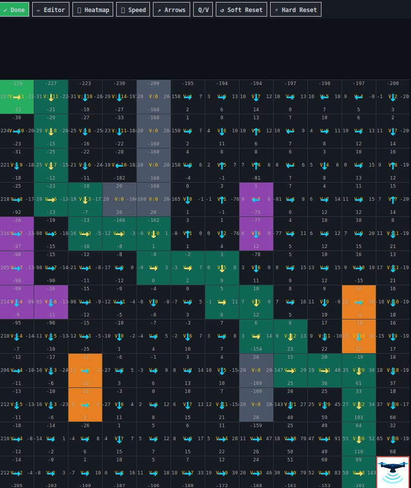
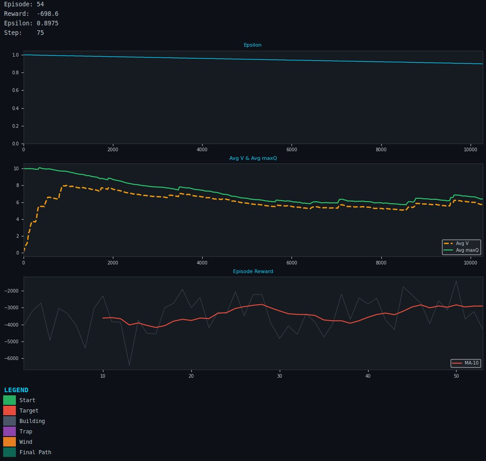

# 🚁 RL Drone — Q-Table Reinforcement Learning Simulator

**Author:** Yair Levi  
**Environment:** Python · WSL · Tkinter · Multiprocessing

---

## Screenshots

### Grid — Final Path with Q/V Values



*The teal-highlighted cells show the validated best path from start (green) to target (red).  
Each cell displays Q-values for all four directions and the V-value in the centre.  
Yellow arrows on path cells show the chosen direction; cyan arrows on non-path cells show the converged policy.*

### Live Training Graphs



*Three live graphs updated during training:  
**Epsilon** — exploration probability decaying over steps;  
**Avg V & Avg maxQ** — value estimates rising as the policy converges;  
**Episode Reward** — raw per-episode reward (grey) with MA-10 smoothed trend (red).*

---

## Overview

A visual Reinforcement Learning simulator where a drone learns the optimal path across a **12×12 grid** using an enhanced Q-table algorithm. The drone starts at the top-left cell and must find the shortest safe route to the bottom-right cell, navigating around buildings, traps, and wind zones placed interactively by the user.

The GUI and the RL engine run in **separate processes** (via `multiprocessing`) so the interface stays fully responsive at all training speeds.

---

## Algorithm

The agent uses **Q-Learning** enhanced with four improvements that significantly speed up convergence:

### 1. Eligibility Traces — Q(λ)
Instead of updating only the cell just visited, eligibility traces propagate the TD error backward through the entire episode path in a single step. Every cell visited this episode gets updated proportional to how recently it was visited (controlled by `λ = 0.8`). This can cut episodes-to-convergence by 5–10×.

```
E  ← γλ · E                  # decay all traces
E[s,a] += 1                  # accumulate at current (s,a)
Q  += α · δ · E              # update ALL cells via traces
```

### 2. Reward Shaping
A small Manhattan-distance bonus is added at every step, giving the agent a gradient toward the target from the very first episode — even before it has seen the target:

```
shaping = 0.4 × (dist_before − dist_after)
reward  += shaping
```
This is potential-based, so it does not change the optimal policy.

### 3. Optimistic Initialisation
All non-border Q-values are seeded at `+10` instead of `0`. Every unvisited cell looks "promising", so the agent naturally explores all reachable cells before epsilon decays — eliminating blind spots near obstacles without extra exploration steps.

### 4. Double Q-Learning
Two Q-tables (`Q` and `Q2`) are maintained. On each update, one table selects the best action and the other evaluates it, eliminating the systematic overestimation bias of standard Q-learning. Both tables contribute equally to all decisions (`Q + Q2`).

### Q-Learning Update Rule

```
δ       = r + γ · Q2[s', argmax Q[s']] − Q[s,a]   # Double Q TD error
Q[s,a] += α · δ                                     # one-step update
Q      += α · δ · E                                  # eligibility propagation
V[s]    = max Q[s,·]
```

### Hyperparameters

| Parameter | Value | Notes |
|---|---|---|
| Learning rate α | 0.1 | |
| Discount factor γ | 0.95 | Higher than standard — propagates reward further |
| Eligibility trace λ | 0.8 | 0 = pure TD, 1 = Monte Carlo |
| Reward shaping scale | 0.4 | Manhattan distance bonus weight |
| Optimistic Q seed | +10.0 | Initial value for free cells |
| Epsilon start | 1.0 | |
| Epsilon min | 0.01 | |
| Epsilon decay | 0.998 per episode | Slower decay for thorough exploration |
| Max steps / episode | 200 | Raised from 60 for obstacle-rich grids |
| Revisit penalty | −3.0 | Discourages oscillation within an episode |
| Stop after N arrivals | 5 | Path traced and validated after 5 successes |

### Reward Structure

| Event | Reward |
|---|---|
| Each step taken | −1 |
| Reach target | +100 |
| Out-of-bounds attempt | −100 |
| Building (impassable — drone stays) | −80 |
| Trap | −40 |
| Wind | −10 |
| Revisit cell in same episode | −3 (extra) |
| Closer to target (shaping) | +0.4 |
| Away from target (shaping) | −0.4 |

### Final Path Algorithm

After 5 successful arrivals, the best path is traced using **greedy argmax** on the combined Q-table (`Q + Q2`). The path undergoes mandatory validation: every cell's `argmax(Q+Q2)` must point exactly to the next cell in the path. If any cell fails, training continues until full convergence. This guarantees:

- No deadlocks (two cells pointing at each other)
- Arrows on path cells exactly match the path direction
- What is displayed in cells (`Q+Q2`) matches what decides the path and arrows

---

## Features

| Feature | Description |
|---|---|
| 12×12 interactive grid | Start top-left, target bottom-right |
| Enhanced Q-Learning | Eligibility traces, reward shaping, optimistic init, Double Q |
| Buildings | Impassable walls — drone blocked and penalised |
| Traps & Wind | Passable but costly structures |
| Heatmap | Toggle: structure colors ↔ V-value heatmap |
| Arrows | Converged best-direction arrows; yellow on final path, cyan elsewhere |
| Q/V display | Shows `Q+Q2` (combined) values and V in each cell |
| Final path highlight | Teal background on best-path cells after training completes |
| Speed control | Slider for 0–0.5 s delay between steps |
| 3-panel live graphs | Epsilon · Avg V & maxQ · Episode reward with MA-10 trend |
| Legend | Color key including Final Path |
| Multiprocessing | GUI and RL worker in separate processes — always responsive |
| Logging | Ring-buffer: 20 files × 16 MB in `rl_drone/log/` |

---

## Project Structure

```
Reinforcement_Learning/
├── main.py                  # Entry point — launches RL worker + GUI
├── requirements.txt         # numpy, Pillow, matplotlib
├── README.md
├── CLAUDE.md                # Dev context & conventions
├── planning.md              # Architecture & design notes
├── tasks.md                 # Implementation checklist
└── rl_drone/                # Python package
    ├── __init__.py
    ├── config.py            # All constants, rewards, algorithm params
    ├── logger_setup.py      # Ring-buffer rotating logger
    ├── environment.py       # Grid, structures, step/reward logic
    ├── agent.py             # Q-tables, eligibility traces, Double Q, path tracing
    ├── gui.py               # Main window, toolbar, resets, state polling
    ├── grid_widget.py       # Canvas: cells, drone, arrows, heatmap, path highlight
    ├── stats_panel.py       # 3-subplot graphs, live stats, legend
    ├── images/
    │   ├── drone.png        # Original drone icon
    │   └── drone_small.png  # Auto-resized to cell dimensions on first run
    └── log/                 # Log files created at runtime
```

> The virtual environment lives at `../../venv` relative to this folder.

---

## Installation

### 1. Prerequisites (WSL)

```bash
sudo apt update
sudo apt install python3 python3-venv python3-tk -y
```

### 2. Create the virtual environment

```bash
# From inside Reinforcement_Learning/
python3 -m venv ../../venv
source ../../venv/bin/activate
```

### 3. Install dependencies

```bash
pip install -r requirements.txt
```

Dependencies: `numpy`, `Pillow`, `matplotlib`

---

## Running

```bash
source ../../venv/bin/activate
python main.py
```

> **WSL display note:** Make sure an X server is running (e.g. VcXsrv or WSLg) and `DISPLAY` is set, e.g. `export DISPLAY=:0`.

---

## UI Guide

### Toolbar Buttons

| Button | Action |
|---|---|
| ▶ Start / Pause | Start training; toggle pause/resume. Turns green (✔ Done) when training completes |
| ✏ Editor | Open the structure editor pane; click cells to place/erase structures |
| 🔥 Heatmap | Toggle: structure colors ↔ V-value heatmap |
| ⏩ Speed | Show/hide the step-delay slider (0 – 0.5 s) |
| ↗ Arrows | Show/hide direction arrows on all converged cells |
| Q/V | Show/hide Q (4 directions, combined Q+Q2) and V values in each cell |
| ↺ Soft Reset | Reset Q, V, epsilon, drone position; keep structures |
| ⚡ Hard Reset | Reset everything — structures, Q, V, drone, graphs |

### Editor Pane (visible when Editor is ON)

Select a structure type then click any grid cell:

| Type | Cell Color | Reward Effect |
|---|---|---|
| Building | Steel grey | −80 · impassable (drone bounces back) |
| Trap | Purple | −40 · passable |
| Wind | Dark orange | −10 · passable |
| Erase | — | Remove structure from cell |

> Placing or erasing a structure during training automatically triggers a Soft Reset so Q-values are recalculated for the new layout.

### Right Stats Panel

- **Live Stats** — episode number, cumulative reward, epsilon, step count
- **Epsilon graph** — exploration probability vs total training steps (fixed 0–1 axis)
- **Avg V & Avg maxQ graph** — value estimates rising toward convergence; V (dashed orange) should approach maxQ (solid green) over time
- **Episode Reward graph** — raw reward per episode (grey) + MA-10 smoothed trend (red); improving trend = agent is learning
- **Legend** — color key for all cell types including the final path highlight

---

## Multiprocessing Architecture

```
┌─────────────────────┐        cmd_queue        ┌──────────────────────┐
│   GUI Process        │ ──────────────────────► │   RL Worker Process  │
│  (Tkinter / main)    │                          │  (Q + Q2 updates,    │
│                      │ ◄────────────────────── │   eligibility traces) │
└─────────────────────┘       state_queue        └──────────────────────┘
```

- `cmd_queue` (GUI → Worker): start, pause, reset, structure edits, speed changes
- `state_queue` (Worker → GUI): per-step state — drone position, `Q+Q2`, V, arrows, episode stats, best path

The GUI polls `state_queue` every 30 ms and renders only the **latest** message, dropping intermediate frames to keep rendering smooth at high training speeds.

---

## Killing a Stuck Process (WSL)

```bash
# Soft kill
pkill -f "python main.py"

# Force kill
pkill -9 python3

# Nuclear option — restart WSL entirely
wsl --shutdown   # run from Windows PowerShell
```

---

## Logging

Logs are written to `rl_drone/log/rl_drone.log` as a rotating ring-buffer:

- **20 files** (1 active + 19 backups), **16 MB each**
- When the last file fills up, rotation wraps back to overwrite the oldest
- Level: `INFO` and above, mirrored to the console

---

## License

MIT — free to use, modify, and distribute.
