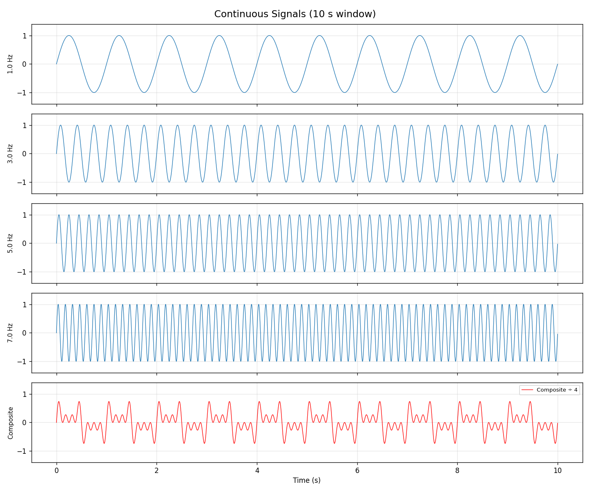
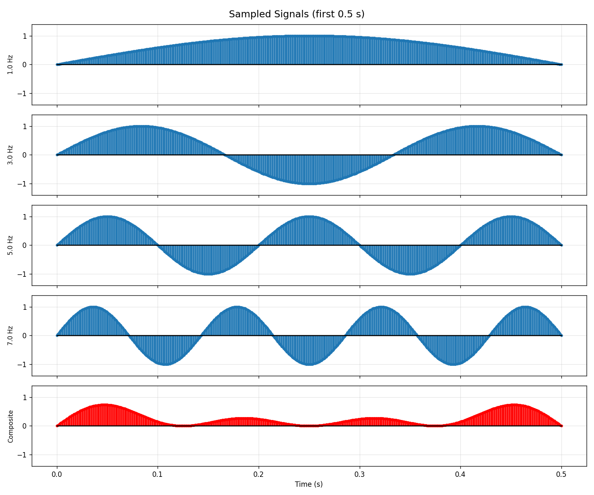
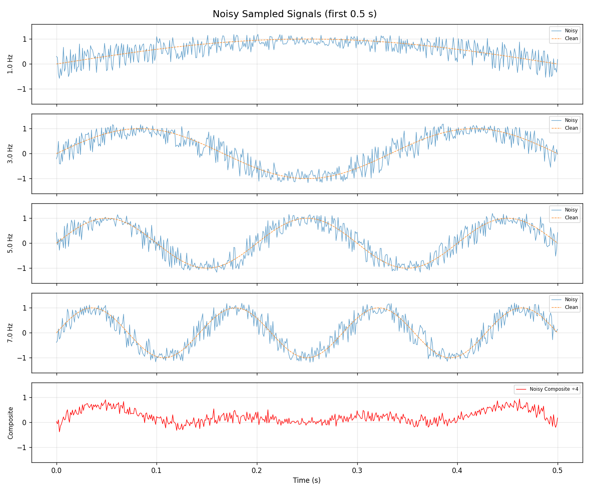
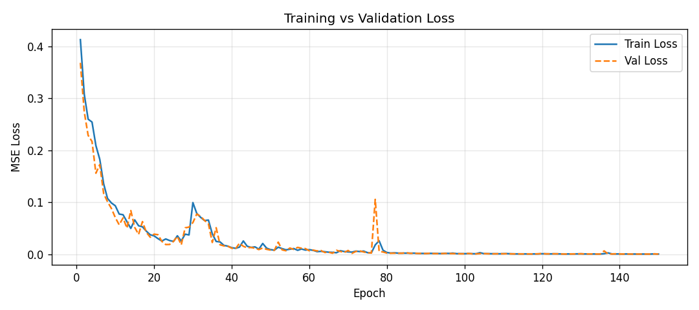
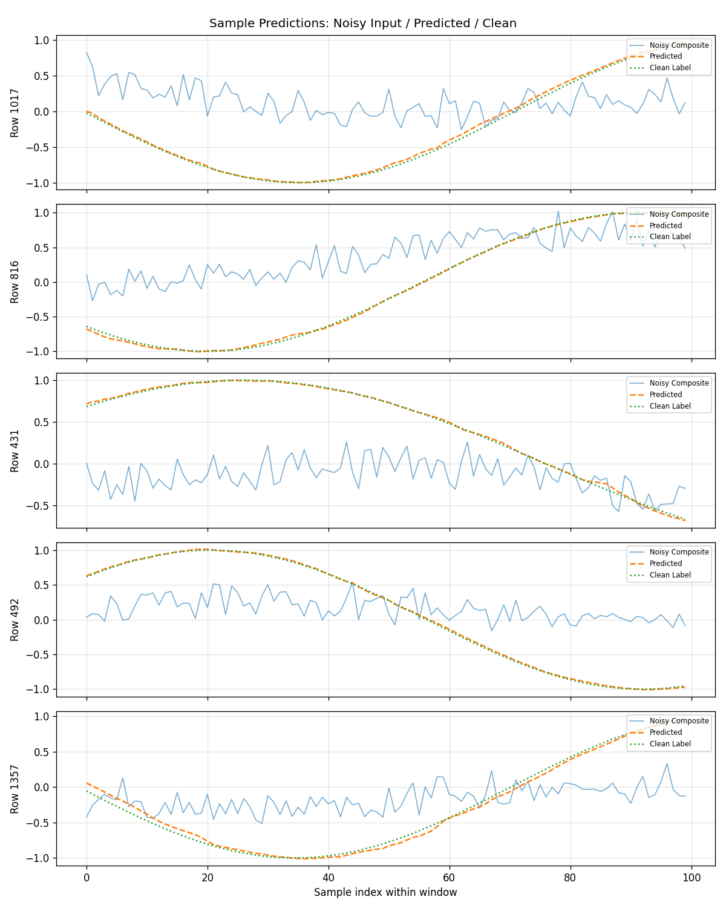

# LSTM Signal Filter

**Author:** Yair Levi  
**Environment:** WSL Ubuntu, Python Virtual Environment  
**Version:** 1.0.0

A Python package that trains a dual-input LSTM network to extract a single clean sine-wave signal from a noisy composite of four mixed frequencies. The one-hot filter vector tells the network *which* frequency to recover; the noisy composite is the signal it must filter.

---

## Results Gallery

### Plot 1 — Pure Continuous Signals (`plots/task2_continuous.png`)



Four analytically generated sine waves at 1, 3, 5, and 7 Hz using `y(t) = A·sin(2πft + φ)` with A=1, φ=0. The bottom panel shows their normalised composite (sum ÷ 4). The composite has a complex waveform because the four frequencies interfere constructively and destructively over time — this is exactly what the LSTM must learn to "un-mix".

---

### Plot 2 — Discrete Sampled Signals (`plots/task4_sampled.png`)



The same four signals after sampling at 1 kHz for 10 seconds (10 000 samples each). Only the first 0.5 s is shown so the individual sample points are visible. At 1 kHz the 1 Hz signal has 1 000 samples per cycle, giving very fine resolution. The composite (bottom, red) shows the same interference pattern as the continuous version.

---

### Plot 3 — Noisy Sampled Signals (`plots/task6_noisy.png`)



Each signal has independent per-sample noise applied:
- **Amplitude noise:** uniform ±0.2 (20% of the unit amplitude)
- **Phase noise:** uniform ±π/5 (~36°)

The noisy signal (blue) visibly deviates from the clean reference (orange dashed) in both amplitude and timing. The composite panel (bottom) mixes all four noisy signals together — this noisy composite is what the LSTM receives as input and must filter.

---

### Plot 4 — Training and Validation Loss (`plots/task14_loss.png`)



MSE loss over 150 epochs for both training (blue) and validation (orange dashed) sets. Key observations:
- **Epoch 1–15:** Rapid initial descent from ~0.41 to ~0.06 — the network quickly learns the dominant signal shapes.
- **Epoch 25–35:** A temporary spike to ~0.10 — caused by the learning rate scheduler triggering a step reduction after detecting a plateau, momentarily destabilising the optimiser before recovering.
- **Epoch 75–80:** A second smaller spike — another scheduler step.
- **Epoch 80–150:** Smooth convergence to near-zero MSE, with train and validation tracking closely — no overfitting.

The close tracking of train and validation loss throughout confirms the model generalises well to unseen data.

---

### Plot 5 — Sample Predictions (`plots/task14_samples.png`)



Five randomly selected test rows. Each panel shows:
- **Blue (Noisy Composite):** The mixed noisy input signal the LSTM receives
- **Orange dashed (Predicted):** The LSTM's output — the estimated clean signal for the requested frequency
- **Green dotted (Clean Label):** The ground truth clean signal

The predicted signal closely follows the clean label across all five examples, successfully separating the target frequency from the noisy composite. The LSTM achieves this using only the 4-d one-hot filter vector (which frequency to extract) and the noisy composite window — no pre-separated signal is provided.

---

## Quick Start

```bash
# 1. Create and activate virtual environment (from LSTM/ folder)
#    IMPORTANT: create the venv from inside WSL, not from Windows
python3 -m venv ../../venv
source ../../venv/bin/activate

# 2. Install dependencies
pip install -r requirements.txt

# 3. Run with defaults (150 epochs, window=100, prefix=200)
python3 main.py

# 4. Run with custom parameters
python3 main.py --layers 3 --epochs 200 --records 10000 --prefix 300
```

---

## Project Structure

```
LSTM/
├── __init__.py          # Package init
├── main.py              # Orchestrator — runs all 14 tasks in order
├── config.py            # CLI argument parsing and Config dataclass
├── logger_setup.py      # Ring-buffer logging (20 × 16 MB files)
├── signals.py           # Tasks 1–2: sine generation & plotting
├── sampling.py          # Tasks 3–4: discrete sampling & plotting
├── noise.py             # Tasks 5–6: noise injection & plotting
├── dataset.py           # Tasks 7–8: dataset construction (parallel)
├── model.py             # Task 10: LSTMFilter network (PyTorch)
├── train.py             # Tasks 9, 11–12: split, train, evaluate
├── visualise.py         # Task 14: loss curve, metrics, sample plots
├── requirements.txt
├── PRD.md               # Full product requirements
├── README.md            # This file
├── Claude.md            # AI assistant context and design decisions
├── planning.md          # Phased delivery plan
└── tasks.md             # Task-to-file mapping

Auto-created at runtime:
├── log/                 # Rotating log files (ring buffer)
├── plots/               # Saved PNG figures
├── data/                # Pickled dataset (dataset.pkl)
└── checkpoints/         # Best model weights (best_model.pt)
```

---

## CLI Reference

| Flag | Default | Description |
|------|---------|-------------|
| `--layers` | `2` | Number of LSTM layers |
| `--amp-noise` | `0.2` | Amplitude noise magnitude (±) |
| `--phase-noise` | `0.6283` | Phase noise magnitude (± rad, default π/5) |
| `--freqs` | `1 3 5 7` | Space-separated signal frequencies (Hz) |
| `--sample-rate` | `1000` | Sampling frequency (Hz) |
| `--duration` | `10` | Duration to sample (seconds) |
| `--records` | `8000` | Number of dataset rows |
| `--epochs` | `150` | Training epochs |
| `--batch-size` | `64` | Mini-batch size |
| `--hidden-size` | `128` | LSTM hidden units per layer |
| `--window` | `100` | Prediction window size (samples) |
| `--prefix` | `200` | Warm-up context samples before the prediction window |
| `--seed` | `42` | Random seed for reproducibility |

---

## Output Files

| File | Contents |
|------|----------|
| `plots/task2_continuous.png` | Pure sine signals + clean composite |
| `plots/task4_sampled.png` | Sampled signals + sampled composite |
| `plots/task6_noisy.png` | Noisy signals vs clean reference + noisy composite |
| `plots/task14_loss.png` | Training / validation MSE loss curve |
| `plots/task14_samples.png` | Noisy composite / predicted / clean label comparison |
| `data/dataset.pkl` | Full dataset as numpy arrays (filters, input_wins, clean_labels) |
| `checkpoints/best_model.pt` | Best model weights (lowest validation loss) |
| `log/lstm_filter.log` | Latest log file (ring buffer, 20 × 16 MB) |

---

## Dataset Structure

The dataset (`data/dataset.pkl`) contains three numpy arrays unpacked as:

```python
import pickle
with open('data/dataset.pkl', 'rb') as f:
    filters, input_wins, clean_labels = pickle.load(f)
```

| Array | Shape | Description |
|-------|-------|-------------|
| `filters` | (8000, 4) | One-hot filter vectors — which frequency to extract |
| `input_wins` | (8000, 300) | Noisy composite windows: 200 warm-up + 100 prediction samples |
| `clean_labels` | (8000, 100) | Clean target signal — ground truth labels |

---

## How It Works

### Signal Pipeline
1. **Generation** — Four sine waves `y(t) = A·sin(2πft + φ)` at 1, 3, 5, 7 Hz (A=1, φ=0).
2. **Sampling** — Each signal is sampled at 1 kHz for 10 s → 10 000 samples each.
3. **Noise** — Per-sample amplitude (±0.2) and phase (±π/5) noise is added independently to each signal.
4. **Composite** — The four noisy signals are summed and divided by 4.

### Dataset Construction
Each of the 8 000 rows contains:
- A one-hot 4-vector identifying the target frequency (e.g. `[0,1,0,0]` = 3 Hz)
- 300 consecutive samples from the noisy composite (200 warm-up + 100 prediction)
- 100 samples of the corresponding clean signal as the label

### LSTM Architecture
The `LSTMFilter` model uses a **filter-conditioned LSTM**:
- The one-hot filter vector is projected via a 2-layer MLP into a hidden embedding
- This embedding **initialises both h₀ and c₀** of the LSTM — the network starts already tuned to the target frequency
- At every time step, the filter embedding is also **concatenated with the composite sample** as additional input, providing a constant reminder of the target frequency
- The LSTM runs over all 300 samples (prefix + window), but the output head is only applied to the **last 100 steps** — after the transient settling period

### Why the Prefix?
An LSTM needs several time steps to build up hidden state context before it can reliably separate frequencies. Without a prefix, the first samples of each prediction window show poor accuracy (the network is still "warming up"). The 200-sample prefix gives the LSTM 200 ms of real signal to settle its state before any prediction is required, eliminating the start-of-window error seen in earlier versions.

### Training
- **Loss:** MSE between predicted and clean signal
- **Optimiser:** Adam (lr=1e-3)
- **Scheduler:** ReduceLROnPlateau — halves lr when val loss plateaus for 8 epochs
- **Gradient clipping:** max norm = 1.0
- **Best model** saved by lowest validation loss

---

## Requirements

- Python ≥ 3.10
- WSL Ubuntu (or any Linux — venv must be created from WSL, not Windows)
- See `requirements.txt` for exact package versions

---

## Known Issues & Fixes Applied

| Issue | Root Cause | Fix |
|-------|-----------|-----|
| `use_line_collection` TypeError | Removed in matplotlib 3.7+ | Removed the argument from `sampling.py` |
| `verbose` TypeError in scheduler | Removed in PyTorch 2.4+ | Removed `verbose=False` from `ReduceLROnPlateau` |
| Venv not executable on WSL | Venv created on Windows contains `.exe` binaries | Always create venv with `python3 -m venv` from inside WSL |
| Predicted signal far from clean at window start | LSTM transient — hidden state not yet settled | Added 200-sample warm-up prefix; output head applied only after prefix |
| Predicted signal smoothing composite instead of tracking clean | Network receiving composite only; 10-sample window too short | Window increased to 100; filter-conditioned h₀/c₀ initialisation |
